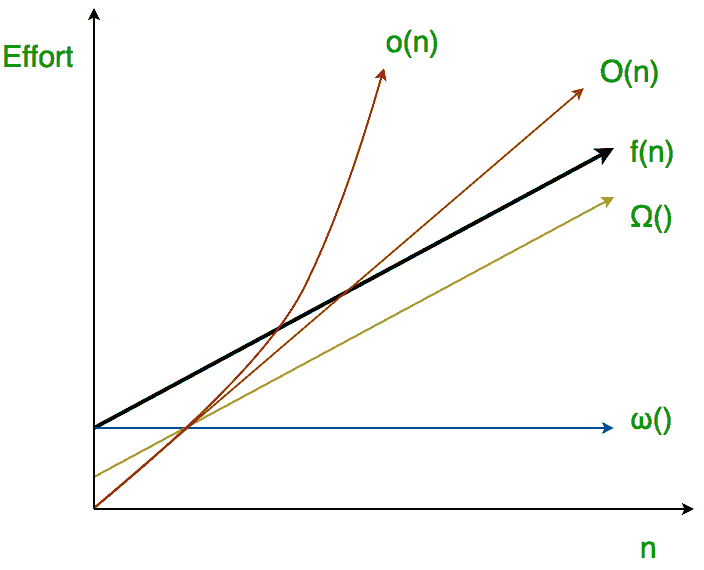

# 算法分析|小 o 和小ω符号

> 原文:[https://www . geeksforgeeks . org/analysis-of-algorithems-little-o-和 little-omega-符号/](https://www.geeksforgeeks.org/analysis-of-algorithems-little-o-and-little-omega-notations/)

**渐近分析**的主要思想是对算法的效率有一个不依赖于机器特定常数的度量，主要是因为这种分析不需要实现算法和比较程序所花费的时间。我们已经讨论了[三个主要的渐近符号](https://www.geeksforgeeks.org/analysis-of-algorithms-set-3asymptotic-notations/)。下面的两个渐近符号被用来表示算法的时间复杂度。

**小ο渐近符号**

big-ο用作算法努力增长的紧上限(这种努力由函数 f(n)描述)，尽管如所写，它也可以是松上限。“Little-ο”(ο())符号用来描述不能紧的上限。

**定义:**设 f(n)和 g(n)为将正整数映射为正实数的函数。我们说 f(n)是ο(g(n))(或者 f(n)εο(g(n)))如果对于**任何实**常数 c > 0，存在一个整数常数 n0 ≥ 1 使得 0 ≤ f(n) < c*g(n)。
 
由此可见，小 o()意味着 f(n)的**松散上限**。小 o 是对最大增长阶的粗略估计，而大ο可能是实际增长阶。

在数学关系中，
f(n) = o(g(n))表示
lim f(n)/g(n) = 0
n→∞

 **例:** 
**是 7n + 8 ∈ o(n 2 )？**
为了使其为真，对于任何 c，我们必须能够找到使
f(n) < c * g(n)渐近为真的 n0。
我们举个例子，
如果 c = 100，我们检查一下不等式是否明显成立。如果 c = 1/100，我们就要多运用
一点想象力，但我们一定能找到一个 n0。(试试 n0 = 1000。)从
这些例子来看，这个猜想似乎是正确的。
然后检查限值，
lim f(n)/g(n)= lim(7n+8)/(n2)= lim 7/2n = 0(l ' hospital)
n→∞n→∞n→∞

因此 7n + 8 ∈ o(n 2 )

**小ω渐近符号**

**定义:**设 f(n)和 g(n)为将正整数映射为正实数的函数。我们说 f(n)是ω(g(n))(或者 f(n) ∈ ω(g(n)))如果对于任何实常数 c > 0，存在一个整数常数 n0 ≥ 1，使得 f(n) > c * g(n) ≥ 0 对于每个整数 n ≥ n0。

f(n)的增长率比 g(n)高，所以大ω(ω)和小ω(ω)的主要区别在于它们的定义。在大ωf(n)=ω(g(n))且界为 0 <=cg(n)<=f(n), but in case of little omega, it is true for 0<=c*g(n) <f>的情况下，大ω(ω)和小ω(ω)的关系类似于大-ο和小 o 的关系，只是现在我们看的是下界。小ω(ω)是增长顺序的粗略估计，而大ω(ω)可能代表增长的精确顺序。我们用ω符号来表示一个不是渐近紧的下界。
和，f(n) ∈ ω(g(n))当且仅当 g(n) ∈ ο((f(n))。

在数学关系中，
如果 f(n)∈(ω(g(n))那么，</f>

**lim f(n)/g(n)=
→**

**例:** **证明 4n+6∈ω(1)；**
小ω(ο)运行时间可以通过应用下面给出的极限公式来证明。
如果 lim f(n)/g(n) = ∞，那么函数 f(n)就是ω(g(n))
n→∞
在这里，我们有函数 f(n)=4n+6 和 g(n)= 1
lim(4n+6)/(1)=∞
n→∞
并且，对于任意 c，我们也可以得到这个不等式 0 的 n0<= c * g(n)

本文由 **[卡丹·帕特尔](https://www.facebook.com/kadam.patel.750)** 供稿。如果你喜欢 GeeksforGeeks 并想投稿，你也可以使用[write.geeksforgeeks.org](https://write.geeksforgeeks.org)写一篇文章或者把你的文章邮寄到 review-team@geeksforgeeks.org。看到你的文章出现在极客博客主页上，帮助其他极客。

如果你发现任何不正确的地方，或者你想分享更多关于上面讨论的话题的信息，请写评论。