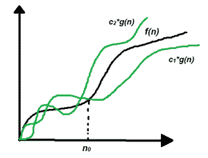

# 算法分析|大–θ(大θ)符号

> 原文:[https://www . geesforgeks . org/算法分析-big-% ce % b8-big-theta-批注/](https://www.geeksforgeeks.org/analysis-of-algorithms-big-%ce%b8-big-theta-notation/)

在算法的[分析](https://www.geeksforgeeks.org/analysis-of-algorithms-set-1-asymptotic-analysis/)中，渐近符号被用来评估算法的性能，在它的[最佳情况和最差情况](https://www.geeksforgeeks.org/analysis-of-algorithms-set-2-asymptotic-analysis/)中。本文将讨论用希腊字母(θ)表示的大θ符号。

**定义:**设 g 和 f 是从自然数集合到自身的函数。如果存在常数 c <sub>1</sub> 、c <sub>2</sub> > 0 和自然数 n <sub>0</sub> ，使得 c<sub>1</sub>* g(n)≤f(n)≤c<sub>2</sub>* g(n)对于所有 n ≥ n <sub>0</sub>

**数学表示:**

> θ(g(n))= { f(n):存在正常数 c <sub>1</sub> 、c <sub>2</sub> 和 n <sub>0</sub> 使得 0≤c<sub>1</sub>* g(n)≤f(n)≤c<sub>2</sub>* g(n)对于所有 n ≥ n 的 <sub>0</sub> }
> 注:θ(g)为一组

上面的定义是指，如果 f(n)是 g(n)的θ，那么对于 n (n ≥ n <sub>0</sub> 的大值，f(n)的值总是在 c1 * g(n)和 c2 * g(n)之间。θ的定义还要求对于大于 n <sub>0</sub> 的 n 值，f(n)必须是非负的。

**图形表示:**



图示

用简单的语言来说，Big–Theta(θ)符号指定了函数 f(n)的渐近界(上界和下界)，并提供了算法的平均时间复杂度。

按照以下步骤查找任何程序的平均时间复杂度:

1.  将程序分成更小的部分。
2.  找到所有类型和数量的输入，并计算它们需要执行的操作数量。确保输入案例分布均匀。
3.  求出所有计算值的总和，然后将总和除以总输入数，假设得到的 n 的函数是 g(n ),去掉所有常数后，用θ表示法表示为θ(g(n ))

**示例:**考虑一个示例，使用线性搜索来[查找某个键是否存在于数组中。思路是](https://www.geeksforgeeks.org/linear-search/)[遍历数组](https://www.geeksforgeeks.org/c-program-to-traverse-an-array/)检查每个元素是否等于关键。

伪代码如下:

```
bool linearSearch(int a[], int n, int key)
{
    for (int i = 0; i < n; i++) {
        if (a[i] == key)
            return true;
    }

    return false;
}
```

下面是上述方法的实现:

## C++

```
// C++ program for the above approach
#include <bits/stdc++.h>
using namespace std;

// Function to find whether a key exists in an
// array or not using linear search
bool linearSearch(int a[], int n, int key)
{
    // Traverse the given array, a[]
    for (int i = 0; i < n; i++) {

        // Check if a[i] is equal to key
        if (a[i] == key)
            return true;
    }

    return false;
}

// Driver Code
int main()
{
    // Given Input
    int arr[] = { 2, 3, 4, 10, 40 };
    int x = 10;
    int n = sizeof(arr) / sizeof(arr[0]);

    // Function Call

    if (linearSearch(arr, n, x))
        cout << "Element is present in array";
    else
        cout << "Element is not present in array";

    return 0;
}
```

## Java 语言(一种计算机语言，尤用于创建网站)

```
// Java program for the above approach
import java.lang.*;
import java.util.*;

class GFG{

// Function to find whether a key exists in an
// array or not using linear search
static boolean linearSearch(int a[], int n,
                            int key)
{

    // Traverse the given array, a[]
    for(int i = 0; i < n; i++)
    {

        // Check if a[i] is equal to key
        if (a[i] == key)
            return true;
    }
    return false;
}

// Driver code
public static void main(String[] args)
{

    // Given Input
    int arr[] = { 2, 3, 4, 10, 40 };
    int x = 10;
    int n = arr.length;

    // Function Call
    if (linearSearch(arr, n, x))
        System.out.println("Element is present in array");
    else
        System.out.println("Element is not present in array");
}
}

// This code is contributed by avijitmondal1998
```

## 蟒蛇 3

```
# Python3 program for the above approach

# Function to find whether a key exists in an
# array or not using linear search
def linearSearch(a, n, key):

    # Traverse the given array, a[]
    for i in range(0, n):

        # Check if a[i] is equal to key
        if (a[i] == key):
            return True

    return False

# Driver Code

# Given Input
arr =  2, 3, 4, 10, 40
x = 10
n = len(arr)

# Function Call
if (linearSearch(arr, n, x)):
    print("Element is present in array")
else:
    print("Element is not present in array")

# This code is contributed by shivanisinghss2110
```

## C#

```
// C# program for above approach
using System;

class GFG{

// Function to find whether a key exists in an
// array or not using linear search
static bool linearSearch(int[] a, int n,
                            int key)
{

    // Traverse the given array, a[]
    for(int i = 0; i < n; i++)
    {

        // Check if a[i] is equal to key
        if (a[i] == key)
            return true;
    }
    return false;
}

// Driver Code
static void Main()
{
    // Given Input
    int[] arr = { 2, 3, 4, 10, 40 };
    int x = 10;
    int n = arr.Length;

    // Function Call
    if (linearSearch(arr, n, x))
        Console.Write("Element is present in array");
    else
        Console.Write("Element is not present in array");
}
}

// This code is contributed by sanjoy_62.
```

## java 描述语言

```
<script>
// JavaScript program for the above approach
// Function to find whether a key exists in an
// array or not using linear search
function linearSearch(a, n, key)
{

    // Traverse the given array, a[]
    for(var i = 0; i < n; i++)
    {

        // Check if a[i] is equal to key
        if (a[i] == key)
            return true;
    }
    return false;
}

// Driver code
    // Given Input
    var arr = [ 2, 3, 4, 10, 40 ];
    var x = 10;
    var n = arr.length;

    // Function Call
    if (linearSearch(arr, n, x))
        document.write("Element is present in array");
    else
        document.write("Element is not present in array");

// This code is contributed by shivanisinghss2110
</script>
```

**Output**

```
Element is present in array
```