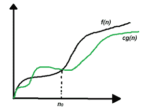
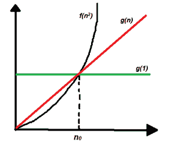

# 算法分析|大–ω(大-ω)符号

> 原文:[https://www . geesforgeks . org/算法分析-big-% cf % 89-big-omega-符号/](https://www.geeksforgeeks.org/analysis-of-algorithms-big-%cf%89-big-omega-notation/)

在算法的[分析](https://www.geeksforgeeks.org/analysis-of-algorithms-set-1-asymptotic-analysis/)中，渐近符号被用来评估算法的性能，在它的[最佳情况和最差情况](https://www.geeksforgeeks.org/analysis-of-algorithms-set-2-asymptotic-analysis/)中。本文将讨论用希腊字母(ω)表示的大ω符号。

**定义:**设 g 和 f 是从自然数集合到自身的函数。如果存在常数 c > 0 和自然数 n <sub>0</sub> ，使得所有 n ≥ n <sub>0</sub> 的 c*g(n) ≤ f(n)，则函数 f 称为ω(g)

**数学表示:**

> ω(g)= { f(n):存在正常数 c 和 n <sub>0</sub> 使得 0 ≤ c*g(n) ≤ f(n)对于所有 n ≥ n <sub>0</sub> }
> 注:ω(g)是一个集合

**图形表示:**



图示

简单来说，Big–Omega**(ω)符号指定了函数 f(n)的渐近(极值)下限。**

**按照以下步骤计算任何程序的大–ω**(ω):****

1.  ****将程序分成更小的部分。****
2.  ****假设给定的输入使得程序花费最少的时间，求每个段执行的操作数(根据输入大小)。****
3.  ****把所有的运算加起来简化一下，就说是 f(n)。****
4.  ****去掉所有的常数，选择阶次最小的项或任何其他函数，当 n 趋于无穷大时，总是小于 f(n)，假设它是 g(n)，那么 f(n)的 Big–Omega(ω)就是ω(g(n))。****

******示例:**考虑一个示例来[打印一个数组](https://www.geeksforgeeks.org/find-all-pairs-possible-from-the-given-array/)的所有可能的对。想法是运行两个[嵌套循环](https://www.geeksforgeeks.org/nested-loops-in-c-with-examples/)来生成给定数组的所有可能的对。****

****伪代码如下:****

```
**int print(int a[], int n)
{
    for (int i = 0; i < n; i++) 
    {
        for (int j = 0; j < n; j++)
        {
            if(i != j)
                cout << a[i] << " " 
                     << a[j] << "\n";
        }
    }
}**
```

****下面是上述方法的实现:****

## ****C++****

```
**// C++ program for the above approach
#include <bits/stdc++.h>
using namespace std;

// Function to print all possible pairs
int print(int a[], int n)
{
    for (int i = 0; i < n; i++) {
        for (int j = 0; j < n; j++) {
            if (i != j)
                cout << a[i] << " " << a[j] << "\n";
        }
    }
}

// Driver Code
int main()
{

    // Given array
    int a[] = { 1, 2, 3 };

    // Store the size of the array
    int n = sizeof(a) / sizeof(a[0]);

    // Function Call
    print(a, n);

    return 0;
}**
```

## ****Java 语言(一种计算机语言，尤用于创建网站)****

```
**// Java program for the above approach
import java.lang.*;
import java.util.*;

class GFG{

// Function to print all possible pairs
static void print(int a[], int n)
{
    for(int i = 0; i < n; i++)
    {
        for(int j = 0; j < n; j++)
        {
            if (i != j)
                System.out.println(a[i] + " " + a[j]);
        }
    }
}

// Driver code
public static void main(String[] args)
{

    // Given array
    int a[] = { 1, 2, 3 };

    // Store the size of the array
    int n = a.length;

    // Function Call
    print(a, n);
}
}

// This code is contributed by avijitmondal1998**
```

## ****蟒蛇 3****

```
**# Python3 program for the above approach

# Function to print all possible pairs
def printt(a, n) :

    for i in range(n) :
        for j in range(n) :
            if (i != j) :
                print(a[i], "", a[j])

# Driver Code

# Given array
a = [ 1, 2, 3 ]

# Store the size of the array
n = len(a)

# Function Call
printt(a, n)

# This code is contributed by splevel62.**
```

## ****C#****

```
**// C# program for above approach
using System;

class GFG{

// Function to print all possible pairs
static void print(int[] a, int n)
{
    for(int i = 0; i < n; i++)
    {
        for(int j = 0; j < n; j++)
        {
            if (i != j)
                Console.WriteLine(a[i] + " " + a[j]);
        }
    }
}

// Driver Code
static void Main()
{
     // Given array
    int[] a = { 1, 2, 3 };

    // Store the size of the array
    int n = a.Length;

    // Function Call
    print(a, n);
}
}

// This code is contributed by sanjoy_62.**
```

## ****java 描述语言****

```
**<script>

// JavaScript program for the above approach

// Function to print all possible pairs
function print(a, n)
{
    for(let i = 0; i < n; i++)
    {
        for(let j = 0; j < n; j++)
        {
            if (i != j)
                document.write(a[i] + " " +
                               a[j] + "<br>");
        }
    }
}

// Driver Code

// Given array
let a = [ 1, 2, 3 ];

// Store the size of the array
let n = a.length;

// Function Call
print(a, n);

// This code is contributed by code_hunt

</script>**
```

******Output**

```
1 2
1 3
2 1
2 3
3 1
3 2
```**** 

****在这个例子中，很明显打印语句被执行 n <sup>2</sup> 次，因此，如果运行时间 vs n 图被绘制，将获得抛物线图，f(n <sup>2</sup> )。现在线性函数 g(n)，对数函数 g(log n)，常数函数 g(1)在输入范围趋于无穷大时都小于一个抛物线函数因此，这个程序最坏的运行时间可以是ω(log n)，ω(n)，ω(1)，或者 n 趋于无穷大时小于 n 的任意函数 g(n)<sup>2</sup>。见下图:**** 

********

******何时使用大–ω符号:**大–ω符号是算法分析中最少使用的符号，因为它可以对算法的性能做出正确但不精确的陈述。假设一个人花 100 分钟完成一项任务，用ω记数法，可以陈述这个人花 10 分钟以上完成任务，这种说法是正确的，但不精确，因为它没有提到花费时间的上限。类似地，使用ω符号，我们可以说[二分搜索法](https://www.geeksforgeeks.org/binary-search/)的最坏情况运行时间是ω(1)，这是真的，因为我们知道二分搜索法至少需要恒定的时间来执行。****