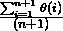
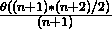

# 算法分析|集合 2(最差、平均和最佳情况)

> 原文:[https://www . geesforgeks . org/analysis-of-algorithms-set-2-渐近分析/](https://www.geeksforgeeks.org/analysis-of-algorithms-set-2-asymptotic-analysis/)

在[之前的帖子](https://www.geeksforgeeks.org/analysis-of-algorithms-set-1-asymptotic-analysis/)中，我们讨论了渐近分析如何克服分析算法的幼稚方式的问题。在这篇文章中，我们将以线性搜索为例，使用渐近分析对其进行分析。
我们可以有三种情况来分析一个算法:
1)最差情况
2)平均情况
3)最佳情况
让我们考虑以下线性搜索的实现。

## C++

```
// C++ implementation of the approach
#include <bits/stdc++.h>
using namespace std;

// Linearly search x in arr[].
// If x is present then return the index,
// otherwise return -1
int search(int arr[], int n, int x)
{
    int i;
    for (i = 0; i < n; i++) {
        if (arr[i] == x)
            return i;
    }
    return -1;
}

// Driver Code
int main()
{
    int arr[] = { 1, 10, 30, 15 };
    int x = 30;
    int n = sizeof(arr) / sizeof(arr[0]);
    cout << x << " is present at index "
         << search(arr, n, x);

    getchar();
    return 0;
}

// This code is contributed
// by Akanksha Rai
```

## C

```
// C implementation of the approach
#include <stdio.h>

// Linearly search x in arr[].
// If x is present then return the index,
// otherwise return -1
int search(int arr[], int n, int x)
{
    int i;
    for (i = 0; i < n; i++) {
        if (arr[i] == x)
            return i;
    }
    return -1;
}

/* Driver program to test above functions*/
int main()
{
    int arr[] = { 1, 10, 30, 15 };
    int x = 30;
    int n = sizeof(arr) / sizeof(arr[0]);
    printf("%d is present at index %d", x,
           search(arr, n, x));

    getchar();
    return 0;
}
```

## Java 语言(一种计算机语言，尤用于创建网站)

```
// Java implementation of the approach

public class GFG {

    // Linearly search x in arr[].  If x is present then
    // return the index, otherwise return -1
    static int search(int arr[], int n, int x)
    {
        int i;
        for (i = 0; i < n; i++) {
            if (arr[i] == x) {
                return i;
            }
        }
        return -1;
    }

    /* Driver program to test above functions*/
    public static void main(String[] args)
    {
        int arr[] = { 1, 10, 30, 15 };
        int x = 30;
        int n = arr.length;
        System.out.printf("%d is present at index %d", x,
                          search(arr, n, x));
    }
}

/*This code is contributed by PrinciRaj1992*/
```

## 蟒蛇 3

```
# Python 3 implementation of the approach

# Linearly search x in arr[]. If x is present
# then return the index, otherwise return -1

def search(arr, x):
    for index, value in enumerate(arr):
        if value == x:
            return index
    return -1

# Driver Code
arr = [1, 10, 30, 15]
x = 30
print(x, "is present at index",
      search(arr, x))

# This code is contributed
# by PrinciRaj1992
```

## C#

```
// C# implementation of the approach
using System;
public class GFG {

    // Linearly search x in arr[].  If x is present then
    // return the index, otherwise return -1
    static int search(int[] arr, int n, int x)
    {
        int i;
        for (i = 0; i < n; i++) {
            if (arr[i] == x) {
                return i;
            }
        }
        return -1;
    }

    /* Driver program to test above functions*/
    public static void Main()
    {
        int[] arr = { 1, 10, 30, 15 };
        int x = 30;
        int n = arr.Length;
        Console.WriteLine(x + " is present at index "
                          + search(arr, n, x));
    }
}

/*This code is contributed by PrinciRaj1992*/
```

## 服务器端编程语言（Professional Hypertext Preprocessor 的缩写）

```
<?php
// PHP implementation of the approach

// Linearly search x in arr[]. If x
// is present then return the index,
// otherwise return -1
function search($arr, $n, $x)
{
    for ($i = 0; $i < $n; $i++)
    {
    if ($arr[$i] == $x)
        return $i;
    }
    return -1;
}

// Driver Code
$arr = array(1, 10, 30, 15);
$x = 30;
$n = sizeof($arr);
echo $x . " is present at index ".
             search($arr, $n, $x);

// This code is contributed
// by Akanksha Rai
```

**输出:**

```
30 is present at index 2
```

**最坏情况分析(通常完成)**
在最坏情况分析中，我们计算算法运行时间的上限。我们必须知道导致执行最大数量操作的情况。对于线性搜索，当要搜索的元素(上面代码中的 x)不在数组中时，会出现最坏的情况。当 x 不存在时，search()函数将其与 arr[]的所有元素逐一进行比较。因此，线性搜索的最坏情况时间复杂度是θ(n)。

**平均案例分析(有时完成)**
在平均案例分析中，我们获取所有可能的输入，并计算所有输入的计算时间。将所有计算值相加，然后将总和除以输入总数。我们必须知道(或预测)病例的分布。对于线性搜索问题，我们假设所有情况都是[均匀分布](http://en.wikipedia.org/wiki/Uniform_distribution_%28discrete%29)(包括数组中不存在 x 的情况)。所以我们把所有的情况相加，然后除以(n+1)。以下是平均时间复杂度的值。

```
Average Case Time =  
```



```
= 
```



```
= Θ(n) 
```

**最佳案例分析(伪造)**
在最佳案例分析中，我们计算算法运行时间的下限。我们必须知道导致执行最少数量操作的情况。在线性搜索问题中，当 x 出现在第一个位置时，出现最佳情况。最佳情况下的运算次数是恒定的(不依赖于 n)。因此，最佳情况下的时间复杂度为θ(1)
大多数情况下，我们进行最坏情况分析来分析算法。在最坏的分析中，我们保证算法运行时间的一个上界是好的信息。
一般的案例分析在大多数实际案例中不容易做，也很少做。在一般情况分析中，我们必须知道(或预测)所有可能输入的数学分布。
最佳案例分析是假的。保证算法的下限不会提供任何信息，因为在最坏的情况下，算法可能需要数年才能运行。
对于某些算法，所有情况都是渐近相同的，即没有最坏和最好的情况。例如[合并排序](http://en.wikipedia.org/wiki/Merge_sort)。合并排序在所有情况下都执行θ(nLogn)操作。大多数其他排序算法都有最坏和最好的情况。例如，在快速排序的典型实现中(其中枢轴被选为角元素)，当输入数组已经被排序时发生最坏的情况，当枢轴元素总是将数组分成两半时发生最好的情况。对于插入排序，最坏的情况发生在数组反向排序时，最好的情况发生在数组以与输出相同的顺序排序时。

https://youtu.be/rlZpZ8es_6k

Next – [Analysis of Algorithms | Set 3 (Asymptotic Notations)](https://www.geeksforgeeks.org/analysis-of-algorithms-set-3asymptotic-notations/) **References:** [MIT’s Video lecture 1 on Introduction to Algorithms](http://www.youtube.com/watch?v=JPyuH4qXLZ0). Please write comments if you find anything incorrect, or you want to share more information about the topic discussed above.