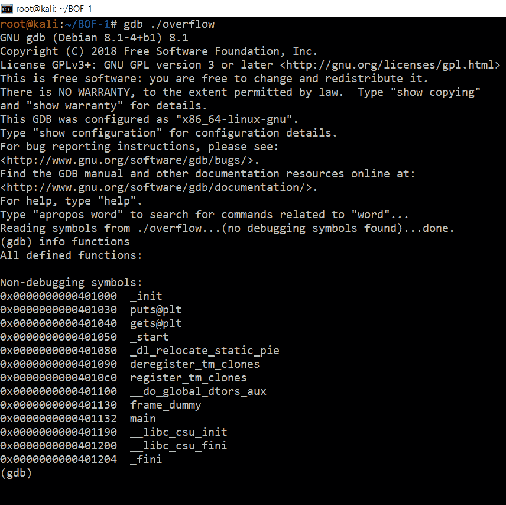
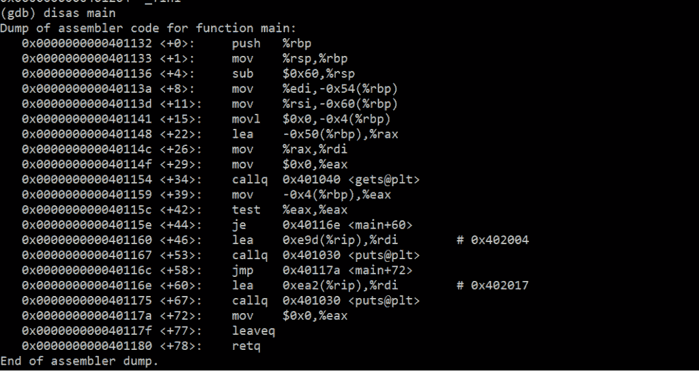
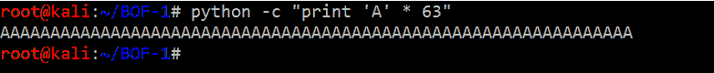
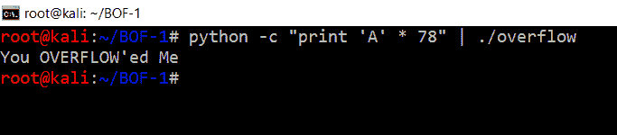
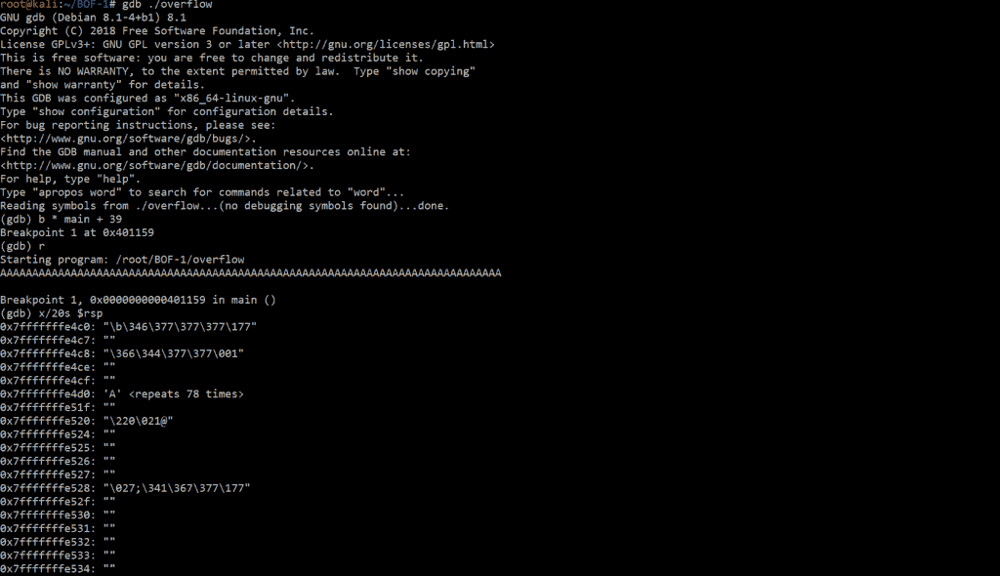

# 用 GDB 分析 BufferOverflow】

> 原文:[https://www . geeksforgeeks . org/analyting-buffer overflow-with-gdb/](https://www.geeksforgeeks.org/analyzing-bufferoverflow-with-gdb/)

**先决条件:** [GDB(分步介绍)](https://www.geeksforgeeks.org/gdb-step-by-step-introduction/)

一个 **[缓冲区溢出](https://www.geeksforgeeks.org/buffer-overflow-attack-with-example/)** 经常发生在定义的变量内的内容被复制到另一个变量而不做**边界检查**或考虑缓冲区的大小。让我们借助内置于每个 Linux 系统中的 [GNU 调试器(GDB)](https://www.geeksforgeeks.org/gdb-step-by-step-introduction/) 来分析缓冲区溢出。

本练习的目的是熟悉调试代码，并了解缓冲区溢出是如何工作的。

```
#include <stdio.h>
#include <stdlib.h>
#include <unistd.h>

int main(int argc, char** argv)
{
    volatile int cantoverflowme;
    char buffer[64];

    cantoverflowme = 0;
    gets(buffer);

    if (cantoverflowme != 0) {
        printf("You OVERFLOW'ed Me\n");
    }
    else {
        printf("Can't Overflow Me\n");
    }
}
```

*   **Step 1**

    让我们用以下标志编译这段代码:

    ```
    gcc overflow.c -o overflow  -fno-stack-protector -z execstack -no-pie 
    ```

    上面的代码将创建一个禁用各种堆栈保护的编译二进制文件

    ```
    -z execstack : Disables Executable Stack
    -fno-stack-protector : Disables Stack Canaries
    -no-pie : Disables Position Independent Executables
    ```

*   **Step 2**

    现在堆栈保护被禁用，我们可以通过键入以下内容在 GDB 加载代码

    ```
    gdb ./overflow
    ```

*   **Step 3**

    代码打开后，我们可以通过键入来查看二进制文件中的函数

    ```
    info functions
    ```

    [](https://contribute.geeksforgeeks.org/wp-content/uploads/fucntions-1.png)

    我们可以看到有一个 get 调用正在被使用，它本质上是脆弱的，因为它不做任何绑定检查。

*   **Step 4**

    让我们打字

    ```
    disas main
    ```

    并拆解主功能
    [](https://contribute.geeksforgeeks.org/wp-content/uploads/daiss.png)

*   **Step 5**

    让我们键入一个断点

    ```
    b * main+39
    ```

    这样我们就可以在程序遇到断点时分析堆栈的内容。

*   **Step 6**

    类型

    ```
    r
    ```

    运行代码并输入任意数量的 A，正如我们从上面的代码中已经知道的那样。
    我们输入 **63 A 和 78 A**看看结果的变化。

*   **Step 7**

    离开 GDB 后，您可以通过键入 python 代码来打印 A。

    ```
    python -c "print 'A' * 63"
    ```

    [](https://contribute.geeksforgeeks.org/wp-content/uploads/A-2.png)
*   **Step 8**

    现在我们有了 63 A，让我们运行代码，并在它要求我们输入时粘贴它。
    [](https://contribute.geeksforgeeks.org/wp-content/uploads/A-2.png)

    让我们再次尝试整个过程，这次让我们输入任意数量的 A，比如说 78。

    一个很酷的方法是

    ```
    python -c "print 'A' * 78" | ./overflow
    ```

    [](https://contribute.geeksforgeeks.org/wp-content/uploads/over.png)

    正如我们所看到的，一旦**溢出发生**它就会改变变量，因为内存在堆栈上泄漏，并且改变了变量值

*   **Step 9**

    让我们检查它重写的堆栈，因此我们必须在

    ```
    main+39
    ```

    然后打字

    ```
    r
    ```

    然后我们可以打字

    ```
    x/20s $rsp
    ```

    ```
    x : eXamine
    20s : 20 values in string
    $rsp : for register RSP (Stack Pointer)
    ```

    [](https://contribute.geeksforgeeks.org/wp-content/uploads/78-3.png)

    因此我们可以看到 **78 A 是如何被写入堆栈并溢出内存**的。