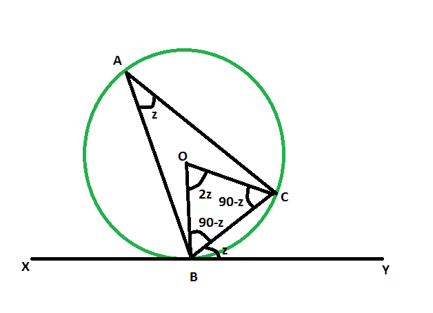

# 当给定交替线段中的角度时，弦和切线之间的角度

> 原文:[https://www . geeksforgeeks . org/给定交替线段中的角度时弦与切线之间的角度/](https://www.geeksforgeeks.org/angle-between-a-chord-and-a-tangent-when-angle-in-the-alternate-segment-is-given/)

给定一个圆，它的弦和切线在一个特定的点相交。给出了交替线段的角度。这里的任务是找到弦和切线之间的角度。
**例:**

```
Input: z = 48
Output: 48 degrees

Input: z = 64
Output: 64 degrees
```



**接近** :

*   让，角度**back**是交替线段中的给定角度。
*   让，弦与圆之间的角度=角度 **CBY** = **z**
*   因为从切线中心画出的线是垂直的，
*   所以，角度 **OBC = 90-z**
*   as， **OB** = **OC** =圆的半径
*   所以，角度 **OCB = 90-z**
*   现在，在三角形中 **OBC** 、
    T3】角 OBC +角 OCB +角 BOC = 180
    **角 BOC = 180 –( 90-z)–(90-z)**
    **角 BOC = 2z**
*   由于圆周上的角度是同一圆弧对着的中心角度的一半，
    所以，角度 **BAC = z**
*   因此，**角度 BAC =角度 CBY**


以下是上述方法的实施:

## C++

```
// C++ program to find the angle
// between a chord and a tangent
// when angle in the alternate segment is given

#include <bits/stdc++.h>
using namespace std;

void anglechordtang(int z)
{
    cout << "The angle between tangent"
         << " and the chord is "
         << z << " degrees" << endl;
}

// Driver code
int main()
{
    int z = 48;
    anglechordtang(z);
    return 0;
}
```

## Java 语言(一种计算机语言，尤用于创建网站)

```
// Java program to find the angle
// between a chord and a tangent
// when angle in the alternate segment is given
import java.io.*;

class GFG
{

    static void anglechordtang(int z)
    {
        System.out.print( "The angle between tangent"
            + " and the chord is "
            + z + " degrees");
    }

    // Driver code
    public static void main (String[] args)
    {
        int z = 48;
        anglechordtang(z);
    }
}

// This code is contributed by anuj_67..
```

## 蟒蛇 3

```
# Python3 program to find the angle
# between a chord and a tangent
# when angle in the alternate segment is given
def anglechordtang(z):

    print("The angle between tangent",
          "and the chord is", z , "degrees");

# Driver code
z = 48;
anglechordtang(z);

# This code is contributed
# by Princi Singh
```

## C#

```
// C# program to find the angle
// between a chord and a tangent
// when angle in the alternate segment is given
using System;

class GFG
{

    static void anglechordtang(int z)
    {
        Console.WriteLine( "The angle between tangent"
            + " and the chord is "
            + z + " degrees");
    }

    // Driver code
    public static void Main ()
    {
        int z = 48;
        anglechordtang(z);
    }
}

// This code is contributed by anuj_67..
```

## java 描述语言

```
<script>
// javascript program to find the angle
// between a chord and a tangent
// when angle in the alternate segment is given

function anglechordtang(z)
{
document.write( "The angle between tangent"
               + " and the chord is "
               + z + " degrees");
}

// Driver code

var z = 48;
anglechordtang(z);

// This code is contributed by Amit Katiyar

</script>
```

**Output:** 

```
The angle between tangent and the chord is 48 degrees
```