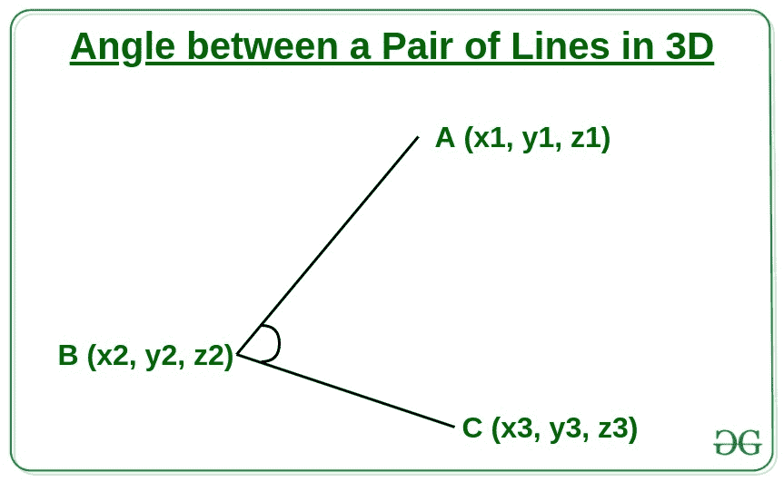
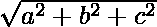
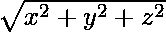

# 3D 中一对直线之间的角度

> 原文:[https://www . geesforgeks . org/3d 线对之间的角度/](https://www.geeksforgeeks.org/angle-between-a-pair-of-lines-in-3d/)

给定三维平面内的三个点 **A(x1，y1，z1)、B(x2，y2，z2)** 、**和 C(x3，y3，z3)** 的坐标，其中 **B** 是直线 **AB** 和 **BC** 的交点，任务是求直线 **AB 和 BC** 之间的夹角。



**例:**

> **输入:** x1 = 1，y1 = 3，Z1 = 3；x2 = 3，y2 = 4，z2 = 5；x3 = 5，y3 = 6，z3 = 9；
> **输出:** 54.6065
> **输入:** x1 = 10，y1 = 10，z1 = 10x2 = 0，y2 = 0，z2 = 0；x3 = 15，y3 = 10，z3 = 15
> **产量:** 56.4496

**进场:**

1.求直线 **AB** 和 **BC** 的方程，方向比给定的坐标为:

> AB =(x1–x2)I+(y1–y2)j+(Z1–z2)k
> BC =(x3–x2)I+(y3–y2)j+(z3–z2)k

2.用[cosθ](https://www.geeksforgeeks.org/java-math-cos-method-examples/)的公式求 AB 线和 BC 线的两个方向比，求 AB 线和 BC 线夹角的余弦为:

> ```
> *** QuickLaTeX cannot compile formula:
>  
> 
> *** Error message:
> Error: Nothing to show, formula is empty
> 
> ```
> 
> 其中，
> AB。BC 是方向比 AB 和 BC 的点积。
> |AB|是 AB 线的量级
> |BC|是 BC 线的量级

3.假设有两个方向比:

```
A = ai + bj + ck
B = xi + yj + zk
```

然后

> 点积(A . B)= A * x+B * y+c * z
> A 的量值= | A | =
> B 的量值= |B| = 

4.计算角度的余弦值给出了弧度的余弦值。要找到角度，将余弦值乘以**(180/**[**)π**](https://www.geeksforgeeks.org/pi-in-c-with-examples/)**)**。

以下是上述方法的实现:

## C++

```
// C++ program for the above approach

#include "bits/stdc++.h"
#define PI 3.14
using namespace std;

// Function to find the angle between
// the two lines
void calculateAngle(
    int x1, int y1, int z1,
    int x2, int y2, int z2,
    int x3, int y3, int z3)
{
    // Find direction ratio of line AB
    int ABx = x1 - x2;
    int ABy = y1 - y2;
    int ABz = z1 - z2;

    // Find direction ratio of line BC
    int BCx = x3 - x2;
    int BCy = y3 - y2;
    int BCz = z3 - z2;

    // Find the dotProduct
    // of lines AB & BC
    double dotProduct
        = ABx * BCx
          + ABy * BCy
          + ABz * BCz;

    // Find magnitude of
    // line AB and BC
    double magnitudeAB
        = ABx * ABx
          + ABy * ABy
          + ABz * ABz;
    double magnitudeBC
        = BCx * BCx
          + BCy * BCy
          + BCz * BCz;

    // Find the cosine of
    // the angle formed
    // by line AB and BC
    double angle = dotProduct;
    angle /= sqrt(
        magnitudeAB * magnitudeBC);

    // Find angle in radian
    angle = (angle * 180) / PI;

    // Print the angle
    cout << abs(angle) << endl;
}

// Driver Code
int main()
{

    // Given coordinates
    // Points A
    int x1 = 1, y1 = 3, z1 = 3;

    // Points B
    int x2 = 3, y2 = 4, z2 = 5;

    // Points C
    int x3 = 5, y3 = 6, z3 = 9;

    // Function Call
    calculateAngle(x1, y1, z1,
                   x2, y2, z2,
                   x3, y3, z3);

    return 0;
}
```

## Java 语言(一种计算机语言，尤用于创建网站)

```
// Java program for the above approach
import java.util.*;

class GFG{

// Function to find the angle
// between the two lines
static void calculateAngle(int x1, int y1, int z1,
                           int x2, int y2, int z2,
                           int x3, int y3, int z3)
{

    // Find direction ratio of line AB
    int ABx = x1 - x2;
    int ABy = y1 - y2;
    int ABz = z1 - z2;

    // Find direction ratio of line BC
    int BCx = x3 - x2;
    int BCy = y3 - y2;
    int BCz = z3 - z2;

    // Find the dotProduct
    // of lines AB & BC
    double dotProduct = ABx * BCx +
                        ABy * BCy +
                        ABz * BCz;

    // Find magnitude of
    // line AB and BC
    double magnitudeAB = ABx * ABx +
                         ABy * ABy +
                         ABz * ABz;
    double magnitudeBC = BCx * BCx +
                         BCy * BCy +
                         BCz * BCz;

    // Find the cosine of the
    // angle formed by line
    // AB and BC
    double angle = dotProduct;
    angle /= Math.sqrt(magnitudeAB * magnitudeBC);

    // Find angle in radian
    angle = (angle * 180) / 3.14;

    // Print the angle
    System.out.printf("%.4f", Math.abs(angle));
}

// Driver code
public static void main(String[] args)
{

    // Given coordinates
    // Points A
    int x1 = 1, y1 = 3, z1 = 3;

    // Points B
    int x2 = 3, y2 = 4, z2 = 5;

    // Points C
    int x3 = 5, y3 = 6, z3 = 9;

    // Function Call
    calculateAngle(x1, y1, z1,
                   x2, y2, z2,
                   x3, y3, z3);
}
}

// This code is contributed by offbeat
```

## 蟒蛇 3

```
# Python3 program for the above approach
import math

# Function to find the angle
# between the two lines
def calculateAngle(x1, y1, z1,
                   x2, y2, z2,
                   x3, y3, z3):

    # Find direction ratio of line AB
    ABx = x1 - x2;
    ABy = y1 - y2;
    ABz = z1 - z2;

    # Find direction ratio of line BC
    BCx = x3 - x2;
    BCy = y3 - y2;
    BCz = z3 - z2;

    # Find the dotProduct
    # of lines AB & BC
    dotProduct = (ABx * BCx +
                  ABy * BCy +
                  ABz * BCz);

    # Find magnitude of
    # line AB and BC
    magnitudeAB = (ABx * ABx +
                   ABy * ABy +
                   ABz * ABz);
    magnitudeBC = (BCx * BCx +
                   BCy * BCy +
                   BCz * BCz);

    # Find the cosine of
    # the angle formed
    # by line AB and BC
    angle = dotProduct;
    angle /= math.sqrt(magnitudeAB *
                       magnitudeBC);

    # Find angle in radian
    angle = (angle * 180) / 3.14;

    # Print angle
    print(round(abs(angle), 4))

# Driver Code
if __name__=='__main__':

    # Given coordinates
    # Points A
    x1, y1, z1 = 1, 3, 3;

    # Points B
    x2, y2, z2 = 3, 4, 5;

    # Points C
    x3, y3, z3 = 5, 6, 9;

    # Function Call
    calculateAngle(x1, y1, z1,
                   x2, y2, z2,
                   x3, y3, z3);

# This code is contributed by AbhiThakur
```

## C#

```
// C# program for the above approach
using System;
class GFG{

// Function to find the angle
// between the two lines
static void calculateAngle(int x1, int y1,
                           int z1, int x2,
                           int y2, int z2,
                           int x3, int y3,
                           int z3)
{

    // Find direction ratio of line AB
    int ABx = x1 - x2;
    int ABy = y1 - y2;
    int ABz = z1 - z2;

    // Find direction ratio of line BC
    int BCx = x3 - x2;
    int BCy = y3 - y2;
    int BCz = z3 - z2;

    // Find the dotProduct
    // of lines AB & BC
    double dotProduct = ABx * BCx +
                        ABy * BCy +
                        ABz * BCz;

    // Find magnitude of
    // line AB and BC
    double magnitudeAB = ABx * ABx +
                         ABy * ABy +
                         ABz * ABz;
    double magnitudeBC = BCx * BCx +
                         BCy * BCy +
                         BCz * BCz;

    // Find the cosine of the
    // angle formed by line
    // AB and BC
    double angle = dotProduct;
    angle /= Math.Sqrt(magnitudeAB *
                       magnitudeBC);

    // Find angle in radian
    angle = (angle * 180) / 3.14;

    // Print the angle
    Console.Write(String.Format("{0:F4}", Math.Abs(angle)));
}

// Driver code
public static void Main()
{

    // Given coordinates
    // Points A
    int x1 = 1, y1 = 3, z1 = 3;

    // Points B
    int x2 = 3, y2 = 4, z2 = 5;

    // Points C
    int x3 = 5, y3 = 6, z3 = 9;

    // Function Call
    calculateAngle(x1, y1, z1,
                   x2, y2, z2,
                   x3, y3, z3);
}
}

// This code is contributed by Code_Mech
```

## java 描述语言

```
<script>

// Javascript program for the above approach

var PI = 3.14;

// Function to find the angle between
// the two lines
function calculateAngle(
    x1, y1, z1,
    x2, y2, z2,
    x3, y3, z3)
{
    // Find direction ratio of line AB
    var ABx = x1 - x2;
    var ABy = y1 - y2;
    var ABz = z1 - z2;

    // Find direction ratio of line BC
    var BCx = x3 - x2;
    var BCy = y3 - y2;
    var BCz = z3 - z2;

    // Find the dotProduct
    // of lines AB & BC
    var dotProduct
        = ABx * BCx
          + ABy * BCy
          + ABz * BCz;

    // Find magnitude of
    // line AB and BC
    var magnitudeAB
        = ABx * ABx
          + ABy * ABy
          + ABz * ABz;
    var magnitudeBC
        = BCx * BCx
          + BCy * BCy
          + BCz * BCz;

    // Find the cosine of
    // the angle formed
    // by line AB and BC
    var angle = dotProduct;
    angle /= Math.sqrt(
        magnitudeAB * magnitudeBC);

    // Find angle in radian
    angle = (angle * 180) / PI;

    // Prvar the angle
    document.write(Math.abs(angle).toFixed(4));
}

// Driver Code
// Given coordinates
// Povars A
var x1 = 1, y1 = 3, z1 = 3;
// Povars B
var x2 = 3, y2 = 4, z2 = 5;
// Povars C
var x3 = 5, y3 = 6, z3 = 9;
// Function Call
calculateAngle(x1, y1, z1,
               x2, y2, z2,
               x3, y3, z3);

</script>
```

**Output:** 

```
54.6065
```