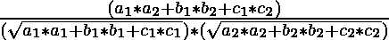

# 3D 中两个平面之间的角度

> 原文:[https://www . geeksforgeeks . org/3d 双面夹角/](https://www.geeksforgeeks.org/angle-between-two-planes-in-3d/)

给定两个平面 **P1:** a1 * x + b1 * y + c1 * z + d1 = 0， **P2:** a2 * x + b2 * y + c2 * z + d2 = 0。任务是在 3D 中找到这两个平面之间的角度。


**例:**

> **输入:** a1 = 1，b1 = 1，c1 = 2，d1 = 1，a2 = 2，b2 = -1，c2 = 1，D2 =-4
> T3】输出:角度为 60.0 度
> T6】输入: a1 = 2，b1 = 2，c1 = -3，d1 = -5，a2 = 3，b2 = -3，c2 = 5，D2 =-6
> T9】输出:角度为 123.69655

**方法:**考虑以下给定两个平面的方程:

```
P1 : a1 * x + b1 * y + c1 * z + d1 = 0 and,
P2 : a2 * x + b2 * y + c2 * z + d2 = 0, 
```

其中 a1、b1、c1 和 a2、b2、c2 是垂直于 P1 和 P2 平面的方向比。
两个平面之间的角度等于平面的法向量所确定的角度。
这些平面之间的角度通过使用以下公式给出:-
Cos A = 
使用逆性质，我们得到:
A = 
以下是上述公式的实现:

## C++

```
// C++ program to find
// the Angle between
// two Planes in 3 D.
#include <bits/stdc++.h>
#include<math.h>

using namespace std;

// Function to find Angle
void distance(float a1, float b1,
              float c1, float a2,
              float b2, float c2)
{
    float d = (a1 * a2 + b1 *
               b2 + c1 * c2);
    float e1 = sqrt(a1 * a1 + b1 *
                    b1 + c1 * c1);
    float e2 = sqrt(a2 * a2 + b2 *
                    b2 + c2 * c2);
    d = d / (e1 * e2);
    float pi = 3.14159;
    float A = (180 / pi) * (acos(d));
    cout << "Angle is "
         << A << " degree";
}

// Driver Code
int main()
{
    float a1 = 1;
    float b1 = 1;
    float c1 = 2;
    float d1 = 1;
    float a2 = 2;
    float b2 = -1;
    float c2 = 1;
    float d2 = -4;
    distance(a1, b1, c1,
             a2, b2, c2);
    return 0;
}

// This code is contributed
// by Akanksha Rai(Abby_akku)
```

## C

```
// C program to find
// the Angle between
// two Planes in 3 D.
#include<stdio.h>
#include<math.h>

// Function to find Angle
void distance(float a1, float b1,
              float c1, float a2,
              float b2, float c2)
{
    float d = (a1 * a2 + b1 *
               b2 + c1 * c2);
    float e1 = sqrt(a1 * a1 + b1 *
                    b1 + c1 * c1);
    float e2 = sqrt(a2 * a2 + b2 *
                    b2 + c2 * c2);
    d = d / (e1 * e2);
    float pi = 3.14159;
    float A = (180 / pi) * (acos(d));
    printf("Angle is %.2f degree", A);
}

// Driver Code
int main()
{
    float a1 = 1;
    float b1 = 1;
    float c1 = 2;
    float d1 = 1;
    float a2 = 2;
    float b2 = -1;
    float c2 = 1;
    float d2 = -4;
    distance(a1, b1, c1,
             a2, b2, c2);
    return 0;
}

// This code is contributed
// by Amber_Saxena.
```

## Java 语言(一种计算机语言，尤用于创建网站)

```
// Java program to find
// the Angle between
// two Planes in 3 D.
import java .io.*;
import java.lang.Math;

class GFG
{

// Function to find Angle
static void distance(float a1, float b1,
                     float c1, float a2,
                     float b2, float c2)
{

    float d = (a1 * a2 + b1 *
               b2 + c1 * c2);
    float e1 = (float)Math.sqrt(a1 * a1 + b1 *
                                b1 + c1 * c1);
    float e2 = (float)Math.sqrt(a2 * a2 + b2 *
                                b2 + c2 * c2);
    d = d / (e1 * e2);
    float pi = (float)3.14159;
    float A = (180 / pi) * (float)(Math.acos(d));
    System.out.println("Angle is "+ A +" degree");
}

// Driver code
public static void main(String[] args)
{
    float a1 = 1;
    float b1 = 1;
    float c1 = 2;
    float d1 = 1;
    float a2 = 2;
    float b2 = -1;
    float c2 = 1;
    float d2 = -4;
    distance(a1, b1, c1,
             a2, b2, c2);
}
}

// This code is contributed
// by Amber_Saxena.
```

## 计算机编程语言

```
# Python program to find the Angle between
# two Planes in 3 D.

import math

# Function to find Angle
def distance(a1, b1, c1, a2, b2, c2):

    d = ( a1 * a2 + b1 * b2 + c1 * c2 )
    e1 = math.sqrt( a1 * a1 + b1 * b1 + c1 * c1)
    e2 = math.sqrt( a2 * a2 + b2 * b2 + c2 * c2)
    d = d / (e1 * e2)
    A = math.degrees(math.acos(d))
    print("Angle is"), A, ("degree")

# Driver Code
a1 = 1
b1 = 1
c1 = 2
d1 = 1
a2 = 2
b2 = -1
c2 = 1
d2 = -4
distance(a1, b1, c1, a2, b2, c2) 
```

## C#

```
// C# program to find
// the Angle between
// two Planes in 3 D.
using System;

class GFG
{

// Function to find Angle
static void distance(float a1, float b1,
                     float c1, float a2,
                      float b2, float c2)
{

    float d = (a1 * a2 + b1 *
               b2 + c1 * c2);
    float e1 = (float)Math.Sqrt(a1 * a1 + b1 *
                                b1 + c1 * c1);
    float e2 = (float)Math.Sqrt(a2 * a2 + b2 *
                                b2 + c2 * c2);
    d = d / (e1 * e2);
    float pi = (float)3.14159;
    float A = (180 / pi) * (float)(Math.Acos(d));
    Console.Write("Angle is "+ A +" degree");
}

// Driver code
public static void Main()
{
    float a1 = 1;
    float b1 = 1;
    float c1 = 2;
    float a2 = 2;
    float b2 = -1;
    float c2 = 1;

    distance(a1, b1, c1,
            a2, b2, c2);
}
}

// This code is contributed
// by ChitraNayal
```

## 服务器端编程语言（Professional Hypertext Preprocessor 的缩写）

```
<?php
// PHP program to find the Angle
// between two Planes in 3 D.

// Function to find Angle
function distance($a1, $b1,
                  $c1, $a2,
                  $b2, $c2)
{
    $d = ($a1 * $a2 + $b1 *
          $b2 + $c1 * $c2);
    $e1 = sqrt($a1 * $a1 + $b1 *
               $b1 + $c1 * $c1);
    $e2 = sqrt($a2 * $a2 + $b2 *
               $b2 + $c2 * $c2);
    $d = $d / ($e1 * $e2);
    $pi = 3.14159;
    $A = (180 / $pi) * (acos($d));
    echo sprintf("Angle is %.2f degree", $A);
}

// Driver Code
$a1 = 1;
$b1 = 1;
$c1 = 2;
$d1 = 1;
$a2 = 2;
$b2 = -1;
$c2 = 1;
$d2 = -4;
distance($a1, $b1, $c1,
         $a2, $b2, $c2);   

// This code is contributed
// by Amber_Saxena.
?>
```

## java 描述语言

```
<script>

      // JavaScript program to find
      // the Angle between
      // two Planes in 3 D.
      // Function to find Angle

      function distance(a1, b1, c1, a2, b2, c2)
      {
        var d = a1 * a2 + b1 * b2 + c1 * c2;
        var e1 = Math.sqrt(a1 * a1 + b1 * b1 + c1 * c1);
        var e2 = Math.sqrt(a2 * a2 + b2 * b2 + c2 * c2);
        d = parseFloat(d / (e1 * e2));
        var pi = 3.14159;
        var A = (180 / pi) * Math.acos(d);
        document.write("Angle is " + A.toFixed(1) + " degree");
      }

      // Driver Code
      var a1 = 1;
      var b1 = 1;
      var c1 = 2;
      var d1 = 1;
      var a2 = 2;
      var b2 = -1;
      var c2 = 1;
      var d2 = -4;
      distance(a1, b1, c1, a2, b2, c2);

</script>
```

**Output:** 

```
Angle is 60.0 degree
```