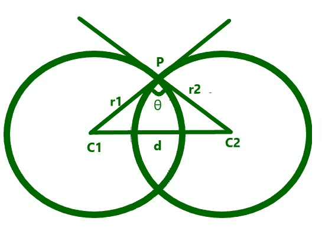
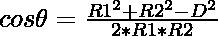

# 圆心相距 D 的两个圆的交角

> 原文:[https://www . geeksforgeeks . org/两个圆心相距 d 距离的相交角/](https://www.geeksforgeeks.org/angle-of-intersection-of-two-circles-having-their-centers-d-distance-apart/)

给定两个正整数 **R1** 和 **R2** 表示两个圆心之间有距离 **D** 的相交圆的半径，任务是求两个圆交角的余弦。

**示例:**

> **输入:** R1 = 3，R2 = 4，D = 5
> T3】输出: 0
> 
> **输入:** R1 = 7，R2 = 3，D = 6
> T3】输出: 0.52381

**方法:**给定的问题可以通过使用如下所示的[几何算法](https://www.geeksforgeeks.org/geometric-algorithms/)来解决:

> [](https://media.geeksforgeeks.org/wp-content/uploads/20210318002608/cir.png)
> 
> 从上图，利用[勾股定理](https://www.geeksforgeeks.org/generate-pythagoras-triplet-single-integer/)，两个圆交角的余弦可以用公式求出:
> 
> 

下面是上述方法的实现:

## C++

```
// C++ program for the above approach
#include <bits/stdc++.h>
using namespace std;

// Function to find the cosine of the
// angle of the intersection of two
// circles with radius R1 and R2
float angle(float R1, float R2, float D)
{
    float ans = (R1 * R1 + R2 * R2 - D * D)
                / (2 * R1 * R2);

    // Return the cosine of the angle
    return ans;
}

// Driver Code
int main()
{
    float R1 = 3, R2 = 4;
    float D = 5;
    cout << angle(R1, R2, D);

    return 0;
}
```

## Java 语言(一种计算机语言，尤用于创建网站)

```
// Java program for the above approach
import java.io.*;

class GFG{

// Function to find the cosine of the
// angle of the intersection of two
// circles with radius R1 and R2
static float angle(float R1, float R2, float D)
{
    float ans = (R1 * R1 + R2 * R2 - D * D) /
               (2 * R1 * R2);

    // Return the cosine of the angle
    return ans;
}

// Driver Code
public static void main (String[] args)
{
    float R1 = 3, R2 = 4;
    float D = 5;

    System.out.println(angle(R1, R2, D));
}
}

// This code is contributed by Ankita saini
```

## 蟒蛇 3

```
# Python3 program for the above approach

# Function to find the cosine of the
# angle of the intersection of two
# circles with radius R1 and R2
def angle(R1, R2, D):

    ans = ((R1 * R1 + R2 * R2 - D * D) /
            (2 * R1 * R2))

    # Return the cosine of the angle
    return ans

# Driver Code
if __name__ == '__main__':

    R1 = 3
    R2 = 4
    D = 5

    print(angle(R1, R2, D))

# This code is contributed by ipg2016107
```

## C#

```
// C# program for the above approach
using System;

class GFG{

// Function to find the cosine of the
// angle of the intersection of two
// circles with radius R1 and R2
static float angle(float R1, float R2, float D)
{
    float ans = (R1 * R1 + R2 * R2 - D * D) /
               (2 * R1 * R2);

    // Return the cosine of the angle
    return ans;
}

// Driver Code
public static void Main(string[] args)
{
    float R1 = 3, R2 = 4;
    float D = 5;

    Console.Write(angle(R1, R2, D));
}
}

// This code is contributed by rutvik_56.
```

## java 描述语言

```
<script>

// Javascript program for the above approach 

// Function to find the cosine of the
// angle of the intersection of two
// circles with radius R1 and R2
function angle(R1, R2, D)
{
    var ans = (R1 * R1 + R2 * R2 - D * D) /
               (2 * R1 * R2);

    // Return the cosine of the angle
    return ans;
}

// Driver Code
var R1 = 3, R2 = 4;
var D = 5;

document.write(angle(R1, R2, D));

// This code is contributed by Ankita saini

</script>
```

**Output:** 

```
0
```

**时间复杂度:**O(1)
T3】辅助空间: O(1)