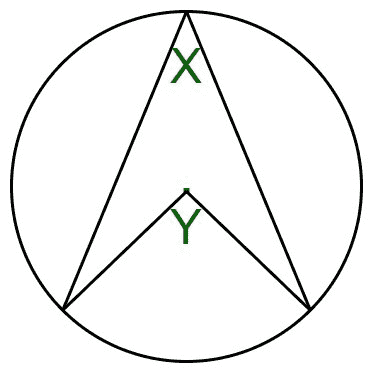

# 圆心处圆弧对着的角度

> 原文:[https://www . geeksforgeeks . org/以圆心为弧对着的角度/](https://www.geeksforgeeks.org/angle-subtended-by-an-arc-at-the-centre-of-a-circle/)

给定圆弧对着圆周 X 的角度，任务是找出圆弧对着圆心的角度。
对于下图中的 eg，给你一个角度 X，你必须找到角度 y。



**例:**

> **输入:** X = 30
> **输出:** 60
> **输入:** X = 90
> **输出:** 180

**进场:**

*   当我们画半径 AD 和弦 CB 时，我们得到三个小三角形。
*   三个三角形 ABC、ADB 和 ACD 是等腰的，因为 AB、AC 和 AD 是圆的半径。
*   所以在每个三角形中，两个锐角(s，t 和 u)相等。
*   从图中我们可以看到

```
D = t + u (i)
```

*   在三角形 ABC 中，

```
s + s + A = 180 (angles in triangle)
ie, A = 180 - 2s  (ii)
```

*   在三角形 BCD 中，

```
(t + s) + (s + u) + (u + t) = 180 (angles in triangle again)
so 2s + 2t + 2u = 180
ie 2t + 2u = 180 - 2s (iii)

```

```
A = 2t + 2u = 2D from (i), (ii)  and (iii)
```

*   因此证明了中心的角度是圆周角度的两倍。

以下是上述方法的实现:

## C++

```
// C++ implementation of the approach

#include <bits/stdc++.h>
using namespace std;

// Function to find Angle
// subtended by an arc
// at the centre of a circle
int angle(int n)
{
    return 2 * n;
}

// Driver code
int main()
{
    int n = 30;
    cout << angle(n);

    return 0;
}
```

## Java 语言(一种计算机语言，尤用于创建网站)

```
// Java implementation of the approach
import java.io.*;

class GFG
{

// Function to find Angle subtended
// by an arc at the centre of a circle
static int angle(int n)
{
    return 2 * n;
}

// Driver code
public static void main (String[] args)
{
    int n = 30;
    System.out.println(angle(n));
}
}

// This code is contributed by ajit.
```

## 蟒蛇 3

```
# Python3 implementation of the approach

# Function to find Angle
# subtended by an arc
# at the centre of a circle
def angle(n):
    return 2 * n

# Driver code
n = 30
print(angle(n))

# This code is contributed by Mohit Kumar
```

## C#

```
// C# implementation of the approach
using System;

class GFG
{

// Function to find Angle subtended
// by an arc at the centre of a circle
static int angle(int n)
{
    return 2 * n;
}

// Driver code
public static void Main()
{
    int n = 30;
    Console.Write(angle(n));
}
}

// This code is contributed by Akanksha_Rai
```

## java 描述语言

```
<script>
// JavaScript implementation of the approach

// Function to find Angle
// subtended by an arc
// at the centre of a circle
function angle(n)
{
    return 2 * n;
}

// Driver code

    let n = 30;
    document.write(angle(n));

// This code is contributed by Surbhi Tyagi.

</script>
```

**Output:** 

```
60
```

**时间复杂度:** O(1)