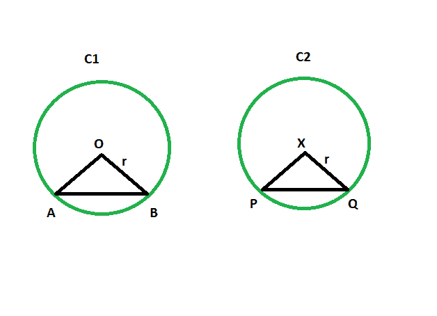

# 当给定全等圆的另一相等弦对着的角度时，弦对着圆心的角度

> 原文:[https://www . geesforgeks . org/当给定全等圆的另一个等弦线对着的角度时，弦线对着圆心的角度/](https://www.geeksforgeeks.org/angle-subtended-by-the-chord-to-center-of-the-circle-when-the-angle-subtended-by-the-another-equal-chord-of-a-congruent-circle-is-given/)

给定两个相等弦的全等圆。给出了其中一个圆的弦对着中心的角度。任务是找到弦对着另一个圆的中心的角度。
**例:**

```
Input: z = 48
Output: 48 degrees

Input: z = 93
Output: 93 degrees
```



**接近** :

*   在三角形 **AOB** 和**PXQ**T4】

```
AO = PX(radii of congruent circles)
BO = QX(radii of congruent circles)
AB = PQ(equal chords)
```

*   所以，三角形 **AOB** 与三角形 **PXQ**
    是**全等**
*   所以，角度 **AOB** =角度**PXQ**T4】

> **全等圆的等弦对着它们中心的等角。**

以下是上述方法的实现:

## C++

```
// C++ program to find the angle subtended by the chord
// to the centre of the circle when the angle subtended
// by another equal chord of a congruent circle is given

#include <bits/stdc++.h>
using namespace std;

void anglequichord(int z)
{
    cout << "The angle is " << z
         << " degrees" << endl;
}

// Driver code
int main()
{
    int z = 48;
    anglequichord(z);
    return 0;
}
```

## Java 语言(一种计算机语言，尤用于创建网站)

```
// Java program to find the angle subtended by the chord
// to the centre of the circle when the angle subtended
// by another equal chord of a congruent circle is given

import java.io.*;

class GFG
{

static void anglequichord(int z)
{
    System.out.println ("The angle is " + z + " degrees");
}

// Driver code
public static void main (String[] args)
{

    int z = 48;
    anglequichord(z);

}
}
```

## 蟒蛇 3

```
# Python 3 program to find the angle subtended by the chord
# to the centre of the circle when the angle subtended
# by another equal chord of a congruent circle is given

def anglequichord(z):
    print ("The angle is " , z
        , " degrees")

# Driver code
if __name__ == "__main__":
    z = 48
    anglequichord(z)

# This code is contributed by ChitraNayal
```

## C#

```
// C# program to find the angle subtended by the chord
// to the centre of the circle when the angle subtended
// by another equal chord of a congruent circle is given
using System;

class GFG
{

    static void anglequichord(int z)
    {
        Console.WriteLine("The angle is " + z + " degrees");
    }

    // Driver code
    public static void Main ()
    {

        int z = 48;
        anglequichord(z);
    }
}

// This code is contributed by AnkitRai01
```

## java 描述语言

```
<script>
// javascript program to find the angle subtended by the chord
// to the centre of the circle when the angle subtended
// by another equal chord of a congruent circle is given

function anglequichord(z)
{
    document.write("The angle is " + z + " degrees");
}

// Driver code

var z = 48;
anglequichord(z);

// This code is contributed by Amit Katiyar

</script>
```

**Output:** 

```
The angle is 48 degrees
```