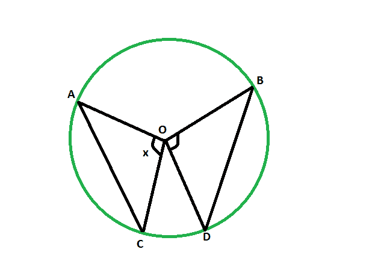

# 当给定另一个相同长度的弦对着的角度时，弦对着的角度

> 原文:[https://www . geesforgeks . org/当给定相同长度的另一个弦对着的角度时，弦对着的角度/](https://www.geeksforgeeks.org/angle-subtended-by-the-chord-when-the-angle-subtended-by-another-chord-of-same-length-is-given/)

给定一个有两个等长弦的圆。给出了其中一根弦对着中心的角度。这里的任务是找到中心另一个弦对着的角度的度量。
**例:**

```
Input: 48
Output: 48 degrees

Input: 82
Output: 82 degrees
```



**逼近** :
让**AC**T41**BD**是圆心在 **O** 的圆的两个相等弦。让弦 **AC** 对着的角度为 **x** 度。
现在，三角形**中的
AOC**T42**BOD**、
T20】AO = OB(同圆半径)
**AB = CD** (等弦)
T26】OC = OD(同圆半径)
那么，三角形**AOC**&T31】BOD 就是

> ****圆的等弦在中心对着等角。****

**以下是上述方法的实现:** 

## **C++**

```
// C++ program to find the angle
// subtended at the center by the chord
// when the angle subtended at center
// by another chord of equal length is given

#include <bits/stdc++.h>
using namespace std;

void angleequichord(int z)
{
    cout << "The angle subtended at the center is "
         << z << " degrees" << endl;
}

// Driver code
int main()
{
    int z = 48;
    angleequichord(z);
    return 0;
}
```

## **Java 语言(一种计算机语言，尤用于创建网站)**

```
// Java program to find the angle
// subtended at the center by the chord
// when the angle subtended at center
// by another chord of equal length is given

import java.io.*;

class GFG
{

static void angleequichord(int z)
{
    System.out.println ( "The angle subtended at the center is "+
        z + " degrees");
}

// Driver code
public static void main (String[] args)
{

    int z = 48;
    angleequichord(z);
}
}

// This code is contributed by ajit.
```

## **蟒蛇 3**

```
# Python3 program to find the angle
# subtended at the center by the chord
# when the angle subtended at center
# by another chord of equal length is given

def angleequichord(z) :

    print("The angle subtended at",
          "the center is", z ,"degrees" );

# Driver code
if __name__ == "__main__" :

    z = 48;
    angleequichord(z);

# This code is contributed by AnkitRai01
```

## **C#**

```
// C# program to find the angle
// subtended at the center by the chord
// when the angle subtended at center
// by another chord of equal length is given
using System;

class GFG
{

static void angleequichord(int z)
{
    Console.WriteLine( "The angle subtended at the center is "+
        z + " degrees");
}

// Driver code
public static void Main (String[] args)
{

    int z = 48;
    angleequichord(z);
}
}

/* This code contributed by PrinciRaj1992 */
```

## **java 描述语言**

```
<script>
// JavaScript program to find the angle
// subtended at the center by the chord
// when the angle subtended at center
// by another chord of equal length is given

function angleequichord(z)
{
    document.write("The angle subtended at the center is "
        + z + " degrees" + "<br>");
}

// Driver code

    let z = 48;
    angleequichord(z);

// This code is contributed by Surbhi Tyagi.

</script>
```

****Output:** 

```
The angle subtended at the center is 48 degrees
```**