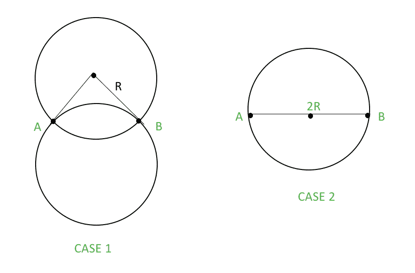
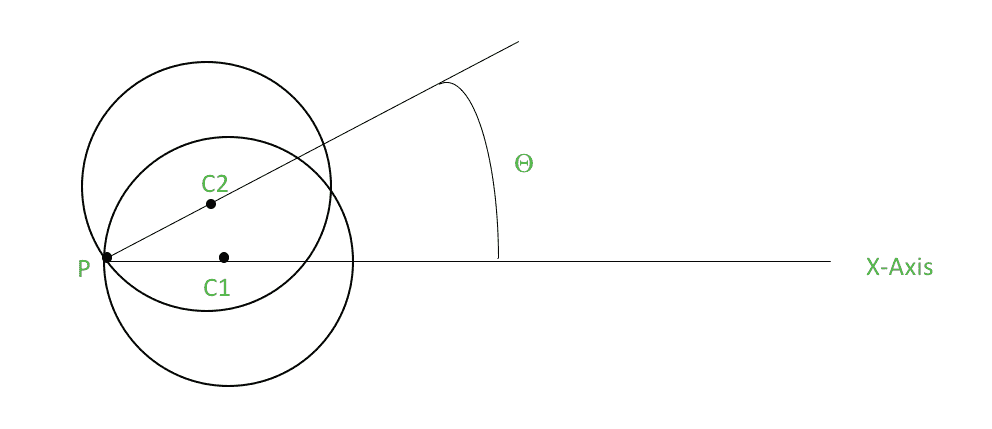
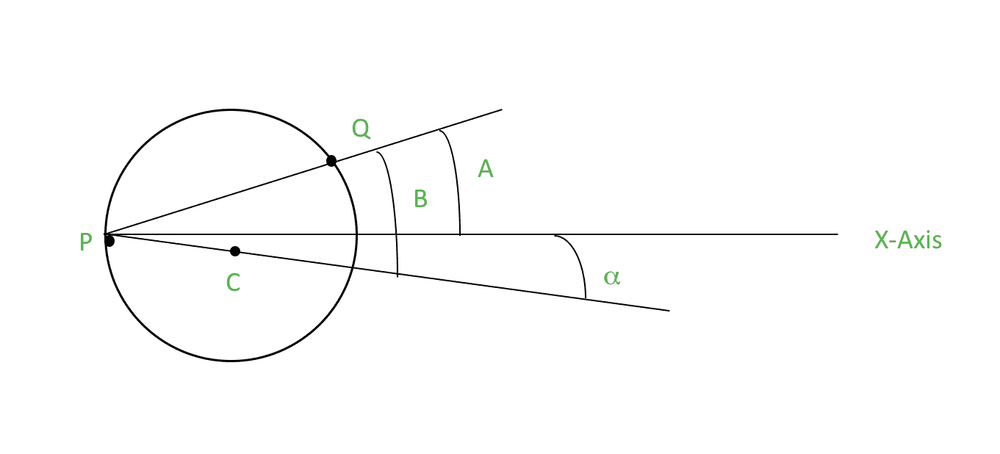
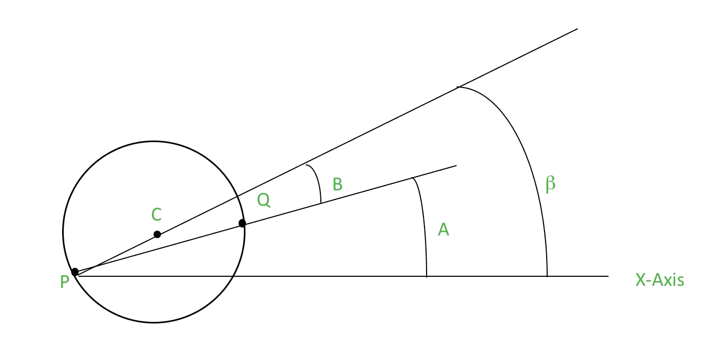

# 角度扫描(给定半径的圆内可包含的最大点)

> 原文:[https://www . geesforgeks . org/angular-sweep-max-points-can-enclosed-circle-给定半径/](https://www.geeksforgeeks.org/angular-sweep-maximum-points-can-enclosed-circle-given-radius/)

给定二维平面上的“n”个点，求半径为“R”的固定半径圆所能包含的最大点数。
注意:即使该点位于圆周上，也认为该点在圆内。
示例:

```
Input : R = 1
        points[] = {(6.47634, 7.69628), (5.16828 4.79915), 
                    (6.69533 6.20378)}
Output :  2
The maximum number of points are 2

Input :  R = 1
  points[] = {(6.65128, 5.47490), (6.42743, 6.26189)
   (6.35864, 4.61611), (6.59020 4.54228), (4.43967 5.70059)
   (4.38226, 5.70536), (5.50755 6.18163), (7.41971 6.13668)
   (6.71936, 3.04496), (5.61832, 4.23857), (5.99424, 4.29328)
   (5.60961, 4.32998), (6.82242, 5.79683), (5.44693, 3.82724) 
   (6.70906, 3.65736), (7.89087, 5.68000), (6.23300, 4.59530)
   (5.92401, 4.92329), (6.24168, 3.81389), (6.22671, 3.62210)}
Output : 11
The maximum number of points are 11
```

**天真算法**

1.  对于给定集合中的任意一对点(比如 A 和 B)，构造与这两个点都接触的半径为“R”的圆。最多有 2 个这样的可能圆。正如我们在这里看到的，最大可能的圆是针对案例 1，即案例 2。



1.  对于每个构建的圆，检查集合中的每个点是否位于圆内。
2.  返回包含最大点数的圆。

时间复杂度:有 <sup>n</sup> C <sub>2</sub> 对点对应，我们最多可以有 2 个 <sup>n</sup> C <sub>2</sub> 圆。对于每个圆，必须检查(n-2)个点。这使得幼稚算法 O(n <sup>3</sup> )。

**角扫算法**
通过使用角扫，我们可以在 O(n <sup>2</sup> log n)中解决这个问题。该算法的基本逻辑思想描述如下。
我们从给定的集合中选取任意一点 P。然后，我们围绕点 P 旋转一个具有固定半径“R”的圆。在整个旋转过程中，点 P 位于圆的圆周上，并且我们在给定值θ处保持圆中的点数，其中参数θ决定旋转角度。因此，圆的状态可以由单个参数θ确定，因为半径是固定的。
我们还可以看到，只有当集合中的一个点进入或退出圆时，保持的计数的值才会改变。



在给定的图中，C1 是θ= 0 的圆，C2 是当我们以θ的一般值旋转圆时构造的圆。
这之后，问题就简化为，如何维护 count 的值。
对于除 P(比如 Q)以外的任意给定点，我们都可以很容易地计算出它进入圆的θ值(设它是α)和它退出圆的θ值(设它是β)。
我们有角度 A 和 B 定义如下，

*   a 是 PQ 和 X 轴之间的角度。
*   b 是 PC 和 PQ 之间的角度，其中 C 是圆心。

其中，x 和 y 代表一个点的坐标，d 代表 P 和 q 之间的距离
现在，从图中我们可以看到，

```
α = A-B 
β = A+B
```

(注:所有角度都是相对于 X 轴的。因此，它变成了“A-B”而不是“B-A”)。
Q 进圈时



当 Q 退出圆圈



我们可以计算除 p 之外的所有点的角度 A 和 B。一旦找到这些角度，我们就对它们进行排序，然后以递增的顺序遍历它们。现在我们维护一个计数器，它告诉我们在某个特定时刻有多少点在圆内。
只有当一个点进入圆或退出圆时，计数才会改变。如果我们找到一个进入角，我们将计数器增加 1，如果我们找到一个退出角，我们将计数器减少 1。使用标志可以很容易地检查角度是入口还是出口。
这样进行下去，计数器总是给我们一个特定状态下圆内点数的有效值。
**重要提示:**有‘d’>2R 的点不需要考虑，因为它们永远不会进入或退出圆圈。
角扫算法可以描述为:

1.  计算每对 <sup>n</sup> C <sub>2</sub> 点之间的距离并存储。
2.  对于任意一个点(比如 P)，使用 getPointsInside()函数得到可以位于绕 P 旋转的圆内的最大点数。
3.  返回的所有值的最大值将是最终答案。

这个算法已经在下面的 C++实现中描述过了。

## 卡片打印处理机（Card Print Processor 的缩写）

```
// C++ program to find the maximum number of
// points that can be enclosed by a fixed-radius
// circle
#include <bits/stdc++.h>
using namespace std;

const int MAX_POINTS = 500;

// complex class which is available in STL has
// been used to implement points. This helps to
// ensure greater functionality easily
typedef complex<double> Point;

Point arr[MAX_POINTS];
double dis[MAX_POINTS][MAX_POINTS];

// This function returns the maximum points that
// can lie inside the circle of radius 'r' being
// rotated about point 'i'
bool mycompare(pair<double,bool> A, pair<double,bool> B)
{
    if(A.first<B.first)
        return true;
    else if(A.first>B.first)
        return false;
    else
        return (A.second==1);
}
int getPointsInside(int i, double r, int n)
{
    // This vector stores alpha and beta and flag
    // is marked true for alpha and false for beta
    vector<pair<double, bool> > angles;

    for (int j=0; j<n; j++)
    {
        if (i != j && dis[i][j] <= 2*r)
        {
            // acos returns the arc cosine of the complex
            // used for cosine inverse
            double B =  acos(dis[i][j]/(2*r));

            // arg returns the phase angle of the complex
            double A = arg(arr[j]-arr[i]);
            double alpha = A-B;
            double beta = A+B;
            angles.push_back(make_pair(alpha, true));
            angles.push_back(make_pair(beta, false));
        }
    }

    // angles vector is sorted and traversed
    sort(angles.begin(), angles.end(), mycompare);

    // count maintains the number of points inside
    // the circle at certain value of theta
    // res maintains the maximum of all count
    int count = 1, res = 1;
    vector<pair<double, bool> >::iterator it;
    for (it=angles.begin(); it!=angles.end(); ++it)
    {
        // entry angle
        if ((*it).second)
            count++;

        // exit angle
        else
            count--;

        if (count > res)
            res = count;
    }

    return res;
}

// Returns count of maximum points that can lie
// in a circle of radius r.
int maxPoints(Point arr[], int n, int r)
{
    // dis array stores the distance between every
    // pair of points
    for (int i=0; i<n-1; i++)
        for (int j=i+1; j<n; j++)

            // abs gives the magnitude of the complex
            // number and hence the distance between
            // i and j
            dis[i][j] = dis[j][i] = abs(arr[i]-arr[j]);

    // This loop picks a point p
    int ans = 0;
    for (int i=0; i<n; i++)

        // maximum number of points for point arr[i]
        ans = max(ans, getPointsInside(i, r, n));

    return ans;
}

// Driver code
int main()
{
    Point  arr[] = {Point(6.47634, 7.69628),
                    Point(5.16828, 4.79915),
                    Point(6.69533, 6.20378)};
    int r = 1;

    int n = sizeof(arr)/sizeof(arr[0]);

    cout << "The maximum number of points are: " 
         << maxPoints(arr, n, r);

    return 0;
}
```

输出:

```
The maximum number of points are: 2
```

**时间复杂度:**有 n 个点，我们为其调用函数 getPointsInside()。这个函数对“n-1”个点起作用，对于这些点，我们得到向量“角度”(一个入口角度和一个出口角度)的 2*(n-1)个大小。现在这个“角度”向量被排序和遍历，这使得 getPointsInside()函数的复杂度等于 O(nlogn)。这使得角度扫描算法为 0(n<sup>2</sup>对数 n。
**相关资源:**使用 stl 中可用的复杂类来实现几何问题的解决方案。
[http://codeforces.com/blog/entry/22175](http://codeforces.com/blog/entry/22175)
本文由**安雅金达尔**供稿。如果你喜欢 GeeksforGeeks 并想投稿，你也可以使用[write.geeksforgeeks.org](https://write.geeksforgeeks.org)写一篇文章或者把你的文章邮寄到 review-team@geeksforgeeks.org。看到你的文章出现在极客博客主页上，帮助其他极客。
如果发现有不正确的地方，或者想分享更多关于上述话题的信息，请写评论。