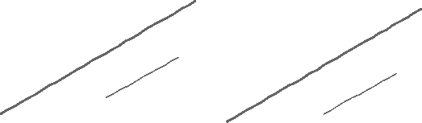
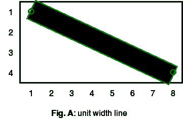
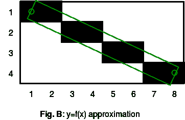
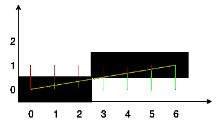
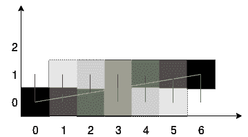
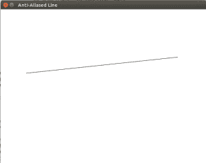

# 抗锯齿线|吴晓琳算法

> 原文:[https://www . geesforgeks . org/反别名-line-Xiaolin-wus-algorithm/](https://www.geeksforgeeks.org/anti-aliased-line-xiaolin-wus-algorithm/)

**抗锯齿画线**
下图是用 Bresenham 的直线算法(左)和吴晓林的直线算法(右)绘制的平滑直线的图像。你觉得哪个更好看？
[](https://media.geeksforgeeks.org/wp-content/uploads/anti-aliasing-1.png) 
**反走样概念**
假设我们要用矩形边从点(1，1)到点(8，4)画一条线。理想的线应该是如图 A 所示的那条线。因为我想在屏幕上显示它，所以我不能使用它。线条需要经过一个叫做**光栅化**的过程，这个过程将决定单个像素的颜色。可以使用几种算法，如[布雷森汉线算法](https://www.geeksforgeeks.org/bresenhams-line-generation-algorithm/)、[数字微分分析仪](https://www.geeksforgeeks.org/dda-line-generation-algorithm-computer-graphics/)、吴晓林线算法、古普塔-斯普罗尔算法。后面两个执行抗锯齿或线条平滑。
前两种算法产生的结果如图 b 所示
[](https://media.geeksforgeeks.org/wp-content/uploads/anti-aliasing-2.png)
[](https://media.geeksforgeeks.org/wp-content/uploads/anti-aliasing-3.png)

线中几乎没有问题(图 B)。
1。像素(4，2)的覆盖范围比像素(3，2)小，但它们都是全黑的。
2。像素(2，2)的覆盖范围几乎和(4，2)一样大，但它是全白色的。
为了克服这些缺点，产生一条看起来更平滑的线条，我们使用了吴晓林的线条算法

**吴晓林的直线算法**
考虑下图，该图是使用 Bresenham 的直线生成算法绘制的。取一个线段和它的初始坐标 X，通过循环中的 X，在线段的末端加 1。在每个步骤中，都会计算误差，即该位置的实际 y 坐标与最近网格单元之间的距离。如果误差不超过单元格高度的一半，则填充。这就是整个算法。
[](https://media.geeksforgeeks.org/wp-content/uploads/anti-aliasing-4.png) 
我们将修改这个算法，使其能够产生一个抗锯齿线。
吴晓林的线算法的特点是，在计算的每一步都是针对最接近像素线的两个像素进行的，根据距离的不同，它们的颜色强度也不同。当前交点中间像素强度给出 100%如果像素在 0.9 像素以内，强度将是 10%。换句话说，100%的强度被划分在两侧限制向量线的像素之间。
[](https://media.geeksforgeeks.org/wp-content/uploads/anti-aliasing-5.png) 
在图片中红色和绿色显示了到两个相邻像素的距离。要计算误差，可以使用浮点并取小数部分的误差值。

**注意:**以下实现使用 [SDL](http://libsdl.org/) 库在屏幕上绘制像素。如果你在像 ubuntu 这样的 debian 系统上，运行下面的命令来安装 SDL 库。

```
sudo apt-get install libsdl2-dev

```

建造使用

```
gcc filename.c -lSDL2

```

**注意:**如果线段在 x 轴上的投影小于在 y 轴上的投影，或者线段的起点和终点互换，那么算法将不起作用。为了避免这种情况，你需要检查向量的方向和它的斜率，然后交换直线的坐标，最终将一切都简化为某一种或至少两种情况。
由于像素值不能是浮点的，下面的算法假设只有整数坐标将作为输入给出。

```
// C program to implement Xiaolin Wu's line drawing
// algorithm.
// We must install SDL library using above steps
// to run this prorgram
#include<SDL2/SDL.h>

// SDL stuff
SDL_Window* pWindow = 0;
SDL_Renderer* pRenderer = 0;

// swaps two numbers
void swap(int* a , int*b)
{
    int temp = *a;
    *a = *b;
    *b = temp;
}

// returns absolute value of number
float absolute(float x )
{
    if (x < 0) return -x;
    else return x;
}

//returns integer part of a floating point number
int iPartOfNumber(float x)
{
    return (int)x;
}

//rounds off a number
int roundNumber(float x)
{
    return iPartOfNumber(x + 0.5) ;
}

//returns fractional part of a number
float fPartOfNumber(float x)
{
    if (x>0) return x - iPartOfNumber(x);
    else return x - (iPartOfNumber(x)+1);

}

//returns 1 - fractional part of number
float rfPartOfNumber(float x)
{
    return 1 - fPartOfNumber(x);
}

// draws a pixel on screen of given brightness
// 0<=brightness<=1\. We can use your own library
// to draw on screen
void drawPixel( int x , int y , float brightness)
{
    int c = 255*brightness;
    SDL_SetRenderDrawColor(pRenderer, c, c, c, 255);
    SDL_RenderDrawPoint(pRenderer, x, y);
}

void drawAALine(int x0 , int y0 , int x1 , int y1)
{
    int steep = absolute(y1 - y0) > absolute(x1 - x0) ;

    // swap the co-ordinates if slope > 1 or we
    // draw backwards
    if (steep)
    {
        swap(&x0 , &y0);
        swap(&x1 , &y1);
    }
    if (x0 > x1)
    {
        swap(&x0 ,&x1);
        swap(&y0 ,&y1);
    }

    //compute the slope
    float dx = x1-x0;
    float dy = y1-y0;
    float gradient = dy/dx;
    if (dx == 0.0)
        gradient = 1;

    int xpxl1 = x0;
    int xpxl2 = x1;
    float intersectY = y0;

    // main loop
    if (steep)
    {
        int x;
        for (x = xpxl1 ; x <=xpxl2 ; x++)
        {
            // pixel coverage is determined by fractional
            // part of y co-ordinate
            drawPixel(iPartOfNumber(intersectY), x,
                        rfPartOfNumber(intersectY));
            drawPixel(iPartOfNumber(intersectY)-1, x,
                        fPartOfNumber(intersectY));
            intersectY += gradient;
        }
    }
    else
    {
        int x;
        for (x = xpxl1 ; x <=xpxl2 ; x++)
        {
            // pixel coverage is determined by fractional
            // part of y co-ordinate
            drawPixel(x, iPartOfNumber(intersectY),
                        rfPartOfNumber(intersectY));
            drawPixel(x, iPartOfNumber(intersectY)-1,
                          fPartOfNumber(intersectY));
            intersectY += gradient;
        }
    }

}

// Driver code
int main(int argc, char* args[])
{

    SDL_Event event;

    // initialize SDL
    if (SDL_Init(SDL_INIT_EVERYTHING) >= 0)
    {
        // if succeeded create our window
        pWindow = SDL_CreateWindow("Anti-Aliased Line ",
                     SDL_WINDOWPOS_CENTERED, SDL_WINDOWPOS_CENTERED,
                                                          640, 480,
                                                  SDL_WINDOW_SHOWN);

        // if the window creation succeeded create our renderer
        if (pWindow != 0)
            pRenderer = SDL_CreateRenderer(pWindow, -1, 0);
    }
    else
        return 1; // sdl could not initialize

    while (1)
    {
        if (SDL_PollEvent(&event) && event.type == SDL_QUIT)
            break;

        // Sets background color to white
        SDL_SetRenderDrawColor(pRenderer, 255, 255, 255, 255);
        SDL_RenderClear(pRenderer);

        // draws a black AALine
        drawAALine(80 , 200 , 550, 150);

        // show the window
        SDL_RenderPresent(pRenderer);
    }

    // clean up SDL
    SDL_Quit();
    return 0;
}
```

输出:

```


```

**参考文献:**
[https://courses . engr . Illinois . edu/ECE 390/archive/archive-f 2000/MP/MP4/anti . html](https://courses.engr.illinois.edu/ece390/archive/archive-f2000/mp/mp4/anti.html)
[https://union assets . com/blog/algorithm-brezen Hema-and-Wu-s-line-299](https://unionassets.com/blog/algorithm-brezenhema-and-wu-s-line-299)
[https://en.wikipedia.org/wiki/Xiaolin_Wu%27s_line_algorithm](https://en.wikipedia.org/wiki/Xiaolin_Wu%27s_line_algorithm)
本文由 **[洛克什·夏尔马](https://www.facebook.com/profile.php?id=100009916891490)** 供稿。如果你喜欢 GeeksforGeeks 并想投稿，你也可以使用[contribute.geeksforgeeks.org](http://www.contribute.geeksforgeeks.org)写一篇文章或者把你的文章邮寄到 contribute@geeksforgeeks.org。看到你的文章出现在极客博客主页上，帮助其他极客。

如果你发现任何不正确的地方，或者你想分享更多关于上面讨论的话题的信息，请写评论。