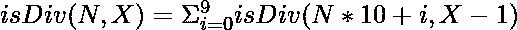

# 在 N 的末尾追加 X 位，使其能被 M 整除

> 原文:[https://www . geesforgeks . org/append-x-digits-to-n-end-使其可被 m 整除/](https://www.geeksforgeeks.org/append-x-digits-to-the-end-of-n-to-make-it-divisible-by-m/)

给定三个正整数 **N** 、 **M** 和 **X** ，任务是通过在 **N** 的右侧追加 **X** 数字生成一个数字，使得该数字可被 **M** 整除。如果存在多个解决方案，则打印其中任何一个。否则，打印 **-1** 。

**示例:**

> **输入:** N = 10，M = 5，X = 4
> **输出:** 105555
> **说明:**通过在 N 右侧追加 X(= 4)位，N (= 10)的可能值之一为 105555，可被 M (= 5)整除。
> 
> **输入:** N = 4，M = 50，X = 2
> T3】输出: 400

**方法:**思路是在 **N** 右侧追加 **X** 位，从范围**【0，9】**中尝试出所有可能的数字，在 N 右侧追加 **X** 位后，检查该数字是否可被 **M** 整除。如果发现是真的，那就打印号码。否则，打印 **-1** 。以下是循环关系:

> 

按照以下步骤解决问题:

*   利用上述递推关系，通过在 **N** 右侧追加 **X** 位，检查数字 **N** 是否可被 **M** 整除。如果发现为真，则通过追加 **X** 位来打印 **N** 的值。
*   否则，打印 **-1** 。

下面是上述方法的实现:

## C++

```
// C++ program to implement
// the above approach
#include <bits/stdc++.h>
using namespace std;

// Function to check if the value of N by
// appending X digits on right side of N
// is divisible by M or not
bool isDiv(int N, int X, int M, int& res)
{

    // Base Case
    if (X == 0) {

        // If N is divisible
        // by M
        if (N % M == 0) {

            // Update res
            res = N;
            return true;
        }

        return false;
    }

    // Iterate over the range [0, 9]
    for (int i = 0; i <= 9; i++) {

        // If N is divisible by M by
        // appending X digits
        if (isDiv(N * 10 + i, X - 1, M, res)) {

            return true;
        }
    }
}

// Driver Code
int main()
{
    int N = 4, M = 50, X = 2;

    // Stores the number by appending
    // X digits on the right side of N
    int res = -1;

    isDiv(N, X, M, res);
    cout << res;
}
```

## Java 语言(一种计算机语言，尤用于创建网站)

```
// Java program for the above approach
import java.io.*;
import java.util.*;

class GFG
{

  // Function to check if the value of N by
  // appending X digits on right side of N
  // is divisible by M or not
  static int isDiv(int N, int X, int M, int res)
  {

    // Base Case
    if (X == 0)
    {

      // If N is divisible
      // by M
      if (N % M == 0)
      {

        // Update res
        res = N;
        return res;
      }

      return res;
    }

    // Iterate over the range [0, 9]
    for (int i = 0; i < 9; i++)
    {

      // If N is divisible by M by
      // appending X digits
      int temp = isDiv(N * 10 + i, X - 1, M, res);
      if (temp != -1)
      {
        return temp;
      }
    }
    return res;
  }

  // Driver code
  public static void main(String[] args)
    throws java.lang.Exception
  {
    int N = 4, M = 50, X = 2;

    // Stores the number by appending
    // X digits on the right side of N
    int res = -1;

    res = isDiv(N, X, M, res);
    System.out.println(res);
  }
}

// This code is contributed by 18bhupenderyadav18.
```

## 蟒蛇 3

```
# Python3 program to implement
# the above approach

# Function to check if the value of N by
# appending X digits on right side of N
# is divisible by M or not

# global variable to store result
res = -1

def isDiv(N, X, M):
    # Base case
    if(X == 0):
        # If N is divisible
        # by M
        if(N % M == 0):
            global res
            res = N
            return True

        return False

    # Iterate over the range [0, 9]
    for i in range(10):
        # if N is Divisible by M upon appending X digits
        if(isDiv(N*10+i, X-1, M)):
            return True

# Driver Code
if __name__ == "__main__":
    N, M, X = 4, 50, 2

    if(isDiv(N, X, M)):
        print(res)
    else:
        print("-1")
```

## C#

```
// C# program to implement
// the above approach 
using System;

class GFG
{

  // Function to check if the value of N by
  // appending X digits on right side of N
  // is divisible by M or not
  static int isDiv(int N, int X, int M, int res)
  {

    // Base Case
    if (X == 0)
    {

      // If N is divisible
      // by M
      if (N % M == 0)
      {

        // Update res
        res = N;
        return res;
      }

      return res;
    }

    // Iterate over the range [0, 9]
    for (int i = 0; i < 9; i++)
    {

      // If N is divisible by M by
      // appending X digits
      int temp = isDiv(N * 10 + i, X - 1, M, res);
      if (temp != -1)
      {
        return temp;
      }
    }
    return res;
  }

  // Driver code
  public static void Main()
  {
    int N = 4, M = 50, X = 2;

    // Stores the number by appending
    // X digits on the right side of N
    int res = -1;

    res = isDiv(N, X, M, res);
    Console.WriteLine(res);
  }
}

// This code is contributed by sanjoy_62
```

## java 描述语言

```
<script>

// Javascript program to implement
// the above approach

var res = -1;

// Function to check if the value of N by
// appending X digits on right side of N
// is divisible by M or not
function isDiv(N, X, M)
{

    // Base Case
    if (X == 0) {

        // If N is divisible
        // by M
        if (N % M == 0) {

            // Update res
            res = N;
            return true;
        }

        return false;
    }

    // Iterate over the range [0, 9]
    for (var i = 0; i <= 9; i++) {

        // If N is divisible by M by
        // appending X digits
        if (isDiv(N * 10 + i, X - 1, M)) {

            return true;
        }
    }
}

// Driver Code

var N = 4, M = 50, X = 2;

// Stores the number by appending
// X digits on the right side of N
isDiv(N, X, M, res);

document.write(res);

</script>
```

**Output**

```
400
```

***时间复杂度:**O(10<sup>X</sup>)*
***辅助空间:** O(1)*