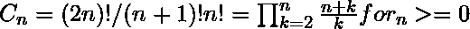
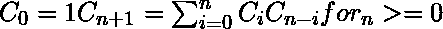
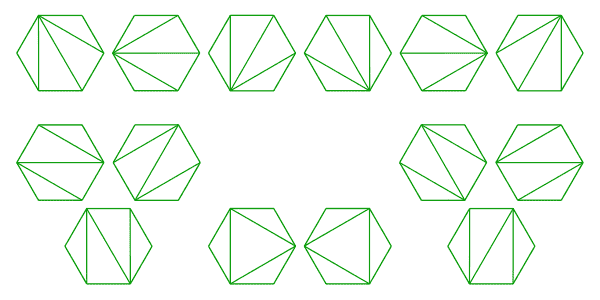
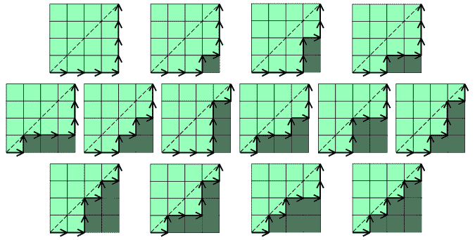
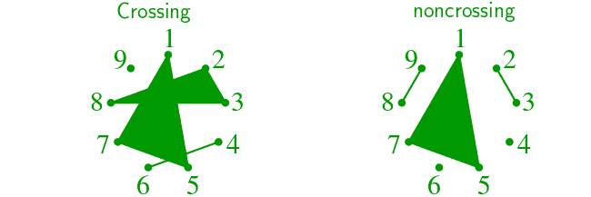
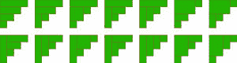
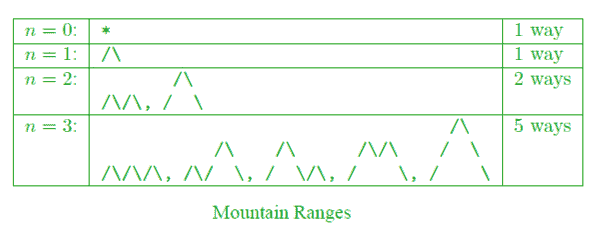

# 加泰罗尼亚数字的应用

> 原文:[https://www . geesforgeks . org/applications-of-Catalan-numbers/](https://www.geeksforgeeks.org/applications-of-catalan-numbers/)

**Background :**

[Catalan numbers](https://www.geeksforgeeks.org/program-nth-catalan-number/) are defined using below formula:

Catalan numbers can also be defined using following recursive formula.

The first few Catalan numbers for n = 0, 1, 2, 3, … are **1, 1, 2, 5, 14, 42, 132, 429, 1430, 4862, …**

第 n 个加泰罗尼亚数字的实现参见[本](https://www.geeksforgeeks.org/program-nth-catalan-number/)。

**Applications :**

1.  [具有 n 个键的可能二分搜索法树的数量](https://www.geeksforgeeks.org/g-fact-18/)。
2.  包含正确匹配的 n 对括号的表达式数。对于 n = 3，可能的表达式是((()))，(())，()()，(())()，(()))。
3.  n+2 边的凸多边形通过连接顶点分裂成三角形的方式数。
    
4.  有 n+1 片叶子的[满二叉树](http://geeksquiz.com/binary-tree-set-3-types-of-binary-tree/)(如果每个顶点有两个子树或者没有子树，则有根二叉树是满的)。
5.  [n 个节点可以有多个不同的未标记二叉树](http://geeksquiz.com/enumeration-of-binary-trees/)。
6.  矩形网格上从左下，即(n-1，0)到右上(0，n-1)的 2n 阶路径数，这些路径不在主对角线上方相交。
    
7.  在 n+1 个字母的单词中插入 n 对括号的方法，例如，对于 n=2，有 2 种方法:((ab)c)或(a(bc))。对于 n=3 有 5 种方式，((ab)(cd))、((ab)c(d))、((a(bc))d、(a((bc)d))、(a(BC)d))、(a(b(cd))。
8.  集合{1，…，2n}中每个块大小为 2 的非交叉分区数。当且仅当在其平面图中，块是不相交的(即不相交)，则分区是非相交的。例如，下面两个是{1，2，3，4，5，6，7，8，9}的交叉和非交叉分区。分区{{1，5，7}、{2，3，8}、{4，6}、{9}}交叉，分区{{1，5，7}、{2，3}、{4}、{6}、{8，9}}不交叉。
    
9.  长度为 2n 的 Dyck 字数。Dyck 单词是由 n 个 X 和 n 个 Y 组成的字符串，因此字符串的初始段没有比 X 更多的 Y。例如，以下是长度为 6 的 Dyck 单词:<big>XXXYYY XYXYY XYXYXYXYXYXYXYY。</big>
10.  用 n 个矩形平铺高度为 n 的阶梯形状的方法数。下图说明了 n = 4 的情况:
    
11.  连接圆形不相交弦上的点的方法的数量。这类似于上面的第 3 点。
12.  形成一个“山脉”的方法的数量，n 个上划和 n 个下划都保持在原始线以上。山脉的解释是山永远不会低于地平线。
13.  {1，…，n}的堆栈可排序排列数。如果 S(w) = (1，…，n)，则一个置换 w 被称为堆栈可排序的，其中 S(w)被递归地定义如下:写 w = unv 其中 n 是 w 中最大的元素，u 和 v 是较短的序列，并且集合 S(w) = S(u)S(v)n，其中 S 是单元素序列的恒等式。
14.  避开图案 123(或长度为 3 的任何其他图案)的{1，…，n}排列的数量；即没有三项递增子序列的排列数。对于 n = 3，这些排列是 132，213，231，312 和 321。对于 n = 4，它们是 1432、2143、2413、2431、3142、3214、3241、3412、3421、4132、4213、4231、4312 和 4321

**来源:**

1.  [https://en . Wikipedia . org/wiki/Catalan _ number](https://en.wikipedia.org/wiki/Catalan_number)
2.  [http://mathworld.wolfram.com/CatalanNumber.html](http://mathworld.wolfram.com/CatalanNumber.html)
3.  [http://www-groups . DCS . ST-and . AC . uk/history/杂项/CatalanNumbers/Catalan . html](http://www-groups.dcs.st-and.ac.uk/history/Miscellaneous/CatalanNumbers/catalan.html)
4.  [http://www . mhhe . com/math/adv math/Rosen/r5/指导员/应用程序/ch07.pdf](http://www.mhhe.com/math/advmath/rosen/r5/instructor/applications/ch07.pdf)
5.  [https://oeis.org/A000108](https://oeis.org/A000108)

本文由**阿卡什·斯里瓦斯塔瓦**供稿。如果你喜欢极客博客并想投稿，你也可以写一篇文章并把你的文章邮寄到 contribute@geeksforgeeks.org。看到你的文章出现在极客博客主页上，帮助其他极客。

如果您发现任何不正确的地方，或者您想分享更多关于上面讨论的主题的信息，请写评论