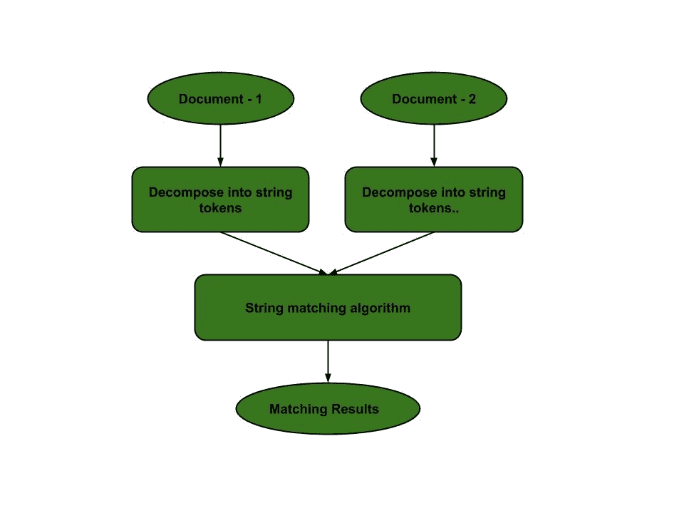
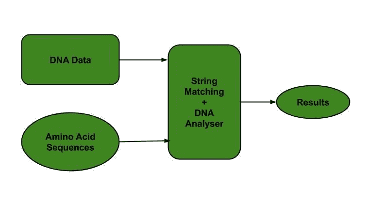
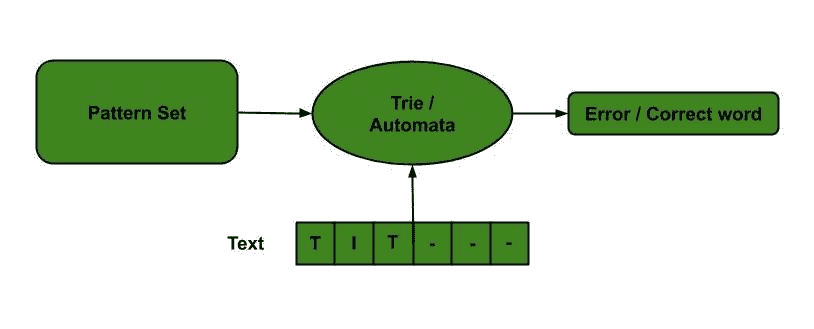
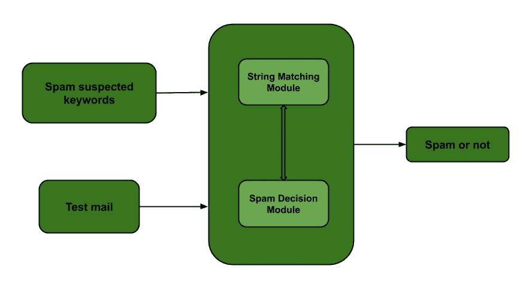
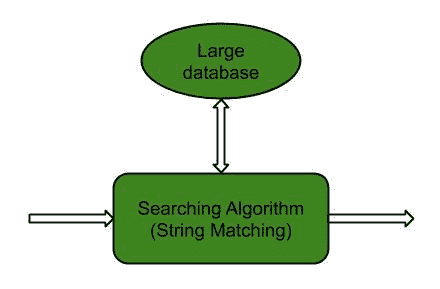
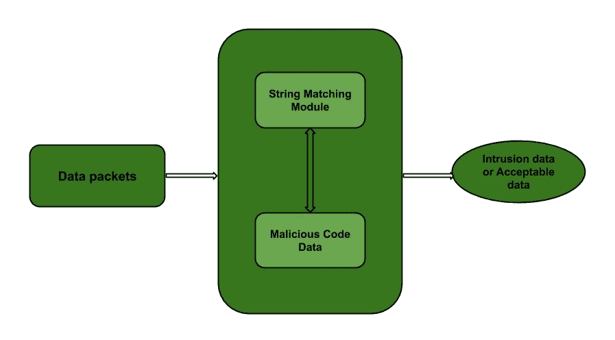

# 字符串匹配算法的应用

> 原文:[https://www . geesforgeks . org/applications-of-string-matching-algorithms/](https://www.geeksforgeeks.org/applications-of-string-matching-algorithms/)

[字符串匹配算法](https://www.geeksforgeeks.org/algorithms-gq/pattern-searching/)极大地影响了计算机科学，并在各种现实问题中发挥了重要作用。它有助于在多个域中执行节省时间的任务。这些算法在搜索另一个字符串中的一个字符串时非常有用。字符串匹配也用于[数据库模式](https://www.geeksforgeeks.org/difference-between-schema-and-database/)，网络系统。
让我们先看几个字符串匹配算法，然后再来看它们在现实世界中的应用。字符串匹配算法可以大致分为两类算法–

1.  精确字符串匹配算法
2.  近似字符串匹配算法

**精确字符串匹配算法:**

精确字符串匹配算法是在一个大的字符串(文本或序列)中找到一个、几个或所有已定义的字符串(模式)，这样每次匹配都是完美的。模式的所有字母必须与相应的匹配子序列相匹配。这些进一步分为四类:

1.  基于字符比较的算法:
    *   [朴素算法:](https://www.geeksforgeeks.org/naive-algorithm-for-pattern-searching/)将模式逐个滑过文本，并检查是否匹配。如果找到匹配项，则再次滑动 1 以检查后续匹配项。
    *   [KMP (Knuth Morris Pratt)算法:](https://www.geeksforgeeks.org/kmp-algorithm-for-pattern-searching/)其思想是每当检测到不匹配时，我们就已经知道下一个窗口文本中的一些字符。因此，我们利用这些信息来避免匹配我们知道无论如何都会匹配的字符。
    *   [Boyer Moore 算法:](https://www.geeksforgeeks.org/boyer-moore-algorithm-for-pattern-searching/)该算法使用了 Naive 和 KMP 算法的最佳 heurestics，并从模式的最后一个字符开始匹配。
    *   [使用 Trie 数据结构:](https://www.geeksforgeeks.org/trie-insert-and-search/)它被用作高效的信息检索数据结构。它以平衡的 BST 形式存储密钥。
2.  确定性有限自动机方法；
    *   [自动机匹配器算法:](https://www.geeksforgeeks.org/finite-automata-algorithm-for-pattern-searching/)它从自动机的第一个状态和文本的第一个字符开始。在每一步，它考虑文本的下一个字符，并在构建的有限自动机中寻找下一个状态，并移动到一个新的状态。
3.  基于位的算法(并行方法)；
    *   [Aho-Corasick 算法:](https://www.geeksforgeeks.org/aho-corasick-algorithm-pattern-searching/)它查找 O(n + m + z)时间内的所有单词，其中 n 是文本的长度，m 是所有单词中的字符总数，z 是文本中单词出现的总次数。这个算法构成了最初的 Unix 命令 fgrep 的基础。
4.  哈希字符串匹配算法:
    *   [Rabin Karp 算法:](https://www.geeksforgeeks.org/rabin-karp-algorithm-for-pattern-searching/)它将模式的哈希值与当前文本子串的哈希值进行匹配，如果哈希值匹配，那么只有它开始匹配单个字符。

**近似字符串匹配算法:**

近似字符串匹配算法(也称为模糊字符串搜索)搜索输入字符串的子字符串。更具体地说，近似字符串匹配方法陈述如下:假设给我们两个字符串，文本 T[1…n]和模式 P[1…m]。任务是找到文本中所有出现的模式，其到模式的[编辑距离](https://en.wikipedia.org/wiki/Edit_distance)最多为 k。一些众所周知的编辑距离是–[莱文斯坦编辑距离](https://en.wikipedia.org/wiki/Levenshtein_distance)和[海明编辑距离](https://en.wikipedia.org/wiki/Hamming_distance)。

这些技术在文本质量较低、模式或文本存在拼写错误、突变后寻找 DNA 子序列、异构数据库等情况下使用。一些近似字符串匹配算法有:

*   **天真方法:**它将模式在文本上逐个滑动，并检查近似匹配。如果找到，则再次滑动 1 以检查后续的近似匹配。
*   卖家算法(动态规划)
*   移位或算法(位图算法)

**字符串匹配算法的应用:**

*   **抄袭检测:**将待比较的文档分解成字符串标记，使用字符串匹配算法进行比较。因此，这些算法用于检测它们之间的相似性，并声明作品是否抄袭或原创。
    
*   **生物信息学和 DNA 测序:**生物信息学涉及将信息技术和计算机科学应用于涉及遗传序列的问题，以找到 DNA 模式。字符串匹配算法和脱氧核糖核酸分析都被共同用于寻找模式集的出现。
    

*   **数字取证:**字符串匹配算法用于定位数字取证文本中感兴趣的特定文本字符串，这对调查非常有用。*   **拼写检查器:** [特里](https://www.geeksforgeeks.org/trie-insert-and-search/)是基于一组预定义的模式构建的。然后，这个 trie 用于字符串匹配。文本被作为输入，如果出现任何这样的模式，则通过达到接受状态来显示。
    *   **垃圾邮件过滤器:**垃圾邮件过滤器使用字符串匹配来丢弃垃圾邮件。例如，为了将一封电子邮件归类为垃圾邮件，通过字符串匹配算法在电子邮件的内容中搜索可疑的垃圾邮件关键词。因此，内容被归类为垃圾邮件与否。
    *   **大型数据库中的搜索引擎或内容搜索:**为了高效地对数据进行分类和组织，使用了字符串匹配算法。分类是基于搜索关键字完成的。因此，字符串匹配算法使人们更容易找到他们正在搜索的信息。
    *   **入侵检测系统:**应用字符串匹配算法找到包含入侵相关关键词的数据包。所有的恶意代码都存储在数据库中，每个传入的数据都与存储的数据进行比较。如果发现匹配，则产生警报。它基于精确的字符串匹配算法，其中必须检测每个入侵的数据包。
    