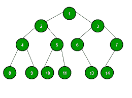

# 树形数据结构的应用

> 原文:[https://www . geesforgeks . org/applications-of-tree-data-structure/](https://www.geeksforgeeks.org/applications-of-tree-data-structure/)



**为什么是树？**
与线性数据结构的数组和链表不同，树是分层(或非线性)数据结构。

1.  One reason to use trees might be because you want to store information that naturally forms a hierarchy. For example, the file system on a computer: 

    文件系统
    ——

```
     /   <-- root
  /      \
...        home
      /          \
   ugrad        course
    /          /    |    \
  ...        cs101 cs112 cs113
```

1.  如果我们以树的形式组织关键字(具有一些排序，例如，BST)，我们可以在适当的时间内搜索给定的关键字(比链表快，比数组慢)。[像](http://en.wikipedia.org/wiki/Self-balancing_binary_search_tree) [AVL](http://en.wikipedia.org/wiki/AVL_tree) 和[红黑树](http://en.wikipedia.org/wiki/Red-black_tree)这样的自平衡搜索树保证了 0(Logn)的搜索上限。
2.  我们可以在适当的时间内插入/删除键(比数组快，比无序链表慢)。[像](http://en.wikipedia.org/wiki/Self-balancing_binary_search_tree) [AVL](http://en.wikipedia.org/wiki/AVL_tree) 和[红黑树](http://en.wikipedia.org/wiki/Red-black_tree)这样的自平衡搜索树保证了插入/删除的 O(Logn)上限。
3.  像链表和不像数组一样，树的指针实现没有节点数量的上限，因为节点是使用指针链接的。

**其他应用:**

1.  存储分层数据，如文件夹结构、组织结构、XML/HTML 数据。
2.  [二叉查找树](https://www.geeksforgeeks.org/binary-search-tree-set-1-search-and-insertion/)是一棵树，允许快速搜索、插入、删除已排序的数据。它还允许找到最近的项目
3.  [堆](https://www.geeksforgeeks.org/heap-data-structure/)是使用数组实现的树形数据结构，用于实现优先级队列。
4.  [B-Tree](https://www.geeksforgeeks.org/b-tree-set-1-introduction-2/) 和 [B+ Tree](https://www.geeksforgeeks.org/database-file-indexing-b-tree-introduction/) :用于实现数据库中的索引。
5.  [语法树](https://www.geeksforgeeks.org/compiler-design-syntax-directed-translation/):编译器设计中的扫描、解析、代码生成、算术表达式求值。
6.  [K-D 树:](https://www.geeksforgeeks.org/k-dimensional-tree/)一种空间划分树，用于组织 K 维空间中的点。
7.  [Trie](https://www.geeksforgeeks.org/trie-insert-and-search/) :用于实现带前缀查找的字典。
8.  [后缀树](https://www.geeksforgeeks.org/pattern-searching-set-8-suffix-tree-introduction/):用于固定文本中的快速模式搜索。
9.  [生成树](https://www.geeksforgeeks.org/applications-of-minimum-spanning-tree/)和最短路径树分别用于计算机网络中的路由器和网桥
10.  作为合成视觉效果数字图像的工作流程。
11.  决策树。
12.  大型组织的组织结构图。

参考文献:
[http://www.cs.bu.edu/teaching/c/tree/binary/](http://www.cs.bu.edu/teaching/c/tree/binary/)
T4【http://en . Wikipedia . org/wiki/Tree _ % 28 data _ structure % 29 # Common _ uses

如果你发现任何不正确的地方，或者你想分享更多关于上面讨论的话题的信息，请写评论。