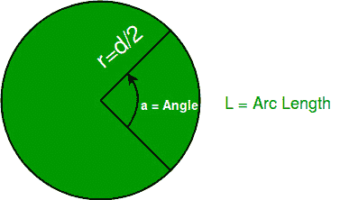

# 给定角度的弧长

> 原文:[https://www.geeksforgeeks.org/arc-length-angle/](https://www.geeksforgeeks.org/arc-length-angle/)

当两条光线在平面上的一个公共点相遇时，角度就是一个几何图形。这些光线形成了角的边，交点称为角的顶点。有一点我们需要记住，形成角度的平面不一定是欧几里得平面。现在，在圆中，弧的长度是圆周的一部分。该图解释了我们讨论过的各个部分:



给定一个角度和一个圆的直径，我们可以用公式计算出圆弧的长度:

```
ArcLength = ( 2 * pi * radius ) * ( angle / 360 )
Where pi = 22/7,
diameter = 2 * radius,
angle is in degree.
```

**例:**

```
Input : 
Diameter = 25
Angle = 45
Explanation : ((22/7) * 25) * (45/360)
Output : 9.821 (rounded)

Input : 
Diameter = 80
Angle = 60
Explanation : ((22/7) * 80) * (60/360)
Output : 41.905 (rounded)
```

**注:**如果角度大于等于 360 度，则弧长无法计算，因为不可能有角度。

## C++

```
// C++ program to calculate
// length of an arc
#include <iostream>
using namespace std;

// function to calculate 
// arc length
double arcLength(double diameter, 
                 double angle)
{
    double pi = 22.0 / 7.0;
    double arc;

    if (angle >= 360) 
    {
        cout<< "Angle cannot",
               " be formed";
        return 0;
    }
    else 
    {
        arc = (pi * diameter) * 
              (angle / 360.0);
        return arc;
    }
}

// Driver Code
int main() 
{
    double diameter = 25.0;
    double angle = 45.0;

    double arc_len = arcLength(diameter, 
                                 angle);
    cout << (arc_len);

    return 0;
}
```

## Java 语言(一种计算机语言，尤用于创建网站)

```
// Java program to calculate 
// length of an arc
public class Arc {

    // function to calculate arc length
    static double arcLength(double diameter, 
                              double angle)
    {
        double pi = 22.0 / 7.0;
        double arc;

        if (angle >= 360) {
            System.out.println("Angle cannot"
                              + " be formed");
            return 0;
        }
        else {
            arc = (pi * diameter) * (angle / 360.0);
            return arc;
        }
    }

    // Driver Code
    public static void main(String args[])
    {
        double diameter = 25.0;
        double angle = 45.0;
        double arc_len = arcLength(diameter, angle);
        System.out.println(arc_len);
    }
}
```

## 蟒蛇 3

```
# Python3 code to calculate 
# length of an arc
import math

# function to calculate arc length
def arcLength(diameter, angle ):
    if angle >= 360:
        print("Angle cannot be formed")
        return 0
    else:
        arc = (3.142857142857143 * diameter) * (angle / 360.0)
        return arc

# Driver Code
diameter = 25.0
angle = 45.0
arc_len = arcLength(diameter, angle)
print(arc_len)

# This code is contributed by "Sharad_Bhardwaj".
```

## C#

```
// C# program to calculate length of an arc
using System;

public class GFG {

    // function to calculate arc length
    static double arcLength(double diameter, 
                              double angle)
    {
        double pi = 22.0 / 7.0;
        double arc;

        if (angle >= 360) {
            Console.WriteLine("Angle cannot"
                              + " be formed");
            return 0;
        }
        else {
            arc = (pi * diameter) * (angle / 360.0);
            return arc;
        }
    }

    // Driver Code
    public static void Main()
    {

        double diameter = 25.0;
        double angle = 45.0;

        double arc_len = arcLength(diameter, angle);

        Console.WriteLine(arc_len);
    }
}

// This code is contributed by Anant Agarwal.
```

## 服务器端编程语言（Professional Hypertext Preprocessor 的缩写）

```
<?php
// PHP program to calculate 
// length of an arc

// function to calculate 
// arc length
function arcLength($diameter, 
                   $angle)
    {
        $pi = 22.0 / 7.0;
        $arc;

        if ($angle >= 360) 
        {
            echo "Angle cannot",
                   " be formed";
            return 0;
        }
        else 
        {
            $arc = ($pi * $diameter) * 
                   ($angle / 360.0);
            return $arc;
        }
    }

// Driver Code
$diameter = 25.0;
$angle = 45.0;
$arc_len = arcLength($diameter, $angle);
echo ($arc_len);

// This code is contributed by ajit
?>
```

## java 描述语言

```
<script>

// JavaScript program to calculate 
// length of an arc  

// function to calculate 
// arc length 
function arcLength(diameter, angle) 
{ 
    let pi = 22.0 / 7.0; 
    let arc; 

    if (angle >= 360) 
    { 
        document.write("Angle cannot" + 
            " be formed"); 
        return 0; 
    } 
    else
    { 
        arc = (pi * diameter) * 
            (angle / 360.0); 
        return arc; 
    } 
} 

// Driver Code 

    let diameter = 25.0; 
    let angle = 45.0; 

    let arc_len = arcLength(diameter, 
                                angle); 
    document.write(arc_len); 

// This code is contributed by Surbhi Tyagi.

</script>
```

**输出:**

```
9.821428571428571
```

本文由 [**【钦莫伊蕾恩卡】**](https://www.linkedin.com/in/lenkachinmoy/) 供稿。如果你喜欢 GeeksforGeeks 并想投稿，你也可以使用[write.geeksforgeeks.org](https://write.geeksforgeeks.org)写一篇文章或者把你的文章邮寄到 review-team@geeksforgeeks.org。看到你的文章出现在极客博客主页上，帮助其他极客。
如果发现有不正确的地方，或者想分享更多关于上述话题的信息，请写评论。