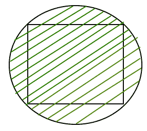

# 正方形外接圆的面积

> 原文:[https://www . geesforgeks . org/area-外接圆-正方形/](https://www.geeksforgeeks.org/area-circumscribed-circle-square/)

给定正方形的边，然后求出它周围的外切圆的面积。
示例:

```
Input : a = 6
Output : Area of a circumscribed circle is : 56.55

Input : a = 4
Output : Area of a circumscribed circle is : 25.13
```

正方形的四条边都等长，四个角都是 90 度。该圆被限定在给定的正方形上，如下图阴影区域所示。



**外接圆的性质如下:**

*   外接圆的中心是正方形两条对角线相交的点。
*   正方形的外接圆是通过正方形的四个顶点构成的。
*   正方形的外接圆的半径等于正方形的半径。

> 用来计算内切圆面积的公式是:
> **(PI * a * a)/2**
> ，其中，a 是正方形中圆的外切边。
> **这个公式是怎么用的？**
> 我们知道[圆的面积](https://www.geeksforgeeks.org/c-program-find-area-circle/) = PI*r*r.
> 我们还知道圆的半径=(正方形对角线)/2
> 对角线的长度=？(2*a*a)
> 半径=？(2*a*a)/2 =？((a*a)/2)
> 面积= PI*r*r = (PI*a*a)/2

## C++

```
// C++ Program to find the
// area of a circumscribed circle
#include <stdio.h>
#define PI 3.14159265

float areacircumscribed(float a)
{
    return (a * a * (PI / 2));
}

// Driver code
int main()
{
    float a = 6;
    printf(" Area of an circumscribed circle is : %.2f ",
           areacircumscribed(a));
    return 0;
}
```

## Java 语言(一种计算机语言，尤用于创建网站)

```
// Java program to calculate
// area of a circumscribed circle-square
import java.io.*;
class Gfg {
    // Utility Function
    static float areacircumscribed(float a)
    {
        float PI = 3.14159265f;
        return (a * a * (PI / 2));
    }

    // Driver Function
    public static void main(String arg[])
    {
        float a = 6;
        System.out.print("Area of an circumscribed"
                         + "circle is :");
        System.out.println(areacircumscribed(a));
    }
}

// The code is contributed by Anant Agarwal.
```

## 蟒蛇 3

```
# Python3 Program to find the
# area of a circumscribed circle
PI = 3.14159265

def areacircumscribed(a):

    return (a * a * (PI / 2))

# Driver code
a = 6
print(" Area of an circumscribed circle is :",
        round(areacircumscribed(a), 2))

# This code is contributed by Smitha Dinesh Semwal
```

## C#

```
// C# Program to find the
// area of a circumscribed circle
using System;

class GFG {

    public static double PI= 3.14159265 ;

    static float areacircumscribed(float a)
    {
        return (a * a * (float)(PI / 2));
    }

    // Driver code
    public static void Main()
    {
        float a = 6;

        Console.Write(" Area of an circumscribed"
                            + " circle is : {0}",
             Math.Round(areacircumscribed(a), 2));
    }
}

// This code is contributed by
// Smitha Dinesh Semwal
```

## 服务器端编程语言（Professional Hypertext Preprocessor 的缩写）

```
<?php
// PHP Program to find the
// area of a circumscribed
// circle

$PI = 3.14159265;

// function returns the area
function areacircumscribed($a)
{
    global $PI;
    return ($a * $a * ($PI / 2));
}

    // Driver code
    $a = 6;
    echo " Area of an circumscribed circle is : ",
                         areacircumscribed($a);

// The code is contributed by anuj_67.
?>
```

## java 描述语言

```
<script>

// Javascript Program to find the
// area of a circumscribed circle
function areacircumscribed(a)
{
    return (a * a * (3.1415 / 2));
}

// Driver code
    let a = 6;
    document.write(" Area of an circumscribed circle is : ",
        areacircumscribed(a));

// This code is contributed by Mayank Tyagi
</script>
```

输出:

```
 Area of an circumscribed circle is : 56.55 
```