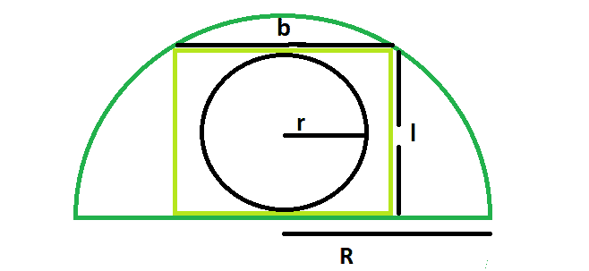

# 内接在矩形内接在半圆内的圆的面积

> 原文:[https://www . geeksforgeeks . org/内接半圆的矩形面积/](https://www.geeksforgeeks.org/area-of-a-circle-inscribed-in-a-rectangle-which-is-inscribed-in-a-semicircle/)

给定一个半径为 **R** 的半圆，该半圆刻出一个长度为 **L** 和宽度为 **B** 的矩形，该矩形又刻出一个半径为 **r** 的圆。任务是找到半径为 r 的圆的面积
**示例:**

```
Input : R = 2
Output : 1.57

Input : R = 5
Output : 9.8125
```



**接近** :

> 我们知道半圆内可内接的最大矩形有，长度， **l=√2R/2** &
> 宽度， **b=R/√2** ( [请参考](https://www.geeksforgeeks.org/area-of-a-square-inscribed-in-a-circle-which-is-inscribed-in-an-equilateral-triangle/) )
> 同样，矩形内可内接的最大圆有半径， **r=b/2=R/2√2** ( [请参考](https://www.geeksforgeeks.org/the-biggest-possible-circle-that-can-be-inscribed-in-rectangle/) )
> 所以圆的面积， **A=π*r^2=π(R/2√2)^2**

## C++

```
// C++ Program to find the area of the circle
// inscribed within the rectangle which in turn
// is inscribed in a semicircle
#include <bits/stdc++.h>
using namespace std;

// Function to find the area of the circle
float area(float r)
{

    // radius cannot be negative
    if (r < 0)
        return -1;

    // area of the circle
    float area = 3.14 * pow(r / (2 * sqrt(2)), 2);
    return area;
}

// Driver code
int main()
{
    float a = 5;
    cout << area(a) << endl;
    return 0;
}
```

## Java 语言(一种计算机语言，尤用于创建网站)

```
// Java Program to find the area of the circle
// inscribed within the rectangle which in turn
// is inscribed in a semicircle

import java.io.*;

class GFG {

// Function to find the area of the circle
static float area(float r)
{

    // radius cannot be negative
    if (r < 0)
        return -1;

    // area of the circle
    float area = (float)(3.14 * Math.pow(r / (2 * Math.sqrt(2)), 2));
    return area;
}

// Driver code

    public static void main (String[] args) {
            float a = 5;
    System.out.println( area(a));
    }
}

 // This code is contributed by ajit
```

## 蟒蛇 3

```
# Python 3 Program to find the
# area of the circle inscribed
# within the rectangle which in
# turn is inscribed in a semicircle
from math import pow, sqrt

# Function to find the area
# of the circle
def area(r):

    # radius cannot be negative
    if (r < 0):
        return -1

    # area of the circle
    area = 3.14 * pow(r / (2 * sqrt(2)), 2);

    return area;

# Driver code
if __name__ == '__main__':
    a = 5
    print("{0:.6}".format(area(a)))

# This code is contributed By
# Surendra_Gangwar
```

## C#

```
// C# Program to find the area of
// the circle inscribed within the
// rectangle which in turn is
// inscribed in a semicircle
using System;

class GFG
{

// Function to find the area
// of the circle
static float area(float r)
{

    // radius cannot be negative
    if (r < 0)
        return -1;

    // area of the circle
    float area = (float)(3.14 * Math.Pow(r /
                        (2 * Math.Sqrt(2)), 2));
    return area;
}

// Driver code
static public void Main (String []args)
{
    float a = 5;
    Console.WriteLine(area(a));
}
}

// This code is contributed
// by Arnab Kundu
```

## 服务器端编程语言（Professional Hypertext Preprocessor 的缩写）

```
<?php
// PHP Program to find the area
// of the circle inscribed within
// the rectangle which in turn
// is inscribed in a semicircle

// Function to find the area
// of the circle
function area($r)
{
    // radius cannot be negative
    if ($r < 0)
        return -1;

    // area of the circle
    $area = 3.14 * pow($r /
              (2 * sqrt(2)), 2);
    return $area;
}

// Driver code
$a = 5;
echo area($a);

// This code is contributed by mits
```

## java 描述语言

```
<script>
// javascript Program to find the area of the circle
// inscribed within the rectangle which in turn
// is inscribed in a semicircle

// Function to find the area of the circle
function area(r)
{

    // radius cannot be negative
    if (r < 0)
        return -1;

    // area of the circle
    var area = (3.14 * Math.pow(r / (2 * Math.sqrt(2)), 2));
    return area;
}

// Driver code
var a = 5;
document.write( area(a).toFixed(6));

// This code contributed by shikhasingrajput

</script>
```

**Output:** 

```
9.8125
```