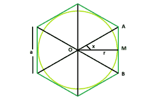

# 内切圆在正六边形中的面积

> 原文:[https://www . geesforgeks . org/正六边形内切圆面积/](https://www.geeksforgeeks.org/area-of-a-circle-inscribed-in-a-regular-hexagon/)

给定边长为 **a** 的正六边形，任务是找到内接圆的面积，假设圆与六条边相切。
**例:**

```
Input: a = 4
Output: 37.68

Input: a = 10
Output: 235.5
```



**逼近** :
从图中可以明显看出，我们可以把正六边形分成 6 个相同的等边三角形。
我们取一个三角形 **OAB** ，以 **O** 为六边形或圆的中心，&T8】AB 为六边形的一边。
让 **M** 为 **AB** 的中点， **OM** 为 **AB** ，**角度 AOM = 30 度**
然后在直角三角形 **OAM 中，**

> **tanx = tan30 = 1/√3**
> 所以， **a/2r = 1/√3**
> 因此， **r = a√3/2**
> 圆的面积，**a =πr =π3a^2/4**

**以下是实施办法** :

## C++

```
// C++ Program to find the area of the circle
// which can be inscribed within the hexagon
#include <bits/stdc++.h>
using namespace std;

// Function to find the area
// of the inscribed circle
float circlearea(float a)
{

    // the side cannot be negative
    if (a < 0)
        return -1;

    // area of the circle
    float A = (3.14 * 3 * pow(a, 2)) / 4;

    return A;
}

// Driver code
int main()
{
    float a = 4;
    cout << circlearea(a) << endl;

    return 0;
}
```

## Java 语言(一种计算机语言，尤用于创建网站)

```
//Java program to find the
//area of the circle
//which can be inscribed within the hexagon

import java.util.*;

class solution
{
static double circlearea(double a)
{

// the side cannot be negative
    if (a < 0)
    return -1;

// area of the circle
    double A = (3.14 * 3 * Math.pow(a,2) ) / 4;

    return A;
}
public static void main(String arr[])
{
    double a = 4;
    System.out.println(circlearea(a));
}
}
```

## 蟒蛇 3

```
# Python 3 program to find the
# area of the circle
# which can be inscribed within the hexagon

# Function to find the area
# of the inscribed circle
def circlearea(a) :

    # the side cannot be negative
    if a < 0 :
        return -1

    #  area of the circle
    A = (3.14 * 3 * pow(a,2)) / 4

    return A

# Driver code    
if __name__ == "__main__" :

    a = 4
    print(circlearea(a))

# This code is contributed by ANKITRAI1
```

## C#

```
// C# program to find 
// the area of the circle
// which can be inscribed
// within the hexagon
using System;

class GFG
{
static double circlearea(double a)
{

    // the side cannot be negative
    if (a < 0)
    return -1;

    // area of the circle
    double A = (3.14 * 3 *
                Math.Pow(a, 2)) / 4;

    return A;
}

// Driver Code
public static void Main()
{
    double a = 4;
    Console.WriteLine(circlearea(a));
}
}

// This code is contributed
// by inder_verma
```

## 服务器端编程语言（Professional Hypertext Preprocessor 的缩写）

```
<?php
// PHP Program to find the area of
// the circle which can be inscribed
// within the hexagon

// Function to find the area
// of the inscribed circle
function circlearea($a)
{

    // the side cannot be negative
    if ($a < 0)
        return -1;

    // area of the circle
    $A = (3.14 * 3 * pow($a, 2)) / 4;

    return $A;
}

// Driver code
$a = 4;
echo circlearea($a) . "\n";

// This code is contributed
// by Akanksha Rai(Abby_akku)
```

## java 描述语言

```
<script>

// javascript program to find the
//area of the circle
//which can be inscribed within the hexagon

function circlearea(a) {

    // the side cannot be negative
    if (a < 0)
        return -1;

    // area of the circle
    var A = (3.14 * 3 * Math.pow(a, 2)) / 4;

    return A;
}

var a = 4;
document.write(circlearea(a));

// This code is contributed by 29AjayKumar

</script>
```

**Output:** 

```
37.68
```