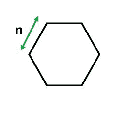

# 六边形的面积

> 原文:[https://www.geeksforgeeks.org/area-of-a-hexagon/](https://www.geeksforgeeks.org/area-of-a-hexagon/)

六边形是一个 6 边的二维几何图形。任何六边形的内角总和是 720 度。正六边形有 6 个旋转对称和 6 个反射对称。所有内角都是 120 度。



**例:**

```
Input: 4
Output: 41.5692

Input: 6
Output: 93.5307
```

> 顶点数:6
> 边数:6
> 内角:120
> 面积= (3 √3(n) <sup>2</sup> ) / 2

**公式是如何工作的？**n 边的等边三角形主要有 6 个，[等边三角形的面积](https://www.geeksforgeeks.org/program-calculate-area-perimeter-equilateral-triangle/)为(sqrt(3)/4) * n * n .由于在六边形中，总共有 6 个 n 边的等边三角形，所以六边形的面积变为(3*sqrt(3)/2) * n * n

## C++

```
// CPP program to find 
// area of a Hexagon
#include <iostream>
#include <math.h>
using namespace std;

// function for calculating
// area of the hexagon.
double hexagonArea(double s)
{
    return ((3 * sqrt(3) * 
            (s * s)) / 2);     
}

// Driver Code
int main()
{
    // Length of a side 
    double s = 4; 
    cout << "Area : "
         << hexagonArea(s);
    return 0;
}
```

## Java 语言(一种计算机语言，尤用于创建网站)

```
class GFG 
{ 
    // Create a function for calculating
    // the area of the hexagon.
    public static double hexagonArea(double s) 
    {
        return ((3 * Math.sqrt(3) * 
                (s * s)) / 2);
    } 

    // Driver Code
    public static void main(String[] args) 
    {     
        // Length of a side
        double s = 4;      
        System.out.print("Area: " + 
                          hexagonArea(s) );
    }
}
```

## 蟒蛇 3

```
# Python3 program to find
# area of a Hexagon
import math

# Function for calculating 
# area of the hexagon.
def hexagonArea(s):

    return ((3 * math.sqrt(3) * 
            (s * s)) / 2); 

# Driver code     
if __name__ == "__main__" : 

    # length of a side. 
    s = 4

    print("Area:","{0:.4f}" . 
           format(hexagonArea(s)))

# This code is contributed by Naman_Garg
```

## C#

```
// C# program to find
// area of a Hexagon
using System;

class GFG 
{

    // Create a function for calculating
    // the area of the hexagon.
    public static double hexagonArea(double s) 
    {
        return ((3 * Math.Sqrt(3) * 
                (s * s)) / 2);
    } 

    // Driver Code
    public static void Main() 
    {
        // Length of a side 
        double s = 4; 

        Console.WriteLine("Area: " + 
                           hexagonArea(s) );
    }
}

// This code is contributed by vt_m.
```

## 服务器端编程语言（Professional Hypertext Preprocessor 的缩写）

```
<?php
// PHP program to find 
// area of a Hexagon

// function for calculating
// area of the hexagon.
function hexagonArea( $s)
{
    return ((3 * sqrt(3) * 
            ($s * $s)) / 2); 
}

// Driver Code

// Length of a side 
$s = 4; 
echo("Area : ");
echo(hexagonArea($s));

// This code is contributed by vt_m.
?>
```

## java 描述语言

```
<script>

// Javascript program to find 
// area of a Hexagon 

// function for calculating 
// area of the hexagon. 
function hexagonArea(s) 
{ 
    return ((3 * Math.sqrt(3) * 
            (s * s)) / 2);     
} 

// Driver Code 

    // Length of a side 
    let s = 4; 
    document.write("Area : "
        + hexagonArea(s)); 

// This code is contributed by Mayank Tyagi
</script>
```

**输出:**

```
Area: 41.5692
```