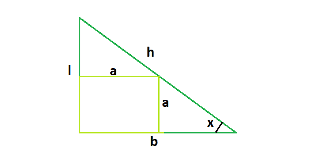

# 直角三角形中最大正方形的面积

> 原文:[https://www . geesforgeks . org/最大直角三角形面积/](https://www.geeksforgeeks.org/area-of-a-largest-square-fit-in-a-right-angle-triangle/)

给定一个直角三角形，高度 **l** ，底边**b**T6】斜边 **h** 。我们需要找到直角三角形中能容纳的最大正方形的面积。

**示例:**

```
Input: l = 3, b = 4, h = 5
Output: 2.93878
The biggest square that can fit inside 
is of 1.71428 * 1.71428 dimension

Input: l = 5, b = 12, h = 13
Output: 12.4567
```



> 考虑到上图，我们看到， **tanx = l/b** 。
> 这里也是真的， **tanx = a/(b-a)** 。
> 所以， **l/b = a/(b-a)** 也就是说， **a = (l*b)/(l+b)**

**下面是需要的实现:**

## C++

```
// C++ Program to find the area of the biggest square
// which can fit inside the right angled triangle
#include <bits/stdc++.h>
using namespace std;

// Function to find the area of the biggest square
float squareArea(float l, float b, float h)
{

    // the height or base or hypotenuse
    // cannot be negative
    if (l < 0 || b < 0 || h < 0)
        return -1;

    // side of the square
    float a = (l * b) / (l + b);

    // squaring to get the area
    return a * a;
}

// Driver code
int main()
{
    float l = 5, b = 12, h = 13;
    cout << squareArea(l, b, h) << endl;

    return 0;
}
```

## Java 语言(一种计算机语言，尤用于创建网站)

```
//Java Program to find the area of the biggest square
//which can fit inside the right angled triangle
public class GFG {

    //Function to find the area of the biggest square
    static float squareArea(float l, float b, float h)
    {

     // the height or base or hypotenuse
     // cannot be negative
     if (l < 0 || b < 0 || h < 0)
         return -1;

     // side of the square
     float a = (l * b) / (l + b);

     // squaring to get the area
     return a * a;
    }

    //Driver code
    public static void main(String[] args) {

         float l = 5, b = 12, h = 13;
         System.out.println(squareArea(l, b, h));
    }
}
```

## 蟒蛇 3

```
# Python 3 Program  to find the
# area of the biggest square
# which can fit inside the right
# angled triangle

# Function to find the area of the biggest square
def squareArea(l, b, h) :

    # the height or base or hypotenuse
    # cannot be negative
    if l < 0 or b < 0 or h < 0 :
        return -1

    # side of the square
    a = (l * b) / (l + b)

    # squaring to get the area
    return a * a

# Driver Code
if __name__ == "__main__" :

    l, b, h = 5, 12, 13

    print(round(squareArea(l, b, h),4))

# This code is contributed by ANKITRAI1
```

## C#

```
// C# Program to find the area of
// the biggest square which can
// fit inside the right angled triangle
using System;
class GFG
{

// Function to find the area
// of the biggest square
static float squareArea(float l, float b,
                        float h)
{

// the height or base or hypotenuse
// cannot be negative
if (l < 0 || b < 0 || h < 0)
    return -1;

// side of the square
float a = (l * b) / (l + b);

// squaring to get the area
return a * a;
}

// Driver code
public static void Main()
{
    float l = 5, b = 12, h = 13;
    Console.WriteLine(squareArea(l, b, h));
}
}

// This code is contributed
// by inder_verma..
```

## 服务器端编程语言（Professional Hypertext Preprocessor 的缩写）

```
<?php
// PHP Program to find the area
// of the biggest square which
// can fit inside the right
// angled triangle

// Function to find the area
// of the biggest square
function squareArea($l, $b, $h)
{

    // the height or base or
    // hypotenuse cannot be
    // negative
    if ($l < 0 || $b < 0 || $h < 0)
        return -1;

    // side of the square
    $a = ($l * $b) / ($l + $b);

    // squaring to get the area
    return $a * $a;
}

// Driver code
$l = 5;
$b = 12;
$h = 13;
echo round(squareArea($l, $b, $h), 4);

// This code is contributed by mits
?>
```

## java 描述语言

```
<script>

// javascript Program to find the area of the biggest square
// which can fit inside the right angled triangle

// Function to find the area of the biggest square
function squareArea(l , b , h)
{

 // the height or base or hypotenuse
 // cannot be negative
 if (l < 0 || b < 0 || h < 0)
     return -1;

 // side of the square
 var a = (l * b) / (l + b);

 // squaring to get the area
 return a * a;
}

// Driver code

 var l = 5, b = 12, h = 13;
 document.write(squareArea(l, b, h).toFixed(4));

// This code contributed by Princi Singh

</script>
```

**Output:** 

```
12.4567
```