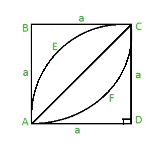

# 正方形内的叶子面积

> 原文:[https://www . geeksforgeeks . org/正方形内的叶子面积/](https://www.geeksforgeeks.org/area-of-a-leaf-inside-a-square/)

给定一个整数 **a** 作为正方形 ABCD 的边。任务是在正方形内找到叶子的面积，如下所示:



**示例:**

> **输入:**a = 7
> T3】输出: 28
> 
> **输入:**a = 21
> T3】输出: 252

**方法:**计算叶片面积，首先求半叶 AECA 的面积，可以给出为:

> **半叶面积=象限面积 AECDA–直角三角形面积 ACD** 。
> 因此，**半叶面积=(PI * a * a/4)–a * a/2**其中 **PI = 22 / 7** 和 **a** 是正方形的边。
> 因此，全叶面积将为**(PI * a * a/2)–a * a**
> 取 **a * a** 公式化，我们得到**叶面积= a * a(PI/2–1)**

下面是上述方法的实现:

## C

```
// C program to find the area of
// leaf inside a square
#include <stdio.h>
#define PI 3.14159265

// Function to find area of
// leaf
float area_leaf(float a)
{
    return (a * a * (PI / 2 - 1));
}

// Driver code
int main()
{
    float a = 7;
    printf("%f",
           area_leaf(a));
    return 0;
}
```

## Java 语言(一种计算机语言，尤用于创建网站)

```
// Java code to find the area of
// leaf inside a square
import java.lang.*;

class GFG {

    static double PI = 3.14159265;

    // Function to find the area of
    // leaf
    public static double area_leaf(double a)
    {
        return (a * a * (PI / 2 - 1));
    }

    // Driver code
    public static void main(String[] args)
    {
        double a = 7;
        System.out.println(area_leaf(a));
    }
}
```

## 蟒蛇 3

```
# Python3 code to find the area of leaf
# inside a square
PI = 3.14159265

# Function to find the area of
# leaf
def area_leaf( a ):
    return ( a * a * ( PI / 2 - 1 ) )

# Driver code
a = 7
print(area_leaf( a ))
```

## C#

```
// C# code to find the area of
// leaf
// inside square
using System;

class GFG {
    static double PI = 3.14159265;

    // Function to find the area of
    // leaf
    public static double area_leaf(double a)
    {
        return (a * a * (PI / 2 - 1));
    }

    // Driver code
    public static void Main()
    {
        double a = 7;
        Console.Write(area_leaf(a));
    }
}
```

## 服务器端编程语言（Professional Hypertext Preprocessor 的缩写）

```
<?php
// PHP program to find the
// area of leaf
// inside a square
$PI = 3.14159265;

// Function to find area of
// leaf
function area_leaf( $a )
{
    global $PI;
    return ( $a * $a * ( $PI / 2 - 1 ) );
}

// Driver code
$a = 7;

echo(area_leaf( $a ));
?>
```

## java 描述语言

```
<script>

// Javascript program to find the area of
// leaf inside a square
const PI = 3.14159265;

// Function to find area of
// leaf
function area_leaf(a)
{
    return(a * a * (PI / 2 - 1));
}

// Driver code
let a = 7;

document.write(Math.round(area_leaf(a)));

// This code is contributed by souravmahato348

</script>
```

**Output:** 

```
28
```