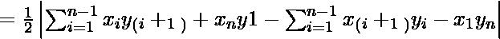
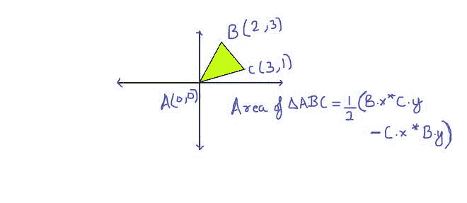
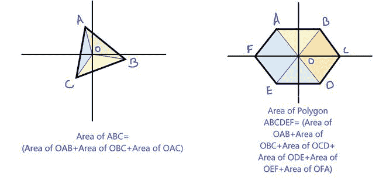
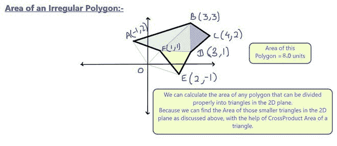

# 给定 n 个有序顶点的多边形面积

> 原文:[https://www . geesforgeks . org/给定 n 个有序顶点的多边形面积/](https://www.geeksforgeeks.org/area-of-a-polygon-with-given-n-ordered-vertices/)

给定具有 n 个顶点的多边形的有序坐标。求多边形的面积。这里的有序意味着从第一个顶点到最后一个顶点，坐标要么以顺时针方式给出，要么以逆时针方式给出。
**例:**

```
Input :  X[] = {0, 4, 4, 0}, Y[] = {0, 0, 4, 4};
Output : 16

Input : X[] = {0, 4, 2}, Y[] = {0, 0, 4}
Output : 8
```

我们可以使用[鞋带公式](https://en.wikipedia.org/wiki/Shoelace_formula)计算多边形的面积。

> 面积
> 
> 
> 
> = | 1/2【(x<sub>1</sub>y<sub>2</sub>+x<sub>2</sub>y<sub>3</sub>+…+x<sub>n-1</sub>y<sub>n</sub>+x<sub>n</sub>y<sub>1</sub>)–
> 
> (x<sub>2</sub>y<sub>1</sub>+x<sub>3</sub>y<sub>2</sub>+…+x<sub>n</sub>y<sub>n-1</sub>+x<sub>1</sub>y<sub>n</sub>)】|

上面的公式是根据顶点的叉积得出多边形中三角形的面积。
下面是上面公式的一个实现。

## 卡片打印处理机（Card Print Processor 的缩写）

```
// C++ program to evaluate area of a polygon using
// shoelace formula
#include <bits/stdc++.h>
using namespace std;

// (X[i], Y[i]) are coordinates of i'th point.
double polygonArea(double X[], double Y[], int n)
{
    // Initialize area
    double area = 0.0;

    // Calculate value of shoelace formula
    int j = n - 1;
    for (int i = 0; i < n; i++)
    {
        area += (X[j] + X[i]) * (Y[j] - Y[i]);
        j = i;  // j is previous vertex to i
    }

    // Return absolute value
    return abs(area / 2.0);
}

// Driver program to test above function
int main()
{
    double X[] = {0, 2, 4};
    double Y[] = {1, 3, 7};

    int n = sizeof(X)/sizeof(X[0]);

    cout << polygonArea(X, Y, n);
}
```

## Java 语言(一种计算机语言，尤用于创建网站)

```
// Java program to evaluate area 
// of a polygon using shoelace formula
import java.io.*;

class GFG 
{
    // (X[i], Y[i]) are coordinates of i'th point.
    public static double polygonArea(double X[], double Y[], 
                                                       int n)
    {
        // Initialize area
        double area = 0.0;

        // Calculate value of shoelace formula
        int j = n - 1;
        for (int i = 0; i < n; i++)
        {
            area += (X[j] + X[i]) * (Y[j] - Y[i]);

            // j is previous vertex to i
            j = i; 
        }

        // Return absolute value
        return Math.abs(area / 2.0);
    }

    // Driver program 
    public static void main (String[] args)
    {
        double X[] = {0, 2, 4};
        double Y[] = {1, 3, 7};

        int n = 3;
        System.out.println(polygonArea(X, Y, n));
    }

}
// This code is contributed by Sunnnysingh
```

## 蟒蛇 3

```
# python3 program to evaluate
# area of a polygon using
# shoelace formula

# (X[i], Y[i]) are coordinates of i'th point.
def polygonArea(X, Y, n):

    # Initialize area
    area = 0.0

    # Calculate value of shoelace formula
    j = n - 1
    for i in range(0,n):
        area += (X[j] + X[i]) * (Y[j] - Y[i])
        j = i   # j is previous vertex to i

    # Return absolute value
    return int(abs(area / 2.0))

# Driver program to test above function
X = [0, 2, 4]
Y = [1, 3, 7]
n = len(X)
print(polygonArea(X, Y, n))

# This code is contributed by
# Smitha Dinesh Semwal
```

## C#

```
// C# program to evaluate area
// of a polygon using shoelace formula
using System;

class GFG {

    // (X[i], Y[i]) are coordinates of i'th point.
    public static double polygonArea(double[] X,
                               double[] Y, int n)
    {

        // Initialize area
        double area = 0.0;

        // Calculate value of shoelace formula
        int j = n - 1;

        for (int i = 0; i < n; i++) {
            area += (X[j] + X[i]) * (Y[j] - Y[i]);

            // j is previous vertex to i
            j = i;
        }

        // Return absolute value
        return Math.Abs(area / 2.0);
    }

    // Driver program
    public static void Main()
    {
        double[] X = { 0, 2, 4 };
        double[] Y = { 1, 3, 7 };

        int n = 3;
        Console.WriteLine(polygonArea(X, Y, n));
    }
}

// This code is contributed by vt_m.
```

## 服务器端编程语言（Professional Hypertext Preprocessor 的缩写）

```
<?php
// PHP program to evaluate area of 
// a polygon using shoelace formula

// (X[i], Y[i]) are 
// coordinates of i'th point.
function polygonArea($X, $Y, $n)
{
    // Initialize area
    $area = 0.0;

    // Calculate value of
    // shoelace formula
    $j = $n - 1;
    for ($i = 0; $i < $n; $i++)
    {
        $area += ($X[$j] + $X[$i]) * 
                 ($Y[$j] - $Y[$i]);

        // j is previous vertex to i         
        $j = $i; 
    }

    // Return absolute value
    return abs($area / 2.0);
}

// Driver Code
$X = array(0, 2, 4);
$Y = array(1, 3, 7);

$n = sizeof($X);

echo polygonArea($X, $Y, $n);

// This code is contributed by ajit
?>
```

## java 描述语言

```
<script>

// JavaScript program to evaluate area
// of a polygon using shoelace formula

    // (X[i], Y[i]) are coordinates of i'th point.
    function polygonArea(X, Y, n)
    {
        // Initialize area
        let area = 0.0;

        // Calculate value of shoelace formula
        let j = n - 1;
        for (let i = 0; i < n; i++)
        {
            area += (X[j] + X[i]) * (Y[j] - Y[i]);

            // j is previous vertex to i
            j = i;
        }

        // Return absolute value
        return Math.abs(area / 2.0);
    } 

// Driver Code

        let X = [0, 2, 4];
        let Y = [1, 3, 7];

        let n = 3;
        document.write(polygonArea(X, Y, n));

// This code is contributed by target_2.    
</script>
```

**输出:**

```
2
```

**为什么叫鞋带公式？**
这个公式之所以这么叫，是因为我们评价它的方式。
**例:**

```
Let the input vertices be
 (0, 1), (2, 3), and (4, 7). 

Evaluation procedure matches with process of tying
shoelaces.

We write vertices as below
  0    1
  2    3
  4    7
  0    1  [written twice]

we evaluate positive terms as below
  0  \  1
  2  \  3
  4  \  7
  0     1  
i.e., 0*3 + 2*7 + 4*1 = 18 

we evaluate negative terms as below
  0     1
  2  /  3
  4  /  7
  0  /  1  
i.e., 0*7 + 4*3 + 2*1 = 14

Area = 1/2 (18 - 14) = 2 

See this for a clearer image.
```

**这是如何工作的？**
我们总是可以把一个多边形分成三角形。面积公式是通过取每条边 AB，计算顶点在原点 O 的三角形 ABO 的(有符号)面积，取叉积(给出平行四边形的面积)除以 2 得到的。当绕过多边形时，这些具有正和负面积的三角形将重叠，原点和多边形之间的面积将被抵消并求和为 0，而只有参考三角形内的面积保持不变。【来源:[维基](https://en.wikipedia.org/wiki/Shoelace_formula)

为了更好地理解，请看下图:



**<u>【使用叉积的三角形面积】</u>**



**<u>将多边形分割成更小的三角形来计算面积</u>**



**<u>同样，对于不规则多边形，我们可以形成三角形来计算面积</u>**

**相关文章:**
[【最小成本多边形三角剖分】](https://www.geeksforgeeks.org/minimum-cost-polygon-triangulation/)
[为给定的一组点找到简单闭合路径](https://www.geeksforgeeks.org/find-simple-closed-path-for-a-given-set-of-points/)
本文由乌卡什·特里维迪供稿。如果您发现任何不正确的地方，或者您想分享关于上面讨论的主题的更多信息，请写评论