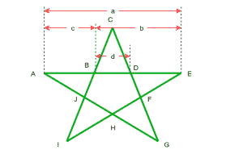

# 正五角星的面积

> 原文:[https://www.geeksforgeeks.org/area-of-a-regular-pentagram/](https://www.geeksforgeeks.org/area-of-a-regular-pentagram/)

给定五角星和它的内侧长度(d)。任务是找出五角星的面积。五角星是一颗五角星，由五段直线画出一条连续的线形成。



**示例:**

> **输入:** d = 5
> **输出:**面积= 139.187
> 正五角星面积= 139.187
> 
> **输入:** d = 7
> **输出:**面积= 272.807

想法是在 a/b、b/c 和 c/d 之间使用[黄金比例](https://en.wikipedia.org/wiki/Golden_ratio)，约等于 1.618
内侧长度 d，所以
c = 1.618 * d
b = 1.618 * c
a = 1.618 * b
AB、BC 和 CD 相等(正五角星的两边)
所以 AB = BC = CD = c，BD 由 d 给出

> 五边形面积=五边形 BDFHJ + 5 的面积*(三角形 BCD 的面积)
> 五边形 BDFHJ 的面积= (d^2 * 5)/ (4* tan 36)
> 三角形 BCD 的面积=[s(s-d)(s-c)(s-c)]^(1/2]{ heron 公式}
> 其中
> s = (d + c + c)/2

下面是上述方法的实现:

## C++

```
// C++ implementation of the approach
#include <bits/stdc++.h>
#define PI 3.14159
using namespace std;

// Function to return the area of triangle BCD
double areaOfTriangle(float d)
{
    // Using Golden ratio
    float c = 1.618 * d;
    float s = (d + c + c) / 2;

    // Calculate area of triangle BCD
    double area = sqrt(s * (s - c) *
                          (s - c) * (s - d));

    // Return area of all 5 triangle are same
    return 5 * area;
}

// Function to return the area of regular pentagon
double areaOfRegPentagon(float d)
{
    // Calculate the area of regular
    // pentagon using above formula
    double cal = 4 * tan(PI / 5);
    double area = (5 * d * d) / cal;

    // Return area of regular pentagon
    return area;
}

// Function to return the area of pentagram
double areaOfPentagram(float d)
{
    // Area of a pentagram is equal to the
    // area of regular  pentagon and five times
    // the area of Triangle
    return areaOfRegPentagon(d) +
                             areaOfTriangle(d);
}

// Driver code
int main()
{
    float d = 5;
    cout << areaOfPentagram(d) << endl;

    return 0;
}
```

## Java 语言(一种计算机语言，尤用于创建网站)

```
// Java implementation of above approach
public class GFG
{

    static double PI = 3.14159;

    // Function to return the area of triangle BCD
    static double areaOfTriangle(float d)
    {
        // Using Golden ratio
        float c = (float) (1.618 * d);
        float s = (d + c + c) / 2;

        // Calculate area of triangle BCD
        double area = Math.sqrt(s * (s - c)
                * (s - c) * (s - d));

        // Return area of all 5 triangle are same
        return 5 * area;
    }

    // Function to return the area of regular pentagon
    static double areaOfRegPentagon(float d)
    {
        // Calculate the area of regular
        // pentagon using above formula
        double cal = 4 * Math.tan(PI / 5);
        double area = (5 * d * d) / cal;

        // Return area of regular pentagon
        return area;
    }

    // Function to return the area of pentagram
    static double areaOfPentagram(float d)
    {
        // Area of a pentagram is equal to the
        // area of regular pentagon and five times
        // the area of Triangle
        return areaOfRegPentagon(d)
                + areaOfTriangle(d);
    }

    // Driver code
    public static void main(String[] args)
    {
        float d = 5;
        System.out.println(areaOfPentagram(d));
    }
}

// This code has been contributed by 29AjayKumar
```

## 蟒蛇 3

```
# Python3 implementation of the approach

import math

PI = 3.14159

# Function to return the area of triangle BCD
def areaOfTriangle(d) :

    # Using Golden ratio
    c = 1.618 * d
    s = (d + c + c) / 2

    # Calculate area of triangle BCD
    area = math.sqrt(s * (s - c) *
                        (s - c) * (s - d))

    # Return area of all 5 triangles are the same
    return 5 * area

# Function to return the area of regular pentagon
def areaOfRegPentagon(d) :

    global PI
    # Calculate the area of regular
    # pentagon using above formula
    cal = 4 * math.tan(PI / 5)
    area = (5 * d * d) / cal

    # Return area of regular pentagon
    return area

# Function to return the area of pentagram
def areaOfPentagram(d) :

    # Area of a pentagram is equal to the
    # area of regular pentagon and five times
    # the area of Triangle
    return areaOfRegPentagon(d) + areaOfTriangle(d)

# Driver code

d = 5
print(areaOfPentagram(d))

# This code is contributed by ihritik
```

## C#

```
// C# implementation of the above approach
using System;

class GFG
{

    static double PI = 3.14159;

    // Function to return the area of triangle BCD
    static double areaOfTriangle(float d)
    {
        // Using Golden ratio
        float c = (float) (1.618 * d);
        float s = (d + c + c) / 2;

        // Calculate area of triangle BCD
        double area = Math.Sqrt(s * (s - c)
                * (s - c) * (s - d));

        // Return area of all 5 triangle are same
        return 5 * area;
    }

    // Function to return the area of regular pentagon
    static double areaOfRegPentagon(float d)
    {
        // Calculate the area of regular
        // pentagon using above formula
        double cal = 4 * Math.Tan(PI / 5);
        double area = (5 * d * d) / cal;

        // Return area of regular pentagon
        return area;
    }

    // Function to return the area of pentagram
    static double areaOfPentagram(float d)
    {
        // Area of a pentagram is equal to the
        // area of regular pentagon and five times
        // the area of Triangle
        return areaOfRegPentagon(d)
                + areaOfTriangle(d);
    }

    // Driver code
    public static void Main()
    {
        float d = 5;
        Console.WriteLine(areaOfPentagram(d));
    }
}

// This code has been contributed by ihritik
```

## java 描述语言

```
<script>
// Javascript implementation of the approach
var PI = 3.14159

// Function to return the area of triangle BCD
function areaOfTriangle(d)
{
    // Using Golden ratio
    var c = 1.618 * d;
    var s = (d + c + c) / 2;

    // Calculate area of triangle BCD
    var area = Math.sqrt(s * (s - c) *
                          (s - c) * (s - d));

    // Return area of all 5 triangle are same
    return 5 * area;
}

// Function to return the area of regular pentagon
function areaOfRegPentagon( d)
{
    // Calculate the area of regular
    // pentagon using above formula
    var cal = 4 * Math.tan(PI / 5);
    var area = (5 * d * d) / cal;

    // Return area of regular pentagon
    return area;
}

// Function to return the area of pentagram
function areaOfPentagram(d)
{
    // Area of a pentagram is equal to the
    // area of regular  pentagon and five times
    // the area of Triangle
    return areaOfRegPentagon(d) +
                             areaOfTriangle(d);
}

// Driver code
var d = 5;
document.write(areaOfPentagram(d).toFixed(3));

// This code is contributed by ShubhamSingh10
</script>
```

**Output:** 

```
139.187
```

**时间复杂度:** O(1)