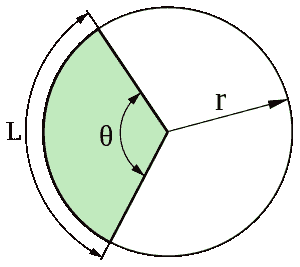

# 圆形扇形的面积

> 原文:[https://www.geeksforgeeks.org/area-of-a-sector/](https://www.geeksforgeeks.org/area-of-a-sector/)

圆形扇区或圆形扇区是由两个半径和一个圆弧围成的圆盘部分，其中较小的区域称为次扇区，较大的区域称为主扇区。让我们看看这个图，试着算出扇面:



来源:维基百科(https://goo.gl/mWijn2)

在此图中，绿色阴影部分是一个扇形，“r”是半径，“θ”是角度，如图所示。这里，我们可以说阴影部分是次要部分，另一部分是主要部分。“L”是扇形的弧线。更多信息，请访问[部门](https://en.wikipedia.org/wiki/Circular_sector)。
现在我们来看看计算圆的扇形的公式。


扇形的面积类似于圆的[面积的计算，只是将圆的面积乘以扇形的角度。
示例:](https://www.geeksforgeeks.org/c-program-find-area-circle/) 

```
Input:
radius = 9
angle = 60
Explanation:
Sector = ( pi * 9*9 ) * ( 60 / 360 )
Output: 42.42857142857142

Input:
radius = 20
angle = 145
Explanation:
Sector = ( pi * 20*20 ) * ( 145 / 360 )
Output: 506.3492063492063
```

## C++

```
// C++ program to find Area of a Sector
#include <iostream>
using namespace std;

void SectorArea(double radius,double angle)
{
    if(angle >= 360)
        cout<<"Angle not possible";

    // Calculating area of the sector
    else
    {
        double sector = ((22 * radius * radius) / 7) 
                       * (angle / 360);
        cout<<sector;
    }
} 

// Driver code
int main() 
{
    double radius = 9;
    double angle = 60;
    SectorArea(radius, angle);
    return 0;
}

// This code is contributed by Anant Agarwal.
```

## Java 语言(一种计算机语言，尤用于创建网站)

```
// Java program to find Area of a Sector

class GFG 
{
    static void SectorArea(double radius,double angle)
    {
        if(angle >= 360)
            System.out.println("Angle not possible");

        // Calculating area of the sector
        else
        {
            double sector =((22 * radius * radius) / 7) 
                           * (angle / 360);
            System.out.println(sector);
        }
    }

    // Driver code
    public static void main (String[] args)
    {
        double radius = 9;
        double angle = 60;
        SectorArea(radius, angle);
    }
}
// This code is contributed by Anant Agarwal.
```

## 蟒蛇 3

```
# Python program to find Area of a Sector

def SectorArea(radius, angle):
    pi = 22 / 7

    # Constraint or Limit
    if angle >= 360:
        print("Angle not possible")
        return

    # Calculating area of the sector
    else:
        sector = (pi * radius ** 2) * (angle / 360)
        print(sector)
        return

# Driver code 
radius = 9
angle = 60
SectorArea(radius, angle)
```

## C#

```
// C# program to find Area of a Sector
using System;

class GFG {

    static void SectorArea(double radius, double angle)
    {

        if (angle >= 360)
            Console.WriteLine("Angle not possible");

        // Calculating area of the sector
        else {
            double sector = ((22 * radius * radius) / 7)
                            * (angle / 360);

            Console.WriteLine(sector);
        }
    }

    // Driver code
    public static void Main()
    {
        double radius = 9;
        double angle = 60;

        SectorArea(radius, angle);
    }
}

// This code is contributed by vt_m.
```

## 服务器端编程语言（Professional Hypertext Preprocessor 的缩写）

```
<?php
// PHP program to find Area of a Sector

function SectorArea( $radius, $angle)
{
    if($angle >= 360)
        echo("Angle not possible");

    // Calculating area of the sector
    else
    {
        $sector = ((22 * $radius * $radius)
                     / 7) * ($angle / 360);
        echo($sector);
    }
} 

// Driver code

    $radius = 9;
    $angle = 60;
    SectorArea($radius, $angle);

// This code is contributed by vt_m.
?>
```

## java 描述语言

```
<script>

// Javascript program to find Area of a Sector

    function SectorArea(radius, angle)
    {
        if(angle >= 360)
            document.write("Angle not possible");

        // Calculating area of the sector
        else
        {
            let sector =((22 * radius * radius) / 7) 
                           * (angle / 360);
            document.write(sector);
        }
    }

// Driver code
        let radius = 9;
        let angle = 60;
        SectorArea(radius, angle);

  // This code is contributed by code_hunt.
</script>
```

输出:

```
42.42857142857142
```

参考:维基百科([圆形扇区](https://en.wikipedia.org/wiki/Circular_sector) )
本文由 [**钦莫伊蕾恩卡**](https://www.linkedin.com/in/lenkachinmoy/) 供稿。如果你喜欢 GeeksforGeeks 并想投稿，你也可以使用[write.geeksforgeeks.org](https://write.geeksforgeeks.org)写一篇文章或者把你的文章邮寄到 review-team@geeksforgeeks.org。看到你的文章出现在极客博客主页上，帮助其他极客。
如果发现有不正确的地方，或者想分享更多关于上述话题的信息，请写评论。