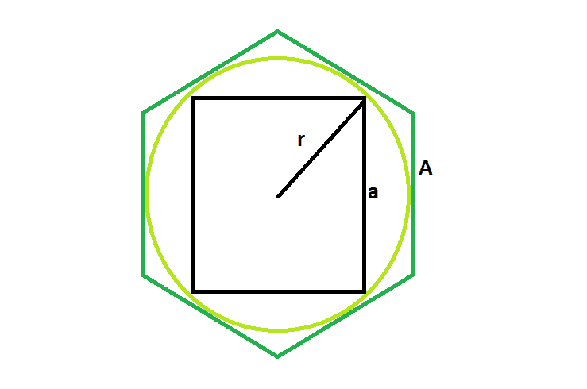

# 内切圆内接六边形的正方形面积

> 原文:[https://www . geesforgeks . org/内切圆面积内切圆/内切圆/T1](https://www.geeksforgeeks.org/area-of-a-square-inscribed-in-a-circle-which-is-inscribed-in-a-hexagon/)

给定一个边为 **A** 的正六边形，该正六边形刻一个半径为 **r** 的圆，该圆又刻一个边为 **a** 的正方形。任务是找到这个正方形的面积。
**示例** :

```
Input :  A = 5
Output : 37.5

Input : A = 8
Output : 96
```



**逼近** :
我们知道内切圆在六边形内的半径是， **r=A√3/2** ( [这里请参考](https://www.geeksforgeeks.org/area-of-a-circle-inscribed-in-a-regular-hexagon/) )
同样，圆内圆的边长是， **a=√r=√3A/√2**
所以，正方形的面积， **Area=(√3A/√2)^2**

## C++

```
// C++ Program to find the area of the square
// inscribed within the circle which in turn
// is inscribed in a hexagon
#include <bits/stdc++.h>
using namespace std;

// Function to find the area of the square
float area(float a)
{

    // side of hexagon cannot be negative
    if (a < 0)
        return -1;

    // area of the square
    float area = pow((a * sqrt(3)) / (sqrt(2)), 2);
    return area;
}

// Driver code
int main()
{
    float a = 5;
    cout << area(a) << endl;
    return 0;
}
```

## Java 语言(一种计算机语言，尤用于创建网站)

```
// Java Program to find the area of the square
// inscribed within the circle which in turn
// is inscribed in a hexagon

import java.io.*;

class GFG {

// Function to find the area of the square
static float area(float a)
{

    // side of hexagon cannot be negative
    if (a < 0)
        return -1;

    // area of the square
    float area = (float)Math.pow((a * Math.sqrt(3)) / (Math.sqrt(2)), 2);
    return area;
}

// Driver code
    public static void main (String[] args) {
        float a = 5;
    System.out.println( area(a));
    }
}
// This code is contributed by ajit
```

## 蟒蛇 3

```
# Python 3 Program to find the area
# of the square inscribed within the
# circle which in turn is inscribed
# in a hexagon
from math import pow, sqrt

# Function to find the area
# of the square
def area(a):

    # side of hexagon cannot
    # be negative
    if (a < 0):
        return -1

    # area of the square
    area = pow((a * sqrt(3)) /
                   (sqrt(2)), 2)
    return area

# Driver code
if __name__ == '__main__':
    a = 5
    print("{0:.3}".format(area(a)))

# This code is contributed
# by SURENDRA_GANGWAR
```

## C#

```
// C# Program to find the area of
// the square inscribed within the
// circle which in turn is inscribed
// in a hexagon
using System;

class GFG
{

// Function to find the area
// of the square
static float area(float a)
{

    // side of hexagon cannot be negative
    if (a < 0)
        return -1;

    // area of the square
    float area = (float)Math.Pow((a * Math.Sqrt(3)) /
                                 (Math.Sqrt(2)), 2);
    return area;
}

// Driver code
public static void Main ()
{
    float a = 5;
    Console.WriteLine( area(a));
}
}

// This code is contributed by inder_verma..
```

## 服务器端编程语言（Professional Hypertext Preprocessor 的缩写）

```
<?php
// PHP Program to find the area
// of the square inscribed within
// the circle which in turn is
// inscribed in a hexagon

// Function to find the area
// of the square
function area($a)
{

    // side of hexagon cannot
    // be negative
    if ($a < 0)
        return -1;

    // area of the square
    $area = pow(($a * sqrt(3)) /
                (sqrt(2)), 2);
    return $area;
}

// Driver code
$a = 5;
echo area($a) . "\n";

// This code is contributed
// by Akanksha Rai(Abby_akku)
?>
```

## java 描述语言

```
<script>

// javascript Program to find the area of the square
// inscribed within the circle which in turn
// is inscribed in a hexagon

// Function to find the area of the square
function area(a)
{

    // side of hexagon cannot be negative
    if (a < 0)
        return -1;

    // area of the square
    var area = Math.pow((a * Math.sqrt(3)) / (Math.sqrt(2)), 2);
    return area;
}

// Driver code
var a = 5;
document.write( area(a).toFixed(5));

// This code contributed by shikhasingrajput

</script>
```

**Output:** 

```
37.5
```