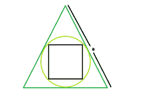

# 内切圆内接等边三角形的正方形面积

> 原文:[https://www . geesforgeks . org/等边三角形内切圆面积/](https://www.geeksforgeeks.org/area-of-a-square-inscribed-in-a-circle-which-is-inscribed-in-an-equilateral-triangle/)

这里给定的是一个边长为 **a** 的等边三角形，它刻下一个圆，圆又刻下一个正方形。任务是找到这个正方形的面积。
**例:**

```
Input: a = 6
Output: 1

Input: a = 10
Output: 0.527046
```



**接近** :

> 设 **r** 为圆的半径，
> 故为等边三角形的内半径，故 **r = a /(2 * √3)**
> 正方形的对角线， **d** =圆的直径= **2 * r = a/ √3**
> 所以，正方形的面积， **A = 0.5 * d * d**
> 故 **A = (1/2) * (a^2) /(**

以下是上述方法的实现:

## C++

```
// C++ Program to find the area of the square
// inscribed within the circle which in turn
// is inscribed in an equilateral triangle
#include <bits/stdc++.h>
using namespace std;

// Function to find the area of the square
float area(float a)
{

    // a cannot be negative
    if (a < 0)
        return -1;

    // area of the square
    float area = sqrt(a) / 6;

    return area;
}

// Driver code
int main()
{
    float a = 10;
    cout << area(a) << endl;
    return 0;
}
```

## Java 语言(一种计算机语言，尤用于创建网站)

```
// Java Program to find the area of the square
// inscribed within the circle which in turn
// is inscribed in an equilateral triangle

import java.io.*;

class GFG {

// Function to find the area of the square
static float area(float a)
{

    // a cannot be negative
    if (a < 0)
        return -1;

    // area of the square
    float area = (float)Math.sqrt(a) / 6;

    return area;
}

// Driver code
    public static void main (String[] args) {
        float a = 10;
    System.out.println( area(a));
// This code is contributed
// by  inder_verma..
    }
}
```

## 蟒蛇 3

```
# Python3 Program to find the area
# of the square inscribed within 
# the circle which in turn is
# inscribed in an equilateral triangle

# import everything from math lib.
from math import *

# Function to find the area
# of the square
def area(a):

    # a cannot be negative
    if a < 0 :
        return -1

    # area of the square
    area = sqrt(a) / 6

    return area

# Driver code    
if __name__ == "__main__" :

    a = 10
    print(round(area(a), 6))

# This code is contributed by ANKITRAI1
```

## C#

```
// C# Program to find the area
// of the square inscribed within
// the circle which in turn is
// inscribed in an equilateral triangle
using System;

class GFG
{

// Function to find the area
// of the square
static float area(float a)
{

    // a cannot be negative
    if (a < 0)
        return -1;

    // area of the square
    float area = (float)Math.Sqrt(a) / 6;

    return area;
}

// Driver code
public static void Main ()
{
    float a = 10;
    Console.WriteLine(area(a));
}
}

// This code is contributed
// by inder_verma
```

## 服务器端编程语言（Professional Hypertext Preprocessor 的缩写）

```
<?php
// PHP Program to find the area
// of the square inscribed within
// the circle which in turn is
// inscribed in an equilateral triangle

// Function to find the
// area of the square
function area($a)
{

    // a cannot be negative
    if ($a < 0)
        return -1;

    // area of the square
    $area = sqrt($a) / 6;

    return $area;
}

// Driver code
$a = 10;
echo area($a);

// This code is contributed
// by inder_verma
?>
```

## java 描述语言

```
<script>
// javascript Program to find the area of the square
// inscribed within the circle which in turn
// is inscribed in an equilateral triangle

// Function to find the area of the square
function area(a)
{

    // a cannot be negative
    if (a < 0)
        return -1;

    // area of the square
    var area = Math.sqrt(a) / 6;

    return area;
}

// Driver code
var a = 10;
document.write( area(a).toFixed(6));

// This code contributed by shikhasingrajput

</script>
```

**Output:** 

```
0.527046
```