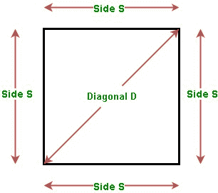
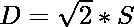
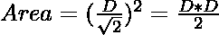
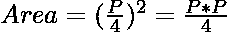

# 正方形的面积|使用边、对角线和周长

> 原文:[https://www . geesforgeks . org/使用边对角线和周长的正方形面积/](https://www.geeksforgeeks.org/area-of-a-square-using-side-diagonal-and-perimeter/)

给定正方形的其中一条边 **S** 、对角线 **D** 或周长 **P** ，任务是用给定值找到正方形的面积。

[](https://media.geeksforgeeks.org/wp-content/uploads/20200724173112/squarjpeg.jpg)

**例:**

> **输入:**S = 5
> T3】输出:使用边的正方形面积= 25
> 
> **输入:** D = 4
> **输出:**使用对角线的正方形面积= 8
> 
> **输入:** P = 32
> **输出:**使用周长的正方形面积= 64

### [利用正方形的边寻找正方形的面积](https://www.geeksforgeeks.org/program-area-square/)

侧面的正方形面积 **S** 由下式给出:

> 面积=边*边

下面是上述方法的实现:

## C++

```
// C++ program for the above approach
#include <iostream>
using namespace std;

// Function to find the area of a square
int areaOfSquare(int S)
{
    // Use above formula
    int area = S * S;

    return area;
}

// Driver Code
int main()
{

    // Given Side of square
    int S = 5;

    // Function call
    cout << areaOfSquare(S);
    return 0;
}
```

## Java 语言(一种计算机语言，尤用于创建网站)

```
// Java program for the above approach
class GFG{

// Function to find the area of a square
static int areaOfSquare(int S)
{
    // Use above formula
    int area = S * S;

    return area;
}

// Driver Code
public static void main(String[] args)
{

    // Given Side of square
    int S = 5;

    // Function call
    System.out.println(areaOfSquare(S));
}
}

// This code is contributed by rock_cool
```

## 蟒蛇 3

```
# Python3 program for the above approach

# Function to find the area of a square
def areaOfSquare(S):

    # Use above formula
    area = S * S

    return area

# Driver Code
if __name__ == '__main__':

    # Given Side of square
    S = 5

    # Function call
    print(areaOfSquare(S))

# This code is contributed by Mohit Kumar
```

## C#

```
// C# program for the above approach
using System;
class GFG{

// Function to find the area of a square
static int areaOfSquare(int S)
{
    // Use above formula
    int area = S * S;

    return area;
}

// Driver Code
public static void Main(string[] args)
{

    // Given Side of square
    int S = 5;

    // Function call
    Console.Write(areaOfSquare(S));
}
}

// This code is contributed by Ritik Bansal
```

## java 描述语言

```
<script>

    // Javascript program for the above approach

    // Function to find the area of a square
    function areaOfSquare(S)
    {
        // Use above formula
        let area = S * S;

        return area;
    }

    // Given Side of square
    let S = 5;

    // Function call
    document.write(areaOfSquare(S));

    // This code is contributed by divyeshrabadiya07.

</script>
```

**Output:** 

```
25
```

### [用对角线找到正方形的面积](https://www.geeksforgeeks.org/program-area-square/)

*   给定边的正方形面积 **S** 由:
    给出

> 面积= S * S …(1)

*   边 **S** 和对角线 **D** 之间的关系由下式给出:

> 
> 
> ……(2)

*   将等式(1)中等式(2)的 S 值代入，我们得到:

> 

下面是上述方法的实现:

## C++

```
// C++ program for the above approach
#include <iostream>
using namespace std;

// Function to find the area of a square
int areaOfSquare(int D)
{
    // Use above formula
    int area = (D * D) / 2;

    return area;
}

// Driver Code
int main()
{

    // Given diagonal of square
    int D = 4;

    // Function call
    cout << areaOfSquare(D);
    return 0;
}
```

## Java 语言(一种计算机语言，尤用于创建网站)

```
// Java program for the above approach
import java.util.*;

class GFG{

// Function to find the area of a square
static int areaOfSquare(int D)
{

    // Use above formula
    int area = (D * D) / 2;

    return area;
}

// Driver Code
public static void main(String[] args)
{

    // Given diagonal of square
    int D = 4;

    // Function call
    System.out.print(areaOfSquare(D));
}
}

// This code is contributed by PrinciRaj1992
```

## 蟒蛇 3

```
# Python3 program for the above approach

# Function to find the area of a square
def areaOfSquare(D):

    # Use above formula
    area = (D * D) // 2;

    return area;

# Driver Code
if __name__ == '__main__':

    # Given diagonal of square
    D = 4;
    # Function call
    print(areaOfSquare(D));

# This code is contributed by PrinciRaj1992
```

## C#

```
// C# program for the above approach
using System;

class GFG{

// Function to find the area of a square
static int areaOfSquare(int D)
{

    // Use above formula
    int area = (D * D) / 2;

    return area;
}

// Driver Code
public static void Main(String[] args)
{

    // Given diagonal of square
    int D = 4;

    // Function call
    Console.Write(areaOfSquare(D));
}
}

// This code is contributed by amal kumar choubey
```

## java 描述语言

```
<script>
    // Javascript program for the above approach

    // Function to find the area of a square
    function areaOfSquare(D)
    {
        // Use above formula
           let area = parseInt((D * D) / 2, 10);

        return area;
    }

    // Given diagonal of square
    let D = 4;

    // Function call
    document.write(areaOfSquare(D));

</script>
```

**Output:** 

```
8
```

### [利用正方形的周长找到正方形的面积](https://www.geeksforgeeks.org/program-area-square/)

*   给定边的正方形面积 **S** 由下式给出:

> 面积= S * S …(1)

*   边 **S** 和周长 **P** 之间的关系由下式给出:

> P =4*S …(2)

*   将等式(1)中等式(2)的 S 值代入，我们得到:

> 

下面是上述公式的实现:

## C++

```
// C++ program for the above approach
#include <iostream>
using namespace std;

// Function to find the area of a square
int areaOfSquare(int P)
{
    // Use above formula
    int area = (P * P) / 16;

    return area;
}

// Driver Code
int main()
{
    // Given perimeter of square
    int P = 32;

    // Function call
    cout << areaOfSquare(P);
    return 0;
}
```

## Java 语言(一种计算机语言，尤用于创建网站)

```
// Java program for the above approach
class GFG{

// Function to find the area of a square
static int areaOfSquare(int P)
{

    // Use above formula
    int area = (P * P) / 16;

    return area;
}

// Driver Code
public static void main(String[] args)
{

    // Given perimeter of square
    int P = 32;

    // Function call
    System.out.print(areaOfSquare(P));
}
}

// This code is contributed by amal kumar choubey
```

## 蟒蛇 3

```
# Python3 program for the above approach

# Function to find the area of a square
def areaOfSquare(P):

    # Use above formula
    area = (P * P) // 16;

    return area;

# Driver Code
if __name__ == '__main__':

    # Given perimeter of square
    P = 32;

    # Function call
    print(areaOfSquare(P));

# This code is contributed by gauravrajput1
```

## C#

```
// C# program for the above approach
using System;

class GFG{

// Function to find the area of a square
static int areaOfSquare(int P)
{

    // Use above formula
    int area = (P * P) / 16;

    return area;
}

// Driver Code
public static void Main(String[] args)
{

    // Given perimeter of square
    int P = 32;

    // Function call
    Console.Write(areaOfSquare(P));
}
}

// This code is contributed by amal kumar choubey
```

## java 描述语言

```
<script>

// javascript program for the above approach
// Function to find the area of a square
function areaOfSquare(P)
{

    // Use above formula
    var area = (P * P) / 16;

    return area;
}

// Driver Code
//Given perimeter of square
var P = 32;

// Function call
document.write(areaOfSquare(P));

// This code is contributed by Princi Singh
</script>
```

**Output:** 

```
64
```