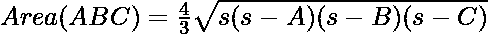
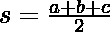

# 从给定的中线长度开始的三角形面积

> 原文:[https://www . geeksforgeeks . org/给定长度的中值三角形面积/](https://www.geeksforgeeks.org/area-of-a-triangle-from-the-given-lengths-of-medians/)

给定三个整数 **A** 、 **B** 和 **C** ，表示三角形三个中线的长度，任务是计算三角形的面积。

> 三角形的中间值**是将一个顶点连接到对侧中点的线段，从而将该侧一分为二。**

**示例:**

> **输入:** A = 9，B = 12，C = 15
> **输出:** 72.0
> **输入:** A = 39，B = 42，C = 45
> **输出:** 1008.0

**方法:**
三角形的面积可以根据给定的中线长度使用以下公式计算:

> 
> 
> 在哪里
> 
> 

下面是上述方法的实现:

## C++14

```
// C++14 program to calculate
// area of a triangle from the
// given lengths of medians
#include <bits/stdc++.h>
using namespace std;

// Function to return the area of
// triangle using medians
double Area_of_Triangle(int a, int b, int c)
{
    int s = (a + b + c) / 2;
    int x = s * (s - a);
    x = x * (s - b);
    x = x * (s - c);
    double area = (4 / (double)3) * sqrt(x);

    return area;
}

// Driver Code
int main()
{
    int a = 9;
    int b = 12;
    int c = 15;

    // Function call
    double ans = Area_of_Triangle(a, b, c);

    // Print the final answer
    cout << ans;
}

// This code is contributed by code_hunt
```

## Java 语言(一种计算机语言，尤用于创建网站)

```
// Java program to calculate
// area of a triangle from the
// given lengths of medians
class GFG{

// Function to return the area of
// triangle using medians
static double Area_of_Triangle(int a,
                               int b, int c)
{
    int s = (a + b + c)/2;
    int x = s * (s - a);
    x = x * (s - b);
    x = x * (s - c);
    double area = (4 / (double)3) * Math.sqrt(x);

    return area;
}

// Driver Code
public static void main(String[] args)
{
    int a = 9;
    int b = 12;
    int c = 15;

    // Function Call
    double ans = Area_of_Triangle(a, b, c);

    // Print the final answer
    System.out.println(ans);
}
}

// This code is contributed by sapnasingh4991
```

## 蟒蛇 3

```
# Python3 program to calculate
# area of a triangle from the
# given lengths of medians
import math

# Function to return the area of
# triangle using medians
def Area_of_Triangle(a, b, c):

    s = (a + b + c)//2
    x = s * (s - a)
    x = x * (s - b)
    x = x * (s - c)
    area = (4 / 3) * math.sqrt(x)

    return area

# Driver Code
a = 9
b = 12
c = 15

# Function Call
ans = Area_of_Triangle(a, b, c)

# Print the final answer
print(round(ans, 2))
```

## C#

```
// C# program to calculate
// area of a triangle from the
// given lengths of medians
using System;

class GFG{

// Function to return the area of
// triangle using medians
static double Area_of_Triangle(int a,
                               int b, int c)
{
    int s = (a + b + c) / 2;
    int x = s * (s - a);

    x = x * (s - b);
    x = x * (s - c);

    double area = (4 / (double)3) * Math.Sqrt(x);

    return area;
}

// Driver Code
public static void Main(String[] args)
{
    int a = 9;
    int b = 12;
    int c = 15;

    // Function call
    double ans = Area_of_Triangle(a, b, c);

    // Print the final answer
    Console.WriteLine(ans);
}
}

// This code is contributed by sapnasingh4991
```

## java 描述语言

```
<script>
// javascript program to calculate
// area of a triangle from the
// given lengths of medians

    // Function to return the area of
    // triangle using medians
    function Area_of_Triangle(a , b , c) {
        var s = (a + b + c) / 2;
        var x = s * (s - a);
        x = x * (s - b);
        x = x * (s - c);
        var area = (4 / 3) * Math.sqrt(x);

        return area;
    }

    // Driver Code

    var a = 9;
    var b = 12;
    var c = 15;

    // Function Call
    var ans = Area_of_Triangle(a, b, c);

    // Prvar the final answer
    document.write(ans.toFixed(1));

// This code is contributed by Rajput-Ji
</script>
```

**Output:** 

```
72.0
```

***时间复杂度:** O(1)*
***辅助空间:** O(1)*