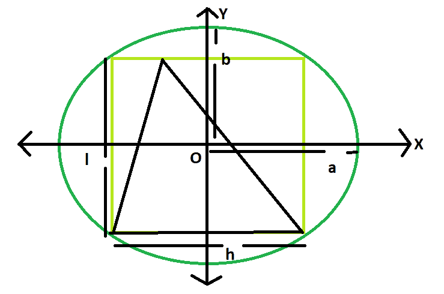

# 内接在矩形内接在椭圆内的三角形面积

> 原文:[https://www . geeksforgeeks . org/内接椭圆的矩形三角形面积/](https://www.geeksforgeeks.org/area-of-a-triangle-inscribed-in-a-rectangle-which-is-inscribed-in-an-ellipse/)

这里给出的是一个椭圆，其轴长为 **2a** 和 **2b** ，椭圆上刻有一个长为 **l** 和宽为 **h** 的矩形，矩形上又刻有一个三角形。任务是找到这个三角形的面积。
**举例:**

```
Input: a = 4, b = 3
Output: 12

Input: a = 5, b = 2
Output: 10
```



**逼近** :
我们知道椭圆内接矩形的面积是， **Ar = 2ab** ( [请参考此处](https://www.geeksforgeeks.org/area-of-largest-rectangle-that-can-be-inscribed-in-an-ellipse/))，
也是矩形 s 内接三角形的面积， **A = Ar/2 = ab** ( [请参考此处](https://www.geeksforgeeks.org/area-of-largest-triangle-that-can-be-inscribed-within-a-rectangle/))
T13】下面是上述逼近 :
的实现

## C++

```
// C++ Program to find the area of the triangle
// inscribed within the rectangle which in turn
// is inscribed in an ellipse
#include <bits/stdc++.h>
using namespace std;

// Function to find the area of the triangle
float area(float a, float b)
{

    // length of a and b cannot be negative
    if (a < 0 || b < 0)
        return -1;

    // area of the triangle
    float A = a * b;
    return A;
}

// Driver code
int main()
{
    float a = 5, b = 2;
    cout << area(a, b) << endl;
    return 0;
}
```

## Java 语言(一种计算机语言，尤用于创建网站)

```
   // Java Program to find the area of the triangle
// inscribed within the rectangle which in turn
// is inscribed in an ellipse

import java.io.*;

class GFG {

// Function to find the area of the triangle
static float area(float a, float b)
{

    // length of a and b cannot be negative
    if (a < 0 || b < 0)
        return -1;

    // area of the triangle
    float A = a * b;
    return A;
}

// Driver code

    public static void main (String[] args) {
    float a = 5, b = 2;
    System.out.println(area(a, b));
    }
}
//This code is contributed by anuj_67..
```

## 蟒蛇 3

```
# Python 3 Program to find the
# area of the triangle inscribed
# within the rectangle which in
# turn is inscribed in an ellipse

# Function to find the area
# of the triangle
def area(a, b):

    # length of a and b cannot
    # be negative
    if (a < 0 or b < 0):
        return -1

    # area of the triangle
    A = a * b
    return A

# Driver code
if __name__ == '__main__':
    a = 5
    b = 2
    print(area(a, b))

# This code is contributed
# by Surendra_Gangwar
```

## C#

```
// C# Program to find the area of
// the triangle inscribed within
// the rectangle which in turn
// is inscribed in an ellipse
using System;

class GFG
{

// Function to find the
// area of the triangle
static float area(float a, float b)
{

    // length of a and b
    // cannot be negative
    if (a < 0 || b < 0)
        return -1;

    // area of the triangle
    float A = a * b;
    return A;
}

// Driver code
static public void Main ()
{
    float a = 5, b = 2;
    Console.WriteLine(area(a, b));
}
}

// This code is contributed by ajit
```

## 服务器端编程语言（Professional Hypertext Preprocessor 的缩写）

```
<?php
// PHP Program to find the area
// of the triangle inscribed within
// the rectangle which in turn
// is inscribed in an ellipse

// Function to find the
// area of the triangle
function area($a, $b)
{

    // length of a and b cannot
    // be negative
    if ($a < 0 || $b < 0)
        return -1;

    // area of the triangle
    $A = $a * $b;
    return $A;
}

// Driver code
$a = 5;
$b = 2;
echo area($a, $b);

// This code is contributed
// by Mahadev99
?>
```

## java 描述语言

```
<script>

// javascript Program to find the area of the triangle
// inscribed within the rectangle which in turn
// is inscribed in an ellipse

// Function to find the area of the triangle
function area(a , b)
{

    // length of a and b cannot be negative
    if (a < 0 || b < 0)
        return -1;

    // area of the triangle
    var A = a * b;
    return A;
}

// Driver code

var a = 5, b = 2;
document.write(area(a, b));

// This code contributed by Princi Singh

</script>
```

**Output:** 

```
10
```