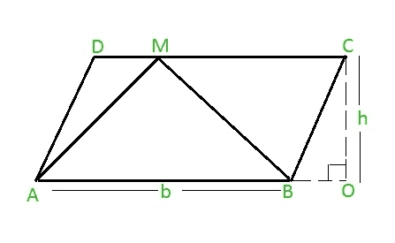

# 平行四边形内三角形的面积

> 原文:[https://www . geesforgeks . org/平行四边形内三角形面积/](https://www.geeksforgeeks.org/area-of-a-triangle-inside-a-parallelogram/)

给定平行四边形的底部和高度 **ABCD** 分别是 **b 和 h** 。任务是计算在平行四边形的基础 **AB** 上构造的三角形的面积▲ABM (M 可以是上侧的任意点)，如下图:



**例:**

```
Input: b = 30, h = 40
Output: 600.000000
```

**进场:**

> **构建在平行四边形的基底上并在平行四边形的相对平行边上的任意点接触的三角形的面积可以给出为= 0.5 *基底*高度**

因此，**面积▲ABM = 0.5 * b * h**
以下是上述方法的实施:

## C++

```
#include <iostream>
using namespace std;

// function to calculate the area
float CalArea(float b, float h)
{
    return (0.5 * b * h);
}
// driver code
int main()
{
    float b, h, Area;
    b = 30;
    h = 40;

    // function calling
    Area = CalArea(b, h);
    // displaying the area
    cout << "Area of Triangle is :" << Area;
    return 0;
}
```

## C

```
#include <stdio.h>

// function to calculate the area
float CalArea(float b, float h)
{
    return (0.5 * b * h);
}

// driver code
int main()
{
    float b, h, Area;
    b = 30;
    h = 40;

    // function calling
    Area = CalArea(b, h);

    // displaying the area
    printf("Area of Triangle is : %f\n", Area);
    return 0;
}
```

## Java 语言(一种计算机语言，尤用于创建网站)

```
public class parallelogram {
    public static void main(String args[])
    {
        double b = 30;
        double h = 40;

        // formula for calculating the area
        double area_triangle = 0.5 * b * h;

        // displaying the area
        System.out.println("Area of the Triangle = " + area_triangle);
    }
}
```

## 计算机编程语言

```
b = 30
h = 40 

# formula for finding the area
area_triangle = 0.5 * b * h

# displaying the output
print("Area of the triangle = "+str(area_triangle))
```

## C#

```
using System;
class parallelogram {
    public static void Main()
    {
        double b = 30;
        double h = 40;

        // formula for calculating the area
        double area_triangle = 0.5 * b * h;

        // displaying the area
        Console.WriteLine("Area of the triangle = " + area_triangle);
    }
}
```

## 服务器端编程语言（Professional Hypertext Preprocessor 的缩写）

```
<?php   
   $b = 30; 
   $h = 40; 
   $area_triangle=0.5*$b*$h; 
    echo "Area of the triangle = "; 
    echo $area_triangle; 
?>
```

## java 描述语言

```
<script>
    var b = 30;
    var h = 40;

    // formula for calculating the area
    var area_triangle = 0.5 * b * h;

    // displaying the area
    document.write("Area of the Triangle = " + area_triangle.toFixed(6));

// This code is contributed by Rajput-Ji
</script>
```

**Output:** 

```
Area of triangle is : 600.000000
```