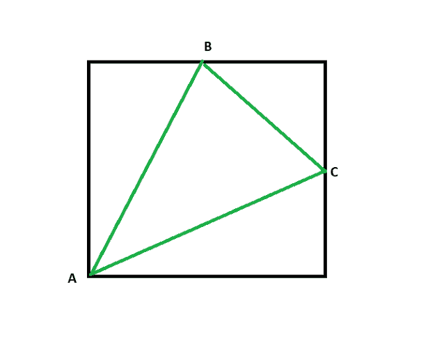
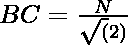
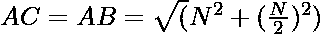

# 一个三角形的面积，其中两个顶点位于一个正方形相对边的中点，另一个顶点位于一个正方形的顶点上

> 原文:[https://www . geeksforgeeks . org/两个顶点位于正方形对边中点的三角形面积和另一个顶点位于正方形顶点上的面积/](https://www.geeksforgeeks.org/area-of-a-triangle-with-two-vertices-at-midpoints-of-opposite-sides-of-a-square-and-the-other-vertex-lying-on-vertex-of-a-square/)

给定一个正整数 **N** 代表一个正方形的边，任务是求一个三角形的[面积，这个三角形是由相邻两条边的中点和与两条边相对的顶点连接而成的。](https://www.geeksforgeeks.org/how-to-find-the-area-of-a-triangle-using-javascript/)

**示例:**

> **输入:**N = 10
> T3】输出: 37.5
> 
> **输入:**N = 1
> T3】输出: 0.375

**方法:**给定的问题可以基于以下观察来解决:

[](https://media.geeksforgeeks.org/wp-content/uploads/20210407161733/Untitled2.png)

*   三角形的一条边将是三角形的[斜边](https://www.geeksforgeeks.org/find-the-hypotenuse-of-a-right-angled-triangle-with-given-two-sides/)，该三角形由顶点作为两个中点和正方形的一个顶点在边长由给出的边的交点处形成。
*   三角形另外两条边的长度由给出。
*   现在，三角形的边是已知的，因此，可以使用 [Heron 公式](https://www.geeksforgeeks.org/applications-of-herons-formula/)计算三角形的面积。

按照以下步骤解决问题:

*   根据上面的公式找到三角形的边，并将其存储在变量中，分别表示为 **a** 、 **b** 和 **c** 。
*   完成上述步骤后，[打印**(s *(s–a)*(s–b)*(s–c))<sup>1/2</sup>**的值，其中 **s = (a + b + c) / 2**](https://www.geeksforgeeks.org/c-program-find-area-triangle/) 。

下面是上述方法的实现:

## C++

```
// C++ program for the above approach

#include <bits/stdc++.h>
using namespace std;

// Function to find the area of the
// triangle that inscribed in square
double areaOftriangle(int side)
{
    // Stores the length of the first
    // side of triangle
    double a = sqrt(pow(side / 2, 2)
                    + pow(side / 2, 2));

    // Stores the length of the second
    // side of triangle
    double b = sqrt(pow(side, 2)
                    + pow(side / 2, 2));

    // Stores the length of the third
    // side of triangle
    double c = sqrt(pow(side, 2)
                    + pow(side / 2, 2));

    double s = (a + b + c) / 2;

    // Stores the area of the triangle
    double area = sqrt(s * (s - a)
                       * (s - b) * (s - c));

    // Return the resultant area
    return area;
}

// Driver Code
int main()
{
    int N = 10;
    cout << areaOftriangle(N);

    return 0;
}
```

## Java 语言(一种计算机语言，尤用于创建网站)

```
// Java program for the above approach
import java.util.*;

class GFG{

// Function to find the area of the
// triangle that inscribed in square
static double areaOftriangle(int side)
{

    // Stores the length of the first
    // side of triangle
    double a = Math.sqrt(Math.pow(side / 2, 2) +
                         Math.pow(side / 2, 2));

    // Stores the length of the second
    // side of triangle
    double b = Math.sqrt(Math.pow(side, 2) +
                         Math.pow(side / 2, 2));

    // Stores the length of the third
    // side of triangle
    double c = Math.sqrt(Math.pow(side, 2) +
                         Math.pow(side / 2, 2));

    double s = (a + b + c) / 2;

    // Stores the area of the triangle
    double area = Math.sqrt(s * (s - a) *
                           (s - b) * (s - c));

    // Return the resultant area
    return area;
}

// Driver code
public static void main(String[] args)
{
    int N = 10;

    System.out.print(areaOftriangle(N));
}
}

// This code is contributed by sanjoy_62
```

## 蟒蛇 3

```
# Python3 program for the above approach
from math import sqrt

# Function to find the area of the
# triangle that inscribed in square
def areaOftriangle(side):

    # Stores the length of the first
    # side of triangle
    a = sqrt(pow(side / 2, 2) + pow(side / 2, 2))

    # Stores the length of the second
    # side of triangle
    b = sqrt(pow(side, 2) + pow(side / 2, 2))

    # Stores the length of the third
    # side of triangle
    c = sqrt(pow(side, 2) + pow(side / 2, 2))

    s = (a + b + c) / 2

    # Stores the area of the triangle
    area = sqrt(s * (s - a) * (s - b) * (s - c))

    # Return the resultant area
    return round(area, 1)

# Driver Code
if __name__ == '__main__':

    N = 10

    print (areaOftriangle(N))

# This code is contributed by mohit kumar 29
```

## C#

```
// C# program for the above approach
using System;
class GFG{

// Function to find the area of the
// triangle that inscribed in square
static double areaOftriangle(int side)
{

    // Stores the length of the first
    // side of triangle
    double a = Math.Sqrt(Math.Pow(side / 2, 2) +
                         Math.Pow(side / 2, 2));

    // Stores the length of the second
    // side of triangle
    double b = Math.Sqrt(Math.Pow(side, 2) +
                         Math.Pow(side / 2, 2));

    // Stores the length of the third
    // side of triangle
    double c = Math.Sqrt(Math.Pow(side, 2) +
                         Math.Pow(side / 2, 2));

    double s = (a + b + c) / 2;

    // Stores the area of the triangle
    double area = Math.Sqrt(s * (s - a) *
                           (s - b) * (s - c));

    // Return the resultant area
    return area;
}

// Driver code
public static void Main(string[] args)
{
    int N = 10;

    Console.WriteLine(areaOftriangle(N));
}}

// This code is contributed by ukasp.
```

## java 描述语言

```
<script>
    // Javascript program for the above approach

    // Function to find the area of the
    // triangle that inscribed in square
    function areaOftriangle(side)
    {

        // Stores the length of the first
        // side of triangle
        let a = Math.sqrt(Math.pow(side / 2, 2) +
                             Math.pow(side / 2, 2));

        // Stores the length of the second
        // side of triangle
        let b = Math.sqrt(Math.pow(side, 2) +
                             Math.pow(side / 2, 2));

        // Stores the length of the third
        // side of triangle
        let c = Math.sqrt(Math.pow(side, 2) +
                             Math.pow(side / 2, 2));

        let s = (a + b + c) / 2;

        // Stores the area of the triangle
        let area = Math.sqrt(s * (s - a) *
                               (s - b) * (s - c));

        // Return the resultant area
        return area.toFixed(1);
    }

    let N = 10;

    document.write(areaOftriangle(N));

// This code is contributed by suresh07.
</script>
```

**Output:** 

```
37.5
```

***时间复杂度:**O(1)*
T5**辅助空间:** O(1)