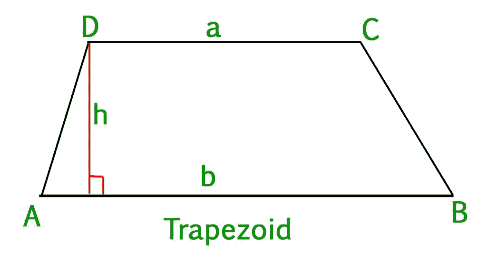
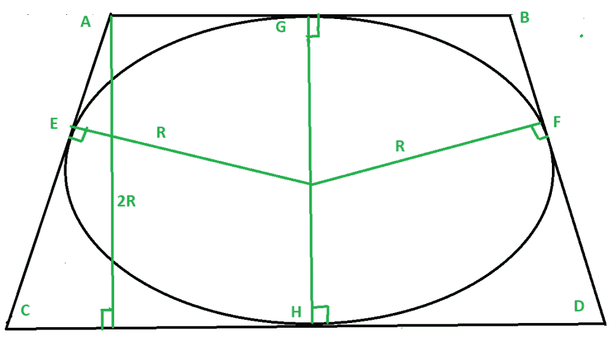

# 内接等腰梯形的圆面积

> 原文:[https://www . geesforgeks . org/等腰梯形内切圆面积/](https://www.geeksforgeeks.org/area-of-circle-inscribed-in-a-isosceles-trapezoid/)

给定**等腰梯形 ABCD** 的两个底为 **a** 和 **b** ，任务是找到内接在该梯形
中的圆**区域**



**例:**

```
Input: a = 10, b = 30 
Output: Area = 235.57

Input: a = 20, b = 36 
Output: Area = 565.38
```

**推导:**给定一个内接于梯形 ABCD(边 AB = n，CD = m)的圆，我们需要求出梯形的高度即(AL)，它是圆半径的一半，才能求出圆的面积。



为了求圆的高度，我们做以下运算。

1.  圆总是会在它们的中点接触到梯形的边，假设 AB、BD、CD、AC 的中点是 G、F、H、E，用圆心连接它们。
2.  现在从对称性，我们可以看到

    ```
    AG = AE = n/2, 
    EC = CG = m/2, 
    HD = DF = n/2,
    GB = FB = m/2
    ```

3.  现在在三角形 ACL 中应用[勾股定理](https://www.geeksforgeeks.org/find-the-hypotenuse-of-a-right-angled-triangle-with-given-two-sides/)。

    ```
    Hypotenuse AC = m/2 + n/2
    Base CL = CH - AG = m/2 - n/2

    we get 
    Perpendicular AL = Square_root(m * n)
    ```

4.  因此梯形的**高度= AL =平方根(给定边的乘积)**
5.  现在圆的半径只是高度的一半，因此面积很容易计算。

**进场:**

1.  求梯形的高度为**(平方根(m * n ))** 。
2.  求内圆半径

    ```
    R = height / 2 
      = square_root(m * n) / 2
    ```

3.  现在找到圆的面积

    ```
    = Pi * R2 
    = ( 3.141 * m * n ) / 4
    ```

下面是上述方法的实现:

## C++

```
// CPP implementation to find
// the rea of the circle
// inscribed in a trapezoid
// having non- parallel sides m, n
#include<bits/stdc++.h>
using namespace std;

// Function to find area of circle
// inscribed in a trapezoid
// having non- parallel sides m, n
double area_of_circle(int m, int n)
{
    // radius of circle by the
    // formula i.e. root( m * n) / 2
    // area of circle = (3.141 ) * ( R ** 2 )

    int square_of_radius = ( m * n ) / 4;
    double area = ( 3.141 * square_of_radius );
    return area;
}

// Driver Code
int main(){
    int n = 10;
    int m = 30;
    cout << (area_of_circle(m, n));
}

// This code is contributed by mohit kumar 29
```

## Java 语言(一种计算机语言，尤用于创建网站)

```
// Java Program to find 
// the rea of the circle 
// inscribed in a trapezoid 
// having non- parallel sides m, n 
class GFG 
{ 

    // Function to find area of circle 
    // inscribed in a trapezoid 
    // having non- parallel sides m, n 
    static double area_of_circle(int m, int n) 
    { 
        // radius of circle by the 
        // formula i.e. root( m * n) / 2 
        // area of circle = (3.141 ) * ( R ** 2 ) 

        int square_of_radius = ( m * n ) / 4; 
        double area = ( 3.141 * square_of_radius ); 
        return area; 
    } 

    // Driver code 
    public static void main (String[] args) 
    { 
        int n = 10; 
        int m = 30; 
        System.out.println(area_of_circle(m, n)); 
    } 
} 

// This code is contributed by Yash_R
```

## 蟒蛇 3

```
# Python 3 implementation to find 
# the rea of the circle 
# inscribed in a trapezoid
# having non- parallel sides  m, n

# Function to find area of circle 
# inscribed in a trapezoid
# having non- parallel sides  m, n
def area_of_circle(m, n):
    # radius of circle by the
    # formula i.e. root( m * n) / 2
    # area of circle = (3.141 ) * ( R ** 2 )

    square_of_radius = ( m * n ) / 4
    area = ( 3.141 * square_of_radius )
    return area

# Driver Code 
if __name__=='__main__': 
    n = 10
    m = 30
    print(area_of_circle(m, n))
```

## C#

```
// C# Program to find 
// the rea of the circle 
// inscribed in a trapezoid 
// having non- parallel sides m, n 
using System; 

class GFG 
{ 

// Function to find area of circle 
// inscribed in a trapezoid 
// having non- parallel sides m, n 
static double area_of_circle(int m, int n) 
{ 
    // radius of circle by the 
    // formula i.e. root( m * n) / 2 
    // area of circle = (3.141 ) * ( R ** 2 ) 

    int square_of_radius = ( m * n ) / 4; 
    double area = ( 3.141 * square_of_radius ); 
    return area; 
} 

// Driver code 
public static void Main () 
{ 
    int n = 10; 
    int m = 30;
    Console.WriteLine(area_of_circle(m, n)); 
} 
} 

// This code is contributed by Sanjit_Prasad
```

## java 描述语言

```
<script>

// Javascript Program to find 
// the rea of the circle 
// inscribed in a trapezoid 
// having non- parallel sides m, n 

// Function to find area of circle 
// inscribed in a trapezoid 
// having non- parallel sides m, n 
function area_of_circle(m, n) 
{ 

    // Radius of circle by the 
    // formula i.e. root( m * n) / 2 
    // area of circle = (3.141 ) * ( R ** 2 ) 

    var square_of_radius = ( m * n ) / 4; 
    var area = ( 3.141 * square_of_radius ); 
    return area; 
} 

// Driver Code 
var n = 10; 
var m = 30; 

document.write(area_of_circle(m, n)); 

// This code is contributed by Khushboogoyal499

</script>
```

**Output:** 

```
235.575
```