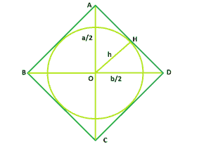

# 菱形内接圆的面积

> 原文:[https://www . geesforgeks . org/菱形内接圆面积/](https://www.geeksforgeeks.org/area-of-circle-inscribed-within-rhombus/)

给定一个对角线为 **a** 和 **b** 的菱形，它包含一个内切圆。任务是根据 a 和 b 找到那个圆的面积。
**例:**

```
Input: l = 5, b = 6
Output: 11.582

Input: l = 8, b = 10
Output: 30.6341
```



**逼近:**从图中我们看到，内切圆的半径也是直角三角形 **AOB** 的高度 **h=OH** 。为了找到它，我们使用三角形面积的方程式:

> 面积 AOB = 1/2 * (a/2) * (b/2) = ab/8 = 12ch

其中 **c = AB** 即斜边。所以，

> r = h = ab/4c = ab/4ⅰ(a ^ 2/4+b ^ 2/4)= ab/2ⅰ(a ^ 2+b ^ 2)

因此圆的面积是

> A = P * r^2 = P a^2 b^2 /4（a2 + b2）

**以下是上述方法的实施:**

## C++

```
// C++ Program to find the area of the circle
// which can be inscribed within the rhombus
#include <bits/stdc++.h>
using namespace std;

// Function to find the area
// of the inscribed circle
float circlearea(float a, float b)
{

    // the diagonals cannot be negative
    if (a < 0 || b < 0)
        return -1;

    // area of the circle
    float A = (3.14 * pow(a, 2) * pow(b, 2))
            / (4 * (pow(a, 2) + pow(b, 2)));
    return A;
}

// Driver code
int main()
{
    float a = 8, b = 10;
    cout << circlearea(a, b) << endl;

    return 0;
}
```

## Java 语言(一种计算机语言，尤用于创建网站)

```
// Java Program to find the area of the circle
// which can be inscribed within the rhombus

public class GFG {

    // Function to find the area
    // of the inscribed circle
    public static float circlearea(double a, double b)
    {
        // the diagonals cannot be negative
        if (a < 0 || b < 0)
            return -1 ;

        //area of the circle
        float A = (float) ((3.14 * Math.pow(a, 2) * Math.pow(b, 2))
                        / (4 * (Math.pow(a, 2) + Math.pow(b, 2)))) ;

        return A ;
    }

    // Driver code
    public static void main(String[] args) {
        float a = 8, b = 10 ;

        System.out.println(circlearea(a, b));

    }
// This code is contributed by ANKITRAI1
}
```

## 蟒蛇 3

```
# Python 3 Program to find the area of the circle
# which can be inscribed within the rhombus

# Function to find the area
# of the inscribed circle
def circlearea(a, b):

    # the diagonals cannot be negative
    if (a < 0 or b < 0):
        return -1

    # area of the circle
    A = ((3.14 * pow(a, 2) * pow(b, 2))/
        (4 * (pow(a, 2) + pow(b, 2))))
    return A

# Driver code
if __name__ == "__main__":
    a = 8
    b = 10
    print( circlearea(a, b))

# This code is contributed by ChitraNayal
```

## C#

```
// C# Program to find the area of the circle
// which can be inscribed within the rhombus
using System;

public class GFG {

    // Function to find the area
    // of the inscribed circle
    public static float circlearea(double a, double b)
    {
        // the diagonals cannot be negative
        if (a < 0 || b < 0)
            return -1 ;

        //area of the circle
        float A = (float) ((3.14 * Math.Pow(a, 2) * Math.Pow(b, 2))
                        / (4 * (Math.Pow(a, 2) + Math.Pow(b, 2)))) ;

        return A ;
    }

    // Driver code
    public static void Main() {
        float a = 8, b = 10 ;

        Console.WriteLine(circlearea(a, b));

    }
// This code is contributed by inder_verma..
}
```

## 服务器端编程语言（Professional Hypertext Preprocessor 的缩写）

```
<?php
// PHP Program to find the area
// of the circle which can be
// inscribed within the rhombus

// Function to find the area
// of the inscribed circle
function circlearea($a, $b)
{

    // the diagonals cannot be negative
    if ($a < 0 || $b < 0)
        return -1;

    // area of the circle
    $A = (3.14 * pow($a, 2) * pow($b, 2)) /
           (4 * (pow($a, 2) + pow($b, 2)));
    return $A;
}

// Driver code
$a = 8; $b = 10;
echo circlearea($a, $b);

// This code is contributed by anuj_67
?>
```

## java 描述语言

```
<script>

// javascript Program to find the area of the circle
// which can be inscribed within the rhombus

// Function to find the area
// of the inscribed circle
function circlearea(a , b)
{
    // the diagonals cannot be negative
    if (a < 0 || b < 0)
        return -1 ;

    //area of the circle
    var A =  ((3.14 * Math.pow(a, 2) * Math.pow(b, 2))
                    / (4 * (Math.pow(a, 2) + Math.pow(b, 2)))) ;

    return A ;
}

// Driver code

var a = 8, b = 10 ;

document.write(circlearea(a, b).toFixed(4));

// This code is contributed by Amit Katiyar

</script>
```

**Output:** 

```
30.6341
```