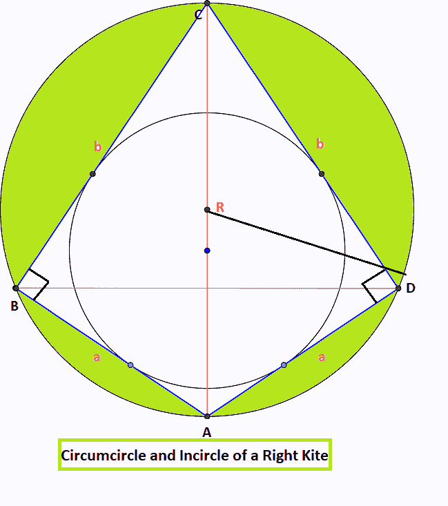

# 右风筝的外圆和内圆面积

> 原文:[https://www . geeksforgeeks . org/右风筝的环圈和内圈面积/](https://www.geeksforgeeks.org/area-of-circumcircle-and-incircle-of-a-right-kite/)

给定两个正整数 **A** 和 **B** 代表右风筝的边，任务是找到右风筝的外圆和内圆的面积。

> 右风筝是一种[风筝](https://www.geeksforgeeks.org/kite-quadrilaterals/)，可以内接成两个相反角度成直角的圆。风筝的对称线也是风筝外接圆的直径。它把风筝分成两个全等的直角三角形，三角形的边是右风筝的 **A** 和 **B** 。
> 
> 

**示例:**

> **输入:** A = 3，B = 4
> **输出:**右风筝外圆面积为 19.625，右风筝内圆面积为 3.14
> 
> **输入:** A = 10，B = 5
> **输出:**右风筝外圆面积为 98.125，右风筝内圆面积为 28.26

**方法:**有一些观察来解决这个问题。按照以下步骤解决此问题:

*   这里**a = AB = AD****b = BC = CD**
*   在风筝中 **ABCD** 以相反的角度 **B** 和 **D** 作为 **90** ，这样相反的角度可以计算为 **tan (A/2) = b/a** 和 **tan(C/2) = a/b**
*   让 **p** 作为对角线的长度 **AC** 和 **q** 作为对角线的长度 **BD** 。
*   对角线 **AC** 可以使用[勾股定理](https://www.geeksforgeeks.org/pythagoras-theorem-and-its-converse-triangles-class-10-maths/)轻松计算。因此**p =(a<sup>2</sup>+b<sup>2</sup>)**
*   由于对角线等于风筝外接圆的直径，外接圆的半径计算为**R =(a<sup>2</sup>+b<sup>2</sup>)<sup>/2</sup>**
*   因此，外接圆的面积将是**π* R * R**
*   还有**、**所有风筝都是切向的[四边形](https://www.geeksforgeeks.org/types-of-quadrilaterals-rectangle-square-rhombus-parallelogram-class-8-maths/)，因此内圆的半径可以通过 **r =风筝面积/风筝半周长，即 r = a*b/(a+b)来计算。**
*   因此，内圆的面积将是**π* r * r .**

下面是上述方法的实现:

## C++

```
// C++ program for the above approach

#include <bits/stdc++.h>
using namespace std;
#define pi 3.14

// Function to calculate the area of
// circumcircle of right kite
double AreaOfCircumcircle(int a, int b)
{
    // Find the radius
    double radius = sqrt(a * a + b * b)
                    / 2;
    return pi * radius * radius;
}

// Function to calculate the area of
// incircle of right kite
double AreaOfIncircle(int a, int b)
{
    // Find the radius
    double radius = (a * b) / (a + b);

    return pi * radius * radius;
}

// Driver Code
int main()
{
    // Given Input
    int a, b;
    a = 10;
    b = 5;

    // Function Call
    double circumarea = AreaOfCircumcircle(
        a, b);
    cout << "Area of circumcircle of Right Kite is"
         << " " << circumarea << endl;

    // Function Call
    double inarea = AreaOfIncircle(
        a, b);
    cout << "Area of incircle of Right Kite is"
         << " " << inarea << endl;

    return 0;
}
```

## Java 语言(一种计算机语言，尤用于创建网站)

```
// Java program for the above approach
public class GFG {
    static double pi = 3.14;

    // Function to calculate the area of
    // circumcircle of right kite
    static double AreaOfCircumcircle(int a, int b)
    {
        // Find the radius
        double radius = Math.sqrt(a * a + b * b) / 2;
        return pi * radius * radius;
    }

    // Function to calculate the area of
    // incircle of right kite
    static double AreaOfIncircle(int a, int b)
    {
        // Find the radius
        double radius = (a * b) / (a + b);

        return pi * radius * radius;
    }

    // Driver code
    public static void main(String[] args)
    {

        // Given Input
        int a, b;
        a = 10;
        b = 5;

        // Function Call
        double circumarea = AreaOfCircumcircle(a, b);
        System.out.printf(
            "Area of circumcircle of Right Kite is %.3f\n",
            circumarea);

        // Function Call
        double inarea = AreaOfIncircle(a, b);
        System.out.printf(
            "Area of incircle of Right Kite is %.2f\n",
            inarea);
    }
}

// This code is contributed by abhinavjain194
```

## 蟒蛇 3

```
# Python program for the above approach
# Function to calculate the area of
# circumcircle of right kite
import math
pi = 3.14

def AreaOfCircumcircle(a, b):

    # Find the radius
    radius = math.sqrt(a * a + b * b)/ 2
    return pi * radius * radius

# Function to calculate the area of
# incircle of right kite
def AreaOfIncircle( a,  b):

    # Find the radius
    radius = (a * b) // (a + b)
    return pi * (radius**2)

# Driver Code
# Given Input
a = 10
b = 5

# Function Call
circumarea = AreaOfCircumcircle(a, b)
print("Area of circumcircle of Right Kite is" ," " , format(circumarea,".3f"))

# Function Call
inarea = AreaOfIncircle(a, b)
print("Area of incircle of Right Kite is" ," " , format(inarea,".2f"))

# this code is contributed by shivanisinghss2110
```

## C#

```
// C# program for the above approach
using System;

class GFG{

static double pi = 3.14;

// Function to calculate the area of
// circumcircle of right kite
static double AreaOfCircumcircle(int a, int b)
{

    // Find the radius
    double radius = Math.Sqrt(a * a + b * b) / 2;
    return pi * radius * radius;
}

// Function to calculate the area of
// incircle of right kite
static double AreaOfIncircle(int a, int b)
{

    // Find the radius
    double radius = (a * b) / (a + b);

    return pi * radius * radius;
}

// Driver code
public static void Main()
{

    // Given Input
    int a, b;
    a = 10;
    b = 5;

    // Function Call
    double circumarea = AreaOfCircumcircle(a, b);
    Console.WriteLine(
        "Area of circumcircle of Right Kite is " +
        circumarea);

    // Function Call
    double inarea = AreaOfIncircle(a, b);
    Console.WriteLine(
        "Area of incircle of Right Kite is " + inarea);
}
}

// This code is contributed by subhammahato348
```

## java 描述语言

```
<script>

        // JavaScript Program for the above approach

        var pi = 3.14

        // Function to calculate the area of
        // circumcircle of right kite
        function AreaOfCircumcircle(a, b) {
            // Find the radius
            let radius = Math.sqrt(a * a + b * b)
                / 2;
            return pi * radius * radius;
        }

        // Function to calculate the area of
        // incircle of right kite
        function AreaOfIncircle(a, b) {
            // Find the radius
            let radius = (a * b) / (a + b);

            return pi * radius * radius;
        }

        // Driver Code

        // Given Input
        let a, b;
        a = 10;
        b = 5;

        // Function Call
        let circumarea = AreaOfCircumcircle(a, b);
        document.write("Area of circumcircle of Right Kite is " +
         (circumarea.toFixed(3)) + "<br>");

        // Function Call
        let inarea = AreaOfIncircle(
            a, b);
        document.write("Area of incircle of Right Kite is " +
         (inarea.toFixed(3)) + "<br>");

    // This code is contributed by Potta Lokesh

</script>
```

**Output**

```
Area of circumcircle of Right Kite is 98.125
Area of incircle of Right Kite is 28.26
```

***时间复杂度** : O(1)*
***辅助空间** : O(1)*