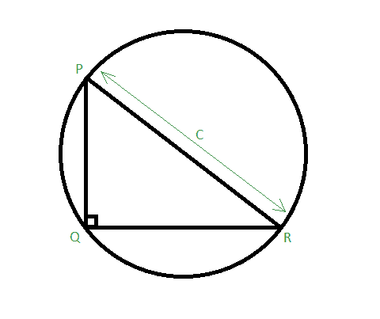

# 直角三角形外接圆面积

> 原文:[https://www . geesforgeks . org/直角三角形外接圆面积/](https://www.geeksforgeeks.org/area-of-circumcircle-of-a-right-angled-triangle/)

给定一个整数 **C** ，它是通过外接圆中心的[外接圆](https://en.wikipedia.org/wiki/Circumscribed_circle)的直角三角形的斜边长度。任务是找到外接圆的面积。



**例:**

> **输入:** C = 8
> **输出:** 50.26
> **输入:** C = 10
> **输出:** 78.53

**逼近:**由于斜边 **C** 经过圆心，圆的半径为 **C / 2** 。
我们知道圆的面积是 **PI * r <sup>2</sup>** 其中**PI = 22/7****r**是圆的半径。
因此外接圆的面积为**π*(C/2)<sup>2</sup>**，即**π* C<sup>2</sup>/4**。
以下是上述方法的实施:

## C++

```
// C++ program to find the area of Circumscribed
// circle of right angled triangle
#include <bits/stdc++.h>
#define PI 3.14159265
using namespace std;

// Function to find area of
// circumscribed circle
float area_circumscribed(float c)
{
    return (c * c * (PI / 4));
}

// Driver code
int main()
{
    float c = 8;
    cout << area_circumscribed(c);
    return 0;
}

// This code is contributed by Shivi_Aggarwal
```

## C

```
// C program to find the area of Circumscribed
// circle of right angled triangle
#include <stdio.h>
#define PI 3.14159265

// Function to find area of
// circumscribed circle
float area_circumscribed(float c)
{
    return (c * c * (PI / 4));
}

// Driver code
int main()
{
    float c = 8;
    printf("%f",
           area_circumscribed(c));
    return 0;
}
```

## Java 语言(一种计算机语言，尤用于创建网站)

```
// Java code to find the area of circumscribed
// circle of right angled triangle
import java.lang.*;

class GFG {

    static double PI = 3.14159265;

    // Function to find the area of
    // circumscribed circle
    public static double area_cicumscribed(double c)
    {
        return (c * c * (PI / 4));
    }

    // Driver code
    public static void main(String[] args)
    {
        double c = 8.0;
        System.out.println(area_cicumscribed(c));
    }
}
```

## 蟒蛇 3

```
# Python3 code to find the area of circumscribed
# circle of right angled triangle
PI = 3.14159265

# Function to find the area of
# circumscribed circle
def area_cicumscribed(c):
    return (c * c * (PI / 4))

# Driver code
c = 8.0
print(area_cicumscribed(c))
```

## C#

```
// C# code to find the area of
// circumscribed circle
// of right angled triangle
using System;

class GFG {
    static double PI = 3.14159265;

    // Function to find the area of
    // circumscribed circle
    public static double area_cicumscribed(double c)
    {
        return (c * c * (PI / 4));
    }

    // Driver code
    public static void Main()
    {
        double c = 8.0;
        Console.Write(area_cicumscribed(c));
    }
}
```

## 服务器端编程语言（Professional Hypertext Preprocessor 的缩写）

```
<?php
// PHP program to find the
// area of Circumscribed
// circle of right angled triangle
$PI = 3.14159265;

// Function to find area of
// circumscribed circle
function area_circumscribed($c)
{
    global $PI;
    return ($c * $c * ($PI / 4));
}

// Driver code
$c = 8;
echo(area_circumscribed($c));
?>
```

## java 描述语言

```
<script>
// javascript code to find the area of circumscribed
// circle of right angled triangle

    let PI = 3.14159265;

    // Function to find the area of
    // circumscribed circle
    function area_cicumscribed(c) {
        return (c * c * (PI / 4));
    }

    // Driver code
    var c = 8.0;
    document.write(area_cicumscribed(c).toFixed(6));

// This code is contributed by Rajput-Ji
</script>
```

**Output:** 

```
50.265484
```