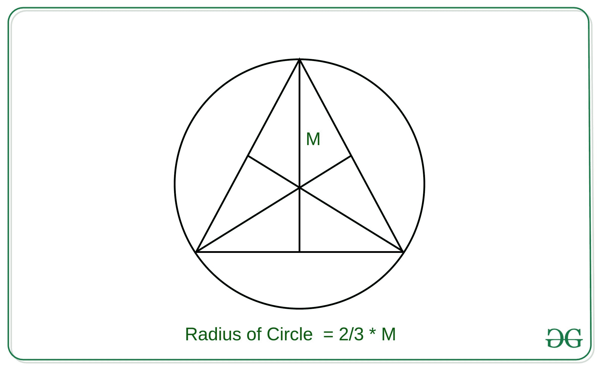
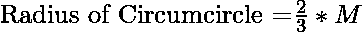

# 使用中位数的等边三角形外接圆面积

> 原文:[https://www . geeksforgeeks . org/等边三角形外接圆面积-使用中值/](https://www.geeksforgeeks.org/area-of-circumcircle-of-an-equilateral-triangle-using-median/)

给定等边三角形的中值 **M** ，任务是使用中值 M
**找到这个等边三角形的外接圆的面积。示例:**

> **输入:** M = 3
> **输出:** 12.5664
> **输入:** M = 6
> **输出:** 50.2655

**方法:**问题中的关键观察点是等边三角形的质心、外心、正心和燃烧点都在同一点上。



因此，内接等边三角形给定中值的圆的半径可以推导为:

然后可以使用本文
中使用的方法计算圆的面积，下面是上述方法的实现:

## C++

```
// C++ implementation to find the
// equation of circle which
// inscribes equilateral triangle
// of median M

#include <iostream>
const double pi = 3.14159265358979323846;
using namespace std;

// Function to find the equation
// of circle whose center is (x1, y1)
// and the radius of circle is r
void circleArea(double r)
{
    cout << (pi * r * r);
}

// Function to find the
// equation of circle which
// inscribes equilateral triangle
// of median M
void findCircleAreaByMedian(double m)
{
    double r = 2 * m / 3;

    // Util Function to find the
    // circle equation
    circleArea(r);
}

// Driver code
int main()
{
    double m = 3;

    // Function Call
    findCircleAreaByMedian(m);
    return 0;
}
```

## Java 语言(一种计算机语言，尤用于创建网站)

```
// Java implementation to find the
// equation of circle which
// inscribes equilateral triangle
// of median M
import java.util.*;

class GFG{

// Function to find the equation
// of circle whose center is (x1, y1)
// and the radius of circle is r
static double circleArea(double r)
{
    double pi = 3.14159265358979323846;
    return (pi * r * r);
}

// Function to find the
// equation of circle which
// inscribes equilateral triangle
// of median M
static double findCircleAreaByMedian(int m)
{
    double r = 2 * m / 3;

    // Function call to find
    // the circle equation
    return circleArea(r);
}

// Driver code
public static void main(String args[])
{
    int m = 3;

    System.out.printf("%.4f", findCircleAreaByMedian(m));
}
}

// This code is contributed by virusbuddah_
```

## 蟒蛇 3

```
# Python3 implementation to find the
# equation of circle which inscribes
# equilateral triangle of median M

pi = 3.14159265358979323846

# Function to find the equation
# of circle whose center is (x1, y1)
# and the radius of circle is r
def circleArea(r):

    print(round(pi * r * r, 4))

# Function to find the
# equation of circle which
# inscribes equilateral triangle
# of median M
def findCircleAreaByMedian(m):

    r = 2 * m /3

    # Function to find the
    # circle equation
    circleArea(r)

# Driver code
if __name__ == '__main__':

    m = 3

    # Function call
    findCircleAreaByMedian(m)

# This code is contributed by mohit kumar 29
```

## C#

```
// C# implementation to find the
// equation of circle which
// inscribes equilateral triangle
// of median M
using System;

class GFG{

// Function to find the equation
// of circle whose center is (x1, y1)
// and the radius of circle is r
static double circleArea(double r)
{
    double pi = 3.14159265358979323846;
    return (pi * r * r);
}

// Function to find the
// equation of circle which
// inscribes equilateral triangle
// of median M
static double findCircleAreaByMedian(int m)
{
    double r = 2 * m / 3;

    // Function call to find
    // the circle equation
    return circleArea(r);
}

// Driver code
public static void Main(string []args)
{
    int m = 3;

    Console.WriteLine("{0:f4}", findCircleAreaByMedian(m));
}
}

// This code is contributed by AnkitRai01
```

## java 描述语言

```
<script>
// javascript implementation to find the
// equation of circle which
// inscribes equilateral triangle
// of median M

    // Function to find the equation
    // of circle whose center is (x1, y1)
    // and the radius of circle is r
    function circleArea(r) {
        var pi = 3.14159265358979323846;
        return (pi * r * r);
    }

    // Function to find the
    // equation of circle which
    // inscribes equilateral triangle
    // of median M
    function findCircleAreaByMedian(m) {
        var r = 2 * m / 3;

        // Function call to find
        // the circle equation
        return circleArea(r);
    }

    // Driver code

    var m = 3;

    document.write(findCircleAreaByMedian(m).toFixed(4));

// This code is contributed by Rajput-Ji
</script>
```

**Output:** 

```
12.5664
```