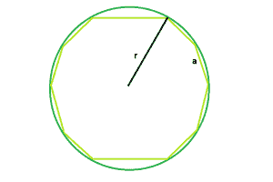

# 圆内接十边形的面积

> 原文:[https://www . geesforgeks . org/十边形内接面积/](https://www.geeksforgeeks.org/area-of-decagon-inscribed-within-the-circle/)

这里给出的是一个正十边形，内接一个半径为 **r** 的圆，任务是找到十边形的面积。
**例:**

```
Input: r = 5
Output: 160.144

Input: r = 8
Output: 409.969
```



**接近** :
我们知道，圆内十边形的一边，**a = r√(2-2co 36)**([这里指](https://www.geeksforgeeks.org/program-to-find-the-circumcircle-of-any-regular-polygon/) )
所以，十边形的面积，

> **a = 5*a^2*(√5+2√5)/2 = 5 *(r√(2-2cos36))^2*(√5+2√5)/2=(5*r^2*(3-√5)*(√5+2√5))/4**

以下是上述方法的实现:

## C++

```
// C++ Program to find the area of the decagon
// inscribed within a circle
#include <bits/stdc++.h>
using namespace std;

// Function to find the area of the decagon
float area(float r)
{

    // radius cannot be negative
    if (r < 0)
        return -1;

    // area of the decagon
    float area = (5 * pow(r, 2) * (3 - sqrt(5))
                  * (sqrt(5) + (2 * sqrt(5))))
                 / 4;
    return area;
}

// Driver code
int main()
{
    float r = 8;
    cout << area(r) << endl;

    return 0;
}
```

<gfg-tab role="tab" slot="tab" id="gfg-tab-1">爪哇</gfg-tab>T3

```
 // Java Program to find the area of the decagon 
// inscribed within a circle 

import java.io.*;

class GFG {

// Function to find the area of the decagon 
static double area(double  r) 
{ 

    // radius cannot be negative 
    if (r < 0) 
        return -1; 

    // area of the decagon 
    double  area = (5 * Math.pow(r, 2) * (3 - Math.sqrt(5)) 
                * (Math.sqrt(5) + ((2 * Math.sqrt(5))))/ 4); 
    return area; 
} 

// Driver code 

    public static void main (String[] args) {
        double  r = 8; 
        System.out.println (area(r)); 
    }
//This code is contributed by ajit
} 
```

T4

## 蟒蛇 3

```
# Python3 Program to find the area of
# the decagon inscribed within a circle
from math import sqrt,pow

# Function to find the
# area of the decagon
def area(r):

    # radius cannot be negative
    if r < 0:
        return -1

    # area of the decagon
    area = (5 * pow(r, 2) * (3 - sqrt(5)) *
                 (sqrt(5) + (2 * sqrt(5))))/ 4
    return area

# Driver code
if __name__ == '__main__':
    r = 8
    print(area(r))

# This code is contributed
# by Surendra_Gangwar
```

## C#

```
// C# Program to find the area of the
// decagon inscribed within a circle
using System;

class GFG
{

// Function to find the area
// of the decagon
static double area(double r)
{

    // radius cannot be negative
    if (r < 0)
        return -1;

    // area of the decagon
    double area = (5 * Math.Pow(r, 2) *
                  (3 - Math.Sqrt(5)) *
                      (Math.Sqrt(5) +
                 ((2 * Math.Sqrt(5))))/ 4);
    return area;
}

// Driver code
static public void Main ()
{
    double r = 8;
    Console.WriteLine (area(r));
}
}

// This code is contributed by akt_mit
```

## 服务器端编程语言（Professional Hypertext Preprocessor 的缩写）

```
<?php
// PHP Program to find the area
// of the decagon inscribed within
// a circle

// Function to find the area
// of the decagon
function area($r)
{

    // radius cannot be negative
    if ($r < 0)
        return -1;

    // area of the decagon
    $area = (5 * pow($r, 2) * (3 - sqrt(5)) *
                (sqrt(5) + (2 * sqrt(5)))) / 4;
    return $area;
}

// Driver code
$r = 8;
echo area($r) . "\n";

// This code is contributed
// by Akanksha Rai(Abby_akku)
?>
```

## java 描述语言

```
<script>
// javascript Program to find the area of the decagon
// inscribed within a circle

// Function to find the area of the decagon
function area( r)
{

    // radius cannot be negative
    if (r < 0)
        return -1;

    // area of the decagon
    var  area = (5 * Math.pow(r, 2) * (3 - Math.sqrt(5))
                * (Math.sqrt(5) + ((2 * Math.sqrt(5))))/ 4);
    return area;
}

// Driver code
var  r = 8;
document.write(area(r).toFixed(3));

// This code is contributed by 29AjayKumar
</script>
```

**Output:** 

```
409.969
```