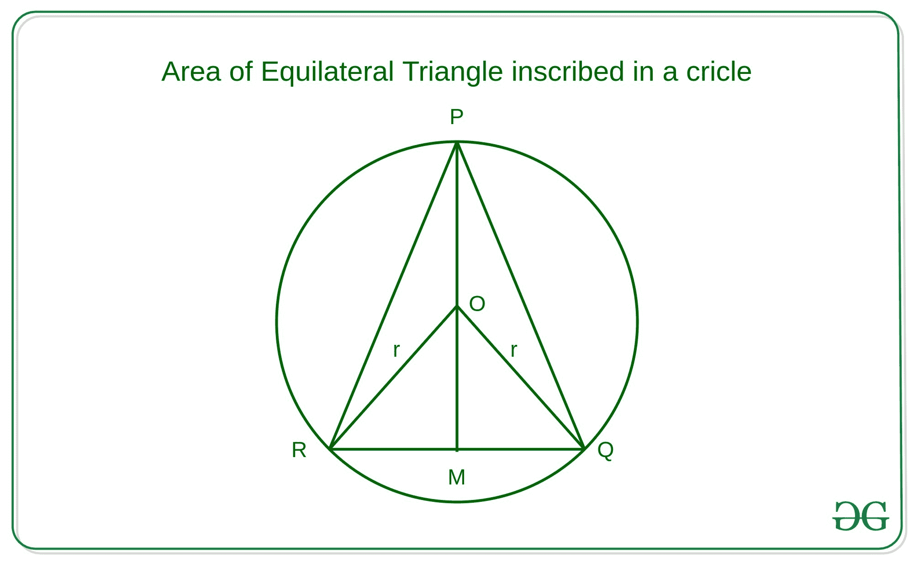

# 内接半径为 R 的圆的等边三角形面积

> 原文:[https://www . geesforgeks . org/等边三角形内接半径为 r 的圆面积/](https://www.geeksforgeeks.org/area-of-equilateral-triangle-inscribed-in-a-circle-of-radius-r/)

给定一个整数 **R** ，它表示一个圆的半径，任务是求内接在这个圆上的等边三角形的面积。

**示例:**

> **输入:** R = 4
> **输出:** 20.784
> **说明:**
> 内接半径为 R 的圆的等边三角形面积为 20.784，而三角形边长为 6.928
> 
> **输入:** R = 7
> **输出:** 63.651
> **说明:**
> 内接半径为 R 的圆的等边三角形面积为 63.651，而三角形边长为 12.124

**逼近:**让上面显示的三角形为等边三角形，表示为 **PQR** 。



*   三角形的[面积可以计算为:](https://www.geeksforgeeks.org/c-program-find-area-triangle/)

```
Area of triangle = (1/2) * Base * Height
```

*   在这种情况下，基数可以是 **PQ、PR 或 QR** ，三角形的高度可以是 **PM** 。因此，

```
Area of Triangle = (1/2) * QR * PM
```

*   现在在**三角 ORQ** 上应用[正弦定律](https://en.wikipedia.org/wiki/Law_of_sines)，

```
 RQ         OR
------  = -------
sin 60    sin 30

=> RQ = OR * sin60 / sin30
=> Side of Triangle = OR * sqrt(3)

As it is clearly observed
PM = PO + OM = r + r * sin30 = (3/2) * r
```

*   因此，所需等边三角形的底边和高度为:

```
Base = r * sqrt(3) = r * 1.732
Height = (3/2) * r
```

*   借助上面给出的公式计算三角形的面积。

下面是上述方法的实现:

## C++

```
// C++ implementation to find
// the area of the equilateral triangle
// inscribed in a circle of radius R
#include <iostream>
using namespace std;

// Function to find the area of
// equilateral triangle inscribed
// in a circle of radius R
double area(int R) {

     // Base and Height of
    // equilateral triangle
    double base = 1.732 * R;
    double height = (1.5) * R;

            // Area using Base and Height
    double area = 0.5 * base * height;
    return area;
}

// Driver Code
int main()
{
    int R = 7;
    cout<<(area(R));
    return 0;
}

// This code is contributed by 29AjayKumar
```

## Java 语言(一种计算机语言，尤用于创建网站)

```
// Java implementation to find
// the area of the equilateral triangle
// inscribed in a circle of radius R
class GFG
{
    // Function to find the area of
    // equilateral triangle inscribed
    // in a circle of radius R
    static double area(int R) {

                // Base and Height of
        // equilateral triangle
        double base = 1.732 * R;
        double height = (1.5) * R;

                // Area using Base and Height
        double area = 0.5 * base * height;
        return area;
    }

    // Driver code
    public static void main(String[] args) {
        int R = 7;
        System.out.println(area(R));

    }
}

// This code is contributed by 29AjayKumar
```

## 蟒蛇 3

```
# Python 3 implementation to find
# the area of the equilateral triangle
# inscribed in a circle of radius R

# Function to find the area of
# equilateral triangle inscribed
# in a circle of radius R
def area(R):
    # Base and Height of
    # equilateral triangle
    base = 1.732 * R
    height = ( 3 / 2 ) * R

    # Area using Base and Height
    area = (( 1 / 2 ) * base * height )
    return area

# Driver Code
if __name__=='__main__':
    R = 7
    print(area(R))
```

## C#

```
// C# implementation to find
// the area of the equilateral triangle
// inscribed in a circle of radius R
using System;

class GFG
{
    // Function to find the area of
    // equilateral triangle inscribed
    // in a circle of radius R
    static double area(int R)
    {

        // Base and Height of
        // equilateral triangle
        double Base = 1.732 * R;
        double height = (1.5) * R;

        // Area using Base and Height
        double area = 0.5 * Base * height;
        return area;
    }

    // Driver code
    public static void Main(String[] args)
    {
        int R = 7;
        Console.WriteLine(area(R));
    }
}

// This code is contributed by 29AjayKumar
```

## java 描述语言

```
<script>

// Javascript implementation to find
// the area of the equilateral triangle
// inscribed in a circle of radius R

// Function to find the area of
// equilateral triangle inscribed
// in a circle of radius R
function area(R)
{

    // Base and Height of
    // equilateral triangle
    var base = 1.732 * R;
    var height = (1.5) * R;

    // Area using Base and Height
    var area = 0.5 * base * height;
    return area;
}

// Driver code
var R = 7;

document.write(area(R));

// This code is contributed by todaysgaurav

</script>
```

**Output:** 

```
63.651
```