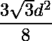

# 给定对角线长度的六边形面积

> 原文:[https://www . geesforgeks . org/给定对角线长度的六边形面积/](https://www.geeksforgeeks.org/area-of-hexagon-with-given-diagonal-length/)

给你一个六边形对角线的长度，你的任务是找到那个六边形的面积。
**例:**

```
Input :   5
Output :   Area of Hexagon: 16.238

Input : 10
Output : Area of Hexagon: 64.9519
```

**六边形**
六边形是一个有六条等边和所有等角的正多边形。六边形的内角各为 120 度，六边形所有角度之和为 720 度。


设 d 为六边形的对角线，那么求六边形面积的公式由
面积=



**以上公式是如何工作的？**
我们知道边长为 a 的六边形的[面积](https://www.geeksforgeeks.org/area-of-a-hexagon/) = (3 √3(a) <sup>2</sup> ) / 2。由于所有边的尺寸都相同，角度为 120 度，因此 d = 2a 或 a = d/2。放入这个值后，我们得到面积为(3 √3(d) <sup>2</sup> ) / 8。
下面是实现。

## C++

```
// C++ program to find the area of Hexagon with given diagonal
#include <bits/stdc++.h>
using namespace std;

// Function to calculate area
float hexagonArea(float d)
{
    // Formula to find area
    return (3 * sqrt(3) * pow(d, 2)) / 8;
}

// Main
int main()
{
    float d = 10;
    cout << "Area of hexagon: " << hexagonArea(d);
    return 0;
}
```

## Java 语言(一种计算机语言，尤用于创建网站)

```
// Java program to find the area of
// Hexagon with given diagonal
import java.lang.Math;

public class GfG {

    // Function to calculate area
    public static float hexagonArea(float d)
    {
        // Formula to find area
        return (float)((3 * Math.sqrt(3) * d * d) / 8);
    }

    public static void main(String []args) {
        float d = 10;
        System.out.println("Area of hexagon: " + hexagonArea(d));
    }
}

// This code is contributed by Rituraj Jain
```

## 蟒蛇 3

```
# Python3 program to find the area
# of Hexagon with given diagonal
from math import sqrt

# Function to calculate area
def hexagonArea(d) :

    # Formula to find area
    return (3 * sqrt(3) * pow(d, 2)) / 8

# Driver ode
if __name__ == "__main__" :

    d = 10
    print("Area of hexagon:",
           round(hexagonArea(d), 3))

# This code is contributed by Ryuga
```

## C#

```
// C# program to find the area of
// Hexagon with given diagonal

using System;

public class GFG{

    // Function to calculate area
    public static float hexagonArea(float d)
    {
        // Formula to find area
        return (float)((3 * Math.Sqrt(3) * d * d) / 8);
    }

//Code driven
    static public void Main (){
            float d = 10;
        Console.WriteLine("Area of hexagon: " + hexagonArea(d));
    }
//This code is contributed by Tushil.   
}
```

## 服务器端编程语言（Professional Hypertext Preprocessor 的缩写）

```
<?php
// PHP program to find the area of
// Hexagon with given diagonal

// Function to calculate area
function hexagonArea($d)
{
    // Formula to find area
    return (3 * sqrt(3) * pow($d, 2)) / 8;
}

// Driver Code
$d = 10;
echo "Area of hexagon: ",
         hexagonArea($d);

// This code is contributed by ajit.
?>
```

## java 描述语言

```
<script>
// JavaScript program to find
// the area of Hexagon with given diagonal

// Function to calculate area
function hexagonArea( d)
{
    // Formula to find area
    return (3 * Math.sqrt(3) * Math.pow(d, 2)) / 8;
}

// Driver Code

    let d = 10;
    document.write("Area of hexagon: " + hexagonArea(d).toFixed(3));

// This code is contributed by todaysgaurav

</script>
```

**输出:**

```
Area of Hexagon:  64.952 
```

**时间复杂度:** O(1)