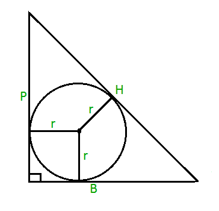

# 直角三角形的内圆面积

> 原文:[https://www . geeksforgeeks . org/直角三角形面积/](https://www.geeksforgeeks.org/area-of-incircle-of-a-right-angled-triangle/)

假定 **P、B 和 H** 分别是直角三角形的垂线、底边和斜边。任务是找到半径为 r 的内圆的面积，如下所示:



**例:**

> **输入:** P = 3，B = 4，H = 5
> **输出:** 3.14
> **输入:** P = 5，B = 12，H = 13
> **输出:** 12.56

**方法:**直角三角形的内倾计算公式可以给出为**r =(P+B–H)/2**。
我们知道圆的面积是**PI * r<sup>2</sup>T8【其中**PI = 22/7****r**是圆的半径。
因此内圆面积为**π*(P+B–H)/2)<sup>2</sup>**。
以下是上述方法的实施:** 

## C

```
// C program to find the area of
// incircle of right angled triangle
#include <stdio.h>
#define PI 3.14159265

// Function to find area of
// incircle
float area_inscribed(float P, float B, float H)
{
    return ((P + B - H) * (P + B - H) * (PI / 4));
}

// Driver code
int main()
{
    float P = 3, B = 4, H = 5;
    printf("%f",
           area_inscribed(P, B, H));
    return 0;
}
```

## Java 语言(一种计算机语言，尤用于创建网站)

```
// Java code to find the area of inscribed
// circle of right angled triangle
import java.lang.*;

class GFG {

    static double PI = 3.14159265;

    // Function to find the area of
    // inscribed circle
    public static double area_inscribed(double P, double B, double H)
    {
        return ((P + B - H) * (P + B - H) * (PI / 4));
    }

    // Driver code
    public static void main(String[] args)
    {
        double P = 3, B = 4, H = 5;
        System.out.println(area_inscribed(P, B, H));
    }
}
```

## 蟒蛇 3

```
# Python3 code to find the area of inscribed
# circle of right angled triangle
PI = 3.14159265

# Function to find the area of
# inscribed circle
def area_inscribed(P, B, H):
    return ((P + B - H)*(P + B - H)*(PI / 4))

# Driver code
P = 3
B = 4
H = 5
print(area_inscribed(P, B, H))
```

## C#

```
// C# code to find the area of
// inscribed circle
// of right angled triangle
using System;

class GFG {
    static double PI = 3.14159265;

    // Function to find the area of
    // inscribed circle
    public static double area_inscribed(double P, double B, double H)
    {
        return ((P + B - H) * (P + B - H) * (PI / 4));
    }

    // Driver code
    public static void Main()
    {
        double P = 3.0, B = 4.0, H = 5.0;
        Console.Write(area_inscribed(P, B, H));
    }
}
```

## 服务器端编程语言（Professional Hypertext Preprocessor 的缩写）

```
<?php
// PHP program to find the
// area of inscribed
// circle of right angled triangle
$PI = 3.14159265;

// Function to find area of
// inscribed circle
function area_inscribed($P, $B, $H)
{
    global $PI;
    return (($P + $B - $H)*($P + $B - $H)* ($PI / 4));
}

// Driver code
$P=3;
$B=4;
$H=5;
echo(area_inscribed($P, $B, $H));
?>
```

## java 描述语言

```
<script>
// javascript code to find the area of inscribed
// circle of right angled triangle
    let PI = 3.14159265;

    // Function to find the area of
    // inscribed circle
    function area_inscribed(P , B , H) {
        return ((P + B - H) * (P + B - H) * (PI / 4));
    }

    // Driver code
    var P = 3, B = 4, H = 5;
    document.write(area_inscribed(P, B, H).toFixed(6));

// This code is contributed by Rajput-Ji
</script>
```

**Output:** 

```
3.141593
```