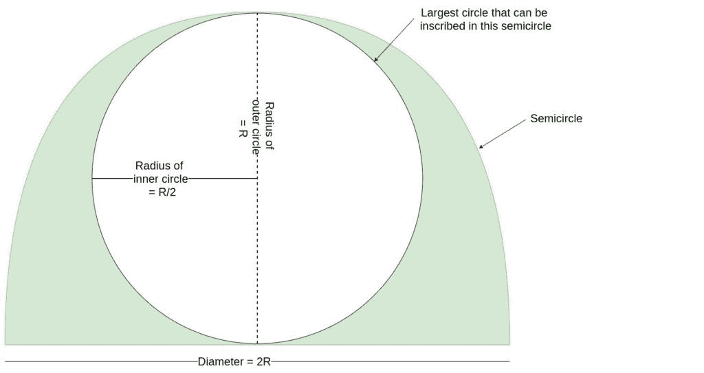

# 可内接半圆的最大圆的面积

> 原文:[https://www . geesforgeks . org/可内接半圆的最大圆面积/](https://www.geeksforgeeks.org/area-of-largest-circle-that-can-be-inscribed-in-a-semicircle/)

给定一个半径为 **R** 的半圆，任务是找出半圆中可以内接的最大圆的面积。
**例:**

```
Input: R = 2
Output: 3.14

Input: R = 8
Output: 50.24
```

**逼近**:让 **R** 为半圆
的半径

1.  对于这个半圆内接的最大圆，圆的直径必须等于半圆的半径。

2.  所以，如果半圆的半径是 **R** ，那么最大内接圆的直径就是 **R** 。
3.  因此内接圆的半径必须是 **R/2**
4.  因此最大圆的面积将是

```
Area of circle = pi*Radius2
               = pi*(R/2)2

since the radius of largest circle is R/2
where R is the radius of the semicircle
```



以下是上述方法的实现:

## C++

```
// C++ Program to find the biggest circle
// which can be inscribed within the semicircle

#include <bits/stdc++.h>
using namespace std;

// Function to find the area
// of the circle
float circlearea(float R)
{

    // Radius cannot be negative
    if (R < 0)
        return -1;

    // Area of the largest circle
    float a = 3.14 * R * R / 4;

    return a;
}

// Driver code
int main()
{
    float R = 2;
    cout << circlearea(R) << endl;

    return 0;
}
```

## Java 语言(一种计算机语言，尤用于创建网站)

```
// Java Program to find the biggest circle
// which can be inscribed within the semicircle
class GFG
{

    // Function to find the area
    // of the circle
    static float circlearea(float R)
    {

        // Radius cannot be negative
        if (R < 0)
            return -1;

        // Area of the largest circle
        float a = (float)((3.14 * R * R) / 4);

        return a;
    }

    // Driver code
    public static void main (String[] args)
    {
        float R = 2;
        System.out.println(circlearea(R));
    }
}

// This code is contributed by AnkitRai01
```

## 蟒蛇 3

```
# Python3 Program to find the biggest circle
# which can be inscribed within the semicircle

# Function to find the area
# of the circle
def circlearea(R) :

    # Radius cannot be negative
    if (R < 0) :
        return -1;

    # Area of the largest circle
    a = (3.14 * R * R) / 4;

    return a;

# Driver code
if __name__ == "__main__" :

    R = 2;
    print(circlearea(R)) ;

# This code is contributed by AnkitRai01
```

## C#

```
// C# Program to find the biggest circle
// which can be inscribed within the semicircle
using System;

class GFG
{

    // Function to find the area
    // of the circle
    static float circlearea(float R)
    {

        // Radius cannot be negative
        if (R < 0)
            return -1;

        // Area of the largest circle
        float a = (float)((3.14 * R * R) / 4);

        return a;
    }

    // Driver code
    public static void Main (string[] args)
    {
        float R = 2;
        Console.WriteLine(circlearea(R));
    }
}

// This code is contributed by AnkitRai01
```

## java 描述语言

```
<script>

// Javascript Program to find the biggest circle
// which can be inscribed within the semicircle

// Function to find the area
// of the circle
function circlearea(R)
{

    // Radius cannot be negative
    if (R < 0)
        return -1;

    // Area of the largest circle
    var a = 3.14 * R * R / 4;

    return a;
}

// Driver code
var R = 2;
document.write(circlearea(R));

// Thid code is contributed by rutvik_56.
</script>
```

**Output:** 

```
3.14
```