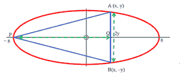

# 顶点与长轴一端重合的椭圆内接的最大等腰三角形面积

> 原文:[https://www . geeksforgeeks . org/面积最大的可内接椭圆等腰三角形，其顶点与长轴的一个端点重合/](https://www.geeksforgeeks.org/area-of-largest-isosceles-triangle-that-can-be-inscribed-in-an-ellipse-whose-vertex-coincides-with-one-extremity-of-the-major-axis/)

给定一个长、短轴长度各为一半的[椭圆](https://en.wikipedia.org/wiki/Ellipse)**A**&**B**，任务是找出顶点与长轴的一个端点重合的椭圆中可内接的最大[等腰三角形](https://en.wikipedia.org/wiki/Isosceles_triangle)的面积。

**示例:**

> **输入:** A = 1，B = 2
> **输出:** 2.598
> **说明:**
> 等腰三角形的面积= ((3 * √3) * A * B) / 4。
> 因此，面积= 2.598。
> 
> **输入:** A = 2，B = 3
> T3】输出: 7.794

**方法:**思路基于以下数学公式:

**证明:**

> 
> 
> 考虑三角形 APB，
> APB 的面积= ab * pq =(1/2)* a * b *(2sin∅–sin2∅)
> 
> 取导数:
> d(area(apb))/d∅= ab(cos∅-cos2∅)
> 
> 将导数等于零:
> d(area(apb))/d∅= 0
> cos∅=–(1/2)
> ∅= 2pi/3
> 
> 因此，APB 的面积= **(3√3) * A * B / 4**

下面是上述方法的实现:

## C++

```
// C++ program for the above approach

#include <bits/stdc++.h>
using namespace std;

// Function to calculate area
// of the isosceles triangle
void triangleArea(float a, float b)
{
    // If a and b are negative
    if (a < 0 || b < 0) {
        cout << -1;
        return;
    }

    // Stores the area of the triangle
    float area = (3 * sqrt(3) * a * b) / (4);

    // Print the area
    cout << area;
}

// Driver code
int main()
{
    // Given value of a & b
    float a = 1, b = 2;

    // Function call to find the
    // area of the isosceles triangle
    triangleArea(a, b);

    return 0;
}
```

## Java 语言(一种计算机语言，尤用于创建网站)

```
// Java program for the above approach
import java.util.*;

class GFG
{

// Function to calculate area
// of the isosceles triangle
static void triangleArea(float a, float b)
{

    // If a and b are negative
    if (a < 0 || b < 0) {
        System.out.println(-1);
        return;
    }

    // Stores the area of the triangle
    float area = (3 * (float)Math.sqrt(3) * a * b) / (4);

    // Print the area
    System.out.println(area);
}

// Driver Code
public static void main(String[] args)
{

    // Given value of a & b
    float a = 1, b = 2;

    // Function call to find the
    // area of the isosceles triangle
    triangleArea(a, b);
}
}

// This code is contributed by sanjoy_62.
```

## 蟒蛇 3

```
# Python 3 program for the above approach
from math import sqrt

# Function to calculate area
# of the isosceles triangle
def triangleArea(a, b):

    # If a and b are negative
    if (a < 0 or b < 0):
        print(-1)
        return

    # Stores the area of the triangle
    area = (3 * sqrt(3) * a * b) / (4);

    # Print the area
    print("{:.5f}".format(area))

# Driver code
if __name__ == '__main__':

    # Given value of a & b
    a = 1
    b = 2

    # Function call to find the
    # area of the isosceles triangle
    triangleArea(a, b)

    # This code is contributed by SURENDRA_GANGWAR.
```

## C#

```
// C# program for the above approach

using System;
public class GFG
{

  // Function to calculate area
  // of the isosceles triangle
  static void triangleArea(float a, float b)
  {

    // If a and b are negative
    if (a < 0 || b < 0) {
      Console.WriteLine(-1);
      return;
    }

    // Stores the area of the triangle
    float area = (3 * (float)Math.Sqrt(3) * a * b) / (4);

    // Print the area
    Console.WriteLine(area);
  }

  // Driver Code
  public static void Main(string[] args)
  {

    // Given value of a & b
    float a = 1, b = 2;

    // Function call to find the
    // area of the isosceles triangle
    triangleArea(a, b);
  }
}

// This code is contributed by AnkThon
```

## java 描述语言

```
<script>

// Javascript program for the above approach

// Function to calculate area
// of the isosceles triangle
function triangleArea(a, b)
{

    // If a and b are negative
    if (a < 0 || b < 0)
    {
        document.write(-1);
        return;
    }

    // Stores the area of the triangle
    var area = (3 *  Math.sqrt(3) * a * b) / (4);

    // Print the area
    document.write(area.toFixed(5));
}

// Driver Code

// Given value of a & b
var a = 1, b = 2;

// Function call to find the
// area of the isosceles triangle
triangleArea(a, b);

// This code is contributed by todaysgaurav

</script>
```

**Output:** 

```
2.59808
```

***时间复杂度:**O(1)*
T5**辅助空间:** O(1)