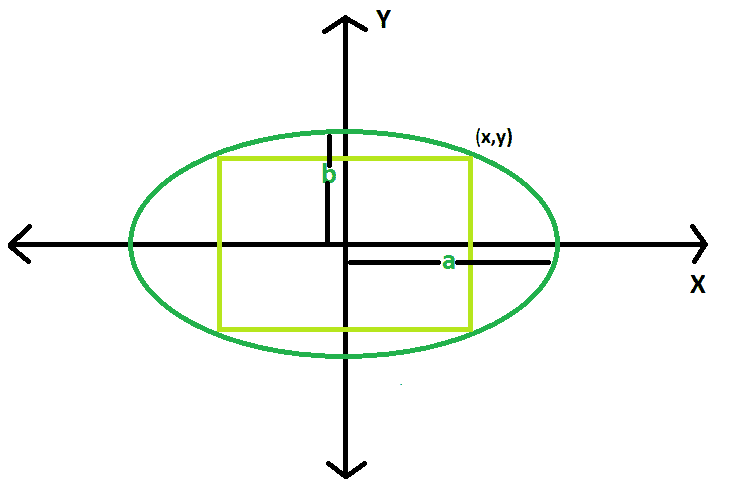

# 椭圆内接的最大矩形面积

> 原文:[https://www . geeksforgeeks . org/最大椭圆内接矩形面积/](https://www.geeksforgeeks.org/area-of-largest-rectangle-that-can-be-inscribed-in-an-ellipse/)

给定一个椭圆，长轴长度 **2a** & **2b** 。任务是找到可在其中内接的最大矩形的面积。
**例** :

```
Input: a = 4, b = 3
Output: 24

Input: a = 10, b = 8
Output: 160
```



**逼近** :
让矩形的右上角有坐标 **(x，y)** ，
那么矩形的面积， **A = 4*x*y** 。
现在，

> 椭圆方程，**(x<sup>2</sup>/a<sup>2</sup>)+(y<sup>2</sup>/b<sup>2</sup>)= 1**
> 把面积看作 **x** 的函数，我们有
> **dA/dx = 4xdy/dx+4y**
> 椭圆相对于 x 的微分方程，我们有
> **2x/a【T15
> **dy/dx =-b<sup>2</sup>x/a<sup>2</sup>y**、
> 和
> T34】dAdx = 4y –( 4b<sup>2</sup>x<sup>2</sup>/a<sup>2</sup>y)**T42】将此设置为 0 并简化，我们有**y<sup>2</sup>= b**
> 由椭圆方程可知，
> T55】y<sup>2</sup>= b<sup>2</sup>–b<sup>2</sup>x<sup>2</sup>/a2T65】这样，**y<sup>2</sup>= b<sup>2</sup>–y<sup>2</sup>**，
> 那么很明显，**x<sup>2</sup>A<sup>2</sup>= 1/2**也是如此，当
> **x= a/√2** 和 **y=b/√2**
> 那么最大面积面积，**A<sub>max</sub>= 2ab**

以下是上述方法的实现:

## C++

```
// C++ Program to find the biggest rectangle
// which can be inscribed within the ellipse
#include <bits/stdc++.h>
using namespace std;

// Function to find the area
// of the rectangle
float rectanglearea(float a, float b)
{

    // a and b cannot be negative
    if (a < 0 || b < 0)
        return -1;

    // area of the rectangle
    return 2 * a * b;
}

// Driver code
int main()
{
    float a = 10, b = 8;
    cout << rectanglearea(a, b) << endl;
    return 0;
}
```

## Java 语言(一种计算机语言，尤用于创建网站)

```
// Java Program to find the biggest rectangle
// which can be inscribed within the ellipse

import java.util.*;
import java.lang.*;
import java.io.*;

class GFG{
// Function to find the area
// of the rectangle
static float rectanglearea(float a, float b)
{

    // a and b cannot be negative
    if (a < 0 || b < 0)
        return -1;

    // area of the rectangle
    return 2 * a * b;
}

// Driver code
public static void main(String args[])
{
    float a = 10, b = 8;
    System.out.println(rectanglearea(a, b));
}
}
```

## 蟒蛇 3

```
# Python 3 Program to find the biggest rectangle
# which can be inscribed within the ellipse

#  Function to find the area
# of the rectangle
def rectanglearea(a, b) :

    # a and b cannot be negative
    if a < 0 or b < 0 :
        return -1

    # area of the rectangle
    return 2 * a * b

# Driver code    
if __name__ == "__main__" :

    a, b = 10, 8
    print(rectanglearea(a, b))

# This code is contributed by ANKITRAI1
```

## C#

```
// C# Program to find the
// biggest rectangle which
// can be inscribed within
// the ellipse
using System;

class GFG
{
// Function to find the area
// of the rectangle
static float rectanglearea(float a,
                           float b)
{

    // a and b cannot be negative
    if (a < 0 || b < 0)
        return -1;

    // area of the rectangle
    return 2 * a * b;
}

// Driver code
public static void Main()
{
    float a = 10, b = 8;
    Console.WriteLine(rectanglearea(a, b));
}
}

// This code is contributed
// by inder_verma
```

## 服务器端编程语言（Professional Hypertext Preprocessor 的缩写）

```
<?php
// PHP Program to find the biggest
// rectangle which can be inscribed
// within the ellipse

// Function to find the area
// of the rectangle
function rectanglearea($a, $b)
{

    // a and b cannot be negative
    if ($a < 0 or $b < 0)
        return -1;

    // area of the rectangle
    return 2 * $a * $b;
}

// Driver code
$a = 10; $b = 8;
echo rectanglearea($a, $b);

// This code is contributed
// by inder_verma
?>
```

## java 描述语言

```
<script>

// javascript Program to find the biggest rectangle
// which can be inscribed within the ellipse

// Function to find the area
// of the rectangle
function rectanglearea(a , b)
{

    // a and b cannot be negative
    if (a < 0 || b < 0)
        return -1;

    // area of the rectangle
    return 2 * a * b;
}

// Driver code

var a = 10, b = 8;
document.write(rectanglearea(a, b));

// This code contributed by Princi Singh

</script>
```

**Output:** 

```
160
```