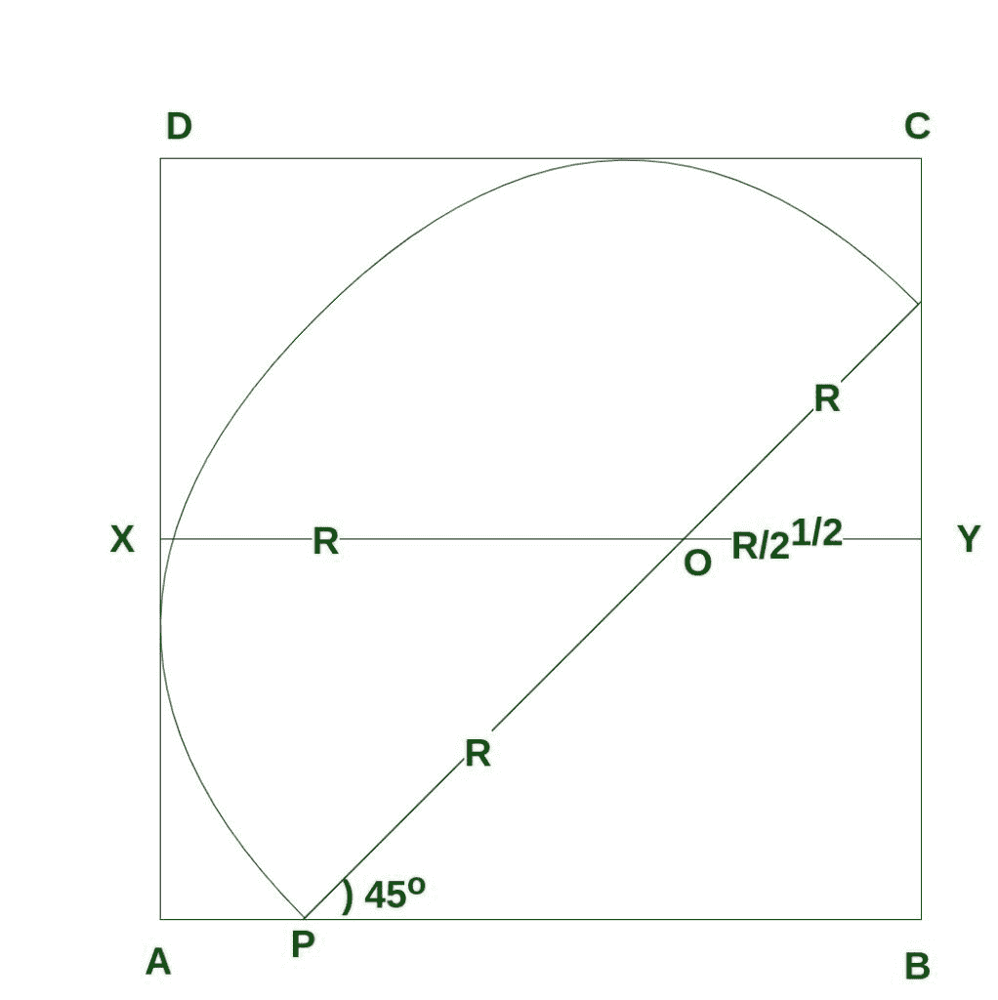

# 正方形内可画的最大半圆面积

> 原文:[https://www . geeksforgeeks . org/正方形内可画的最大半圆面积/](https://www.geeksforgeeks.org/area-of-largest-semicircle-that-can-be-drawn-inside-a-square/)

给定一个边为 **a** 的正方形，任务是找出正方形内可以画出的最大半圆的面积。

**示例:**

```
Input: a = 3
Output: 4.84865

Input: a = 4
Output: 8.61982
```

**逼近**
正方形内接最大面积的半圆，其直径平行于对角线，其半径 **rmax** 给出为:



*   由于图形在对角线 **BD** ，**角度 QPB = 45** 。

```
OY = r cos 45 = r/ √2
```

*   因此

```
a = AB 
  = r + r/√2
  = r(1 + 1/√2)
```

*   因此

```
r = a / (1 + 1/√2)
  = a*√2 / (√2 + 1)
```

*   合理化分母，我们得到

```
r = a*√2*(√2-1)
```

*   因此

```
r = a*2 - a √2
  = a*(2-√2)
```

*   因此，

```
Area of the required semicircle
         = pi * r2/2
         = 3.14*(a*(2-√2))2 / 2
```

*   下面是上述方法的实现:

## 卡片打印处理机（Card Print Processor 的缩写）

```
// C++ program to find Area of
// semicircle in a square

#include <bits/stdc++.h>
using namespace std;

// Function to find area of semicircle
float find_Area(float a)
{
    float R = a * (2.0 - sqrt(2));
    float area = 3.14 * R * R / 2.0;
    return area;
}

// Driver code
int main()
{
    // side of a square
    float a = 4;

    // Call Function to find
    // the area of semicircle
    cout << " Area of semicircle = "
         << find_Area(a);

    return 0;
}
```

## Java 语言(一种计算机语言，尤用于创建网站)

```
// Java program to find Area of
// semicircle in a square
class GFG {

    // Function to find area of semicircle
    static float find_Area(float a)
    {
        float R = a * (float)(2.0 - Math.sqrt(2));
        float area = (float)((3.14 * R * R) / 2.0);
        return area;
    }

    // Driver code
    public static void main (String[] args)
    {
        // side of a square
        float a = 4;

        // Call Function to find
        // the area of semicircle
        System.out.println(" Area of semicircle = " + find_Area(a));
    }
}

// This code is contributed by AnkitRai01
```

## 蟒蛇 3

```
# Python3 program to find Area of
# semicircle in a square
from math import sqrt

# Function to find area of semicircle
def find_Area(a) :

    R = a * (2.0 - sqrt(2));
    area = 3.14 * R * R / 2.0;

    return area;

# Driver code
if __name__ == "__main__" :

    # side of a square
    a = 4;

    # Call Function to find
    # the area of semicircle
    print("Area of semicircle =",find_Area(a));

# This code is contributed by AnkitRai01
```

## C#

```
// C# program to find Area of
// semicircle in a square
using System;

class GFG {

    // Function to find area of semicircle
    static float find_Area(float a)
    {
        float R = a * (float)(2.0 - Math.Sqrt(2));
        float area = (float)((3.14 * R * R) / 2.0);
        return area;
    }

    // Driver code
    public static void Main (string[] args)
    {
        // side of a square
        float a = 4;

        // Call Function to find
        // the area of semicircle
        Console.WriteLine(" Area of semicircle = " + find_Area(a));
    }
}

// This code is contributed by AnkitRai01
```

## java 描述语言

```
<script>

// Javascript program to find Area of
// semicircle in a square

// Function to find area of semicircle
function find_Area(a)
{
    var R = a * (2.0 - Math.sqrt(2));
    var area = 3.14 * R * R / 2.0;
    return area;
}

// Driver code

// side of a square
var a = 4;
// Call Function to find
// the area of semicircle
document.write(" Area of semicircle = "
      + find_Area(a));

// This code is contributed by rutvik_56.
</script>
```

**Output:** 

```
Area of semicircle = 8.61982
```

*   **参考:**T2】http://www.qbyte.org/puzzles/p153s.html