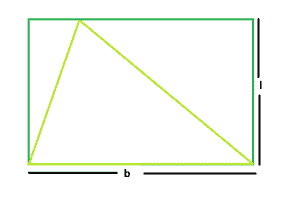

# 矩形内可内接的最大三角形面积

> 原文:[https://www . geeksforgeeks . org/矩形内接最大三角形面积/](https://www.geeksforgeeks.org/area-of-largest-triangle-that-can-be-inscribed-within-a-rectangle/)

给定一个长度为和宽度为的矩形。任务是找出最大三角形中可以内切法的面积。
**示例** :

```
Input: L = 5, B = 4
Output: 10

Input: L = 3, B = 2
Output: 3
```



从图中可以清楚地看到，矩形内接的最大的三角形应该位于同一个底部&在矩形相同的平行边之间有高度升高。
所以，三角形的底边=**B**T3】三角形的高度=**L**T6【因此面积，

```
A = (L*B)/2
```

**注**:还应该清楚的是，如果三角形的底边=矩形的对角线，那么这样得到的三角形的面积仍然= **lb/2** 作为矩形的对角线，把它分成两个面积相等的三角形。
以下是上述方法的实施:

## C++

```
// C++ Program to find the biggest triangle
// which can be inscribed within the rectangle
#include <bits/stdc++.h>
using namespace std;

// Function to find the area
// of the triangle
float trianglearea(float l, float b)
{

    // a and b cannot be negative
    if (l < 0 || b < 0)
        return -1;

    // area of the triangle
    float area = (l * b) / 2;
    return area;
}

// Driver code
int main()
{
    float l = 5, b = 4;
    cout << trianglearea(l, b) << endl;
    return 0;
}
```

## Java 语言(一种计算机语言，尤用于创建网站)

```
// Java Program to find the biggest triangle
// which can be inscribed within the rectangle
import java.util.*;

class GFG
{
    // Function to find the area
    // of the triangle
    static float trianglearea(float l, float b)
    {

        // a and b cannot be negative
        if (l < 0 || b < 0)
            return -1;

        // area of the triangle
        float area = (l * b) / 2;
        return area;
    }

    // Driver code
    public static void main(String args[])
    {
        float l = 5, b = 4;

        System.out.println(trianglearea(l, b));
    }
}
```

## 蟒蛇 3

```
# Python3 Program to find the
# biggest triangle which can be
# inscribed within the rectangle

# Function to find the area
# of the triangle
def trianglearea(l, b) :

    # a and b cannot be negative
    if (l < 0 or b < 0) :
        return -1

    # area of the triangle
    area = (l * b) / 2
    return area

# Driver code
l = 5
b = 4
print(trianglearea(l, b))

# This code is contributed
# by Yatin Gupta
```

## C#

```
// C# Program to find the biggest
// triangle which can be inscribed
// within the rectangle
using System;

class GFG
{
// Function to find the area
// of the triangle
static float trianglearea(float l,
                          float b)
{

    // a and b cannot be negative
    if (l < 0 || b < 0)
        return -1;

    // area of the triangle
    float area = (l * b) / 2;
    return area;
}

// Driver code
public static void Main()
{
    float l = 5, b = 4;

    Console.WriteLine(trianglearea(l, b));
}
}

// This code is contributed
// by inder_verma
```

## 服务器端编程语言（Professional Hypertext Preprocessor 的缩写）

```
<?php
// PHP Program to find the biggest
// triangle which can be inscribed
// within the rectangle

// Function to find the area
// of the triangle
function trianglearea($l, $b)
{

    // a and b cannot be negative
    if ($l < 0 or $b < 0)
        return -1;

    // area of the triangle
    $area = ($l * $b) / 2;
    return $area;
}

// Driver code
$l = 5; $b = 4;
echo trianglearea($l, $b);

// This code is contributed
// by inder_verma
?>
```

## java 描述语言

```
<script>

// javascript Program to find the biggest triangle
// which can be inscribed within the rectangle

// Function to find the area
// of the triangle
function trianglearea( l,  b)
{

    // a and b cannot be negative
    if (l < 0 || b < 0)
        return -1;

    // area of the triangle
    let area = (l * b) / 2;
    return area;
}

// Driver code

    let l = 5, b = 4;
    document.write( trianglearea(l, b) );

// This code contributed by aashish1995

</script>
```

**Output:** 

```
10
```