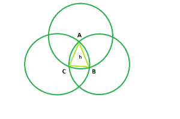

# 勒鲁三角的面积

> 原文:[https://www.geeksforgeeks.org/area-of-reuleaux-triangle/](https://www.geeksforgeeks.org/area-of-reuleaux-triangle/)

给定一个整数 **h** ，它是由与[勒乌三角](https://en.wikipedia.org/wiki/Reuleaux_triangle)相同的顶点组成的等边三角形的边，任务是找到并打印勒乌三角的面积。



**例:**

> **输入:** h = 6
> **输出:** 25.3717
> **输入:** h = 9
> **输出:** 57.0864

**逼近:**三个圆 **ABC** 相交形成的形状为**勒乌三角**，相同顶点即 **ABC** 形成的三角形为边 **h** 的等边三角形。

> 现在，ACB 区面积， **A1 = (π * h <sup>2</sup> ) / 6**
> 同样，CBA 区面积，**A2 =(π* h<sup>2</sup>)/6**T9】和，BAC 区面积，**A3 =(π* h<sup>2</sup>)/6**
> 所以， **A1 + A2 + A3 = (π * h <sup>2
> 所以，勒鲁三角形的面积，**A =(π* h<sup>2</sup>)/2–2 *(等边三角形的面积)=(π–√3)* h<sup>2</sup>/2 = 0.70477 * h<sup>2</sup>**T29】</sup>**

以下是上述方法的实现:

## C++

```
// C++ Program to find the area
// of Reuleaux triangle
#include <bits/stdc++.h>
using namespace std;

// Function to find the Area
// of the Reuleaux triangle
float ReuleauxArea(float a)
{

    // Side cannot be negative
    if (a < 0)
        return -1;

    // Area of the Reuleaux triangle
    float A = 0.70477 * pow(a, 2);
    return A;
}

// Driver code
int main()
{
    float a = 6;
    cout << ReuleauxArea(a) << endl;
    return 0;
}
```

## Java 语言(一种计算机语言，尤用于创建网站)

```
// Java Program to find the area
// of Reuleaux triangle

public class GFG
{
    // Function to find the Area
    // of the Reuleaux triangle
    static double ReuleauxArea(float a)
    {

        // Side cannot be negative
        if (a < 0)
            return -1;

        // Area of the Reuleaux triangle
        double A = (double)0.70477 * Math.pow(a, 2);
        return A;
    }

    // Driver code
    public static void main(String args[])
    {
        float a = 6;
        System.out.println(ReuleauxArea(a)) ;
    }
    // This code is contributed by Ryuga
}
```

## 蟒蛇 3

```
# Python3 program to find the area
# of Reuleaux triangle
import math as mt

# function to the area of the
# Reuleaux triangle
def ReuleauxArea(a):

    # Side cannot be negative
    if a < 0:
        return -1
    # Area of the Reauleax triangle
    return 0.70477 * pow(a, 2)

# Driver code
a = 6
print(ReuleauxArea(a))

# This code is contributed
# by Mohit Kumar       
```

## C#

```
// C# Program to find the area 
// of Reuleaux triangle 

using System;

public class GFG
{
    // Function to find the Area 
    // of the Reuleaux triangle 
    static double ReuleauxArea(float a) 
    { 

        // Side cannot be negative 
        if (a < 0) 
            return -1; 

        // Area of the Reuleaux triangle 
        double A = (double)0.70477 * Math.Pow(a, 2); 
        return A; 
    } 

    // Driver code 
    public static void Main() 
    { 
        float a = 6; 
        Console.WriteLine(ReuleauxArea(a)) ; 
    }
}
    // This code is contributed by Subhadeep
```

## 服务器端编程语言（Professional Hypertext Preprocessor 的缩写）

```
<?php
// PHP Program to find the area
// of Reuleaux triangle

// Function to find the Area
// of the Reuleaux triangle
function ReuleauxArea($a)
{

    // Side cannot be negative
    if ($a < 0)
        return -1;

    // Area of the Reuleaux triangle
    $A = 0.70477 * pow($a, 2);
    return $A;
}

// Driver code
$a = 6;
echo ReuleauxArea($a);

// This code is contributed
// by Akanksha Rai
```

## java 描述语言

```
<script>
// javascript Program to find the area
// of Reuleaux triangle

// Function to find the Area
// of the Reuleaux triangle
function ReuleauxArea(a)
{

    // Side cannot be negative
    if (a < 0)
        return -1;

    // Area of the Reuleaux triangle
    var A = 0.70477 * Math.pow(a, 2);
    return A;
}

// Driver code

var a = 6;
document.write(ReuleauxArea(a)) ;

// This code is contributed by Princi Singh
</script>
```

**Output:** 

```
25.3717
```